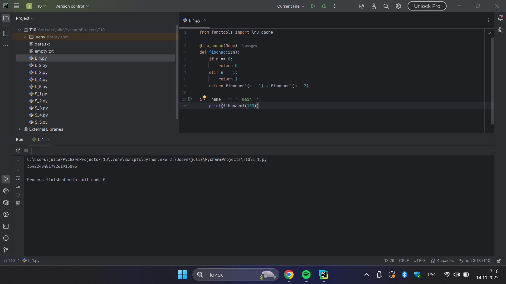
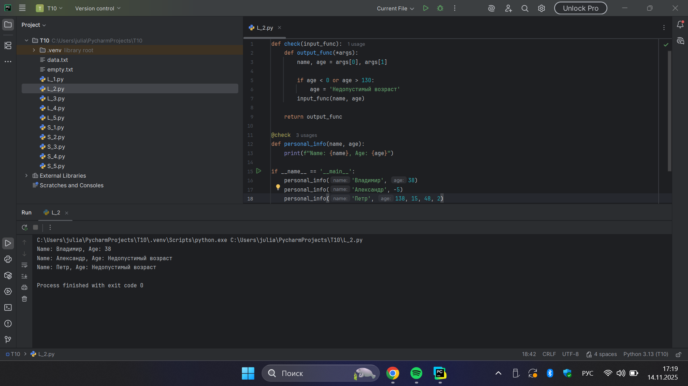
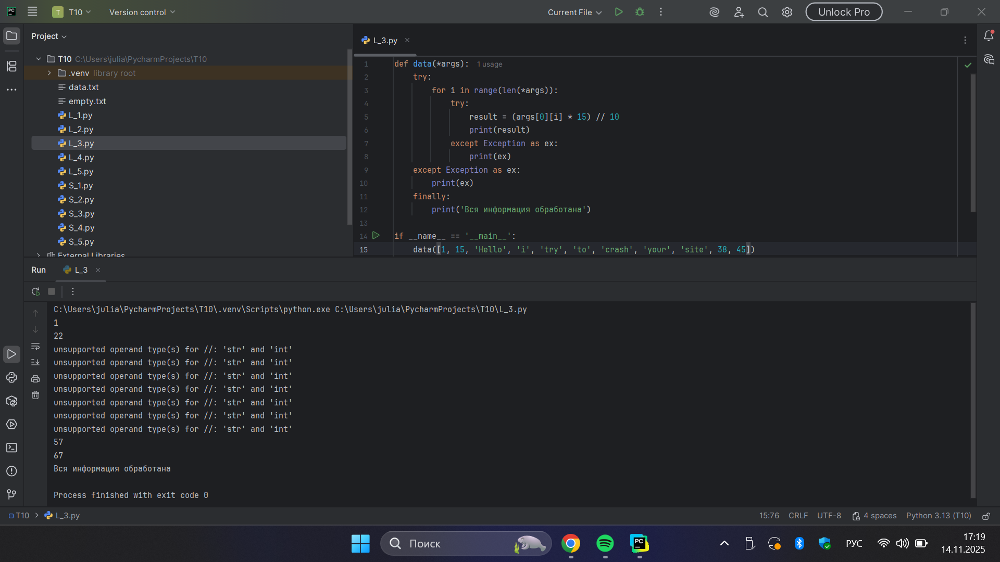
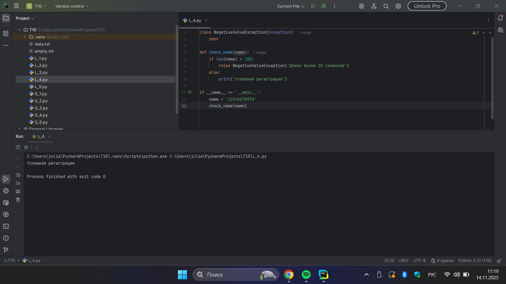
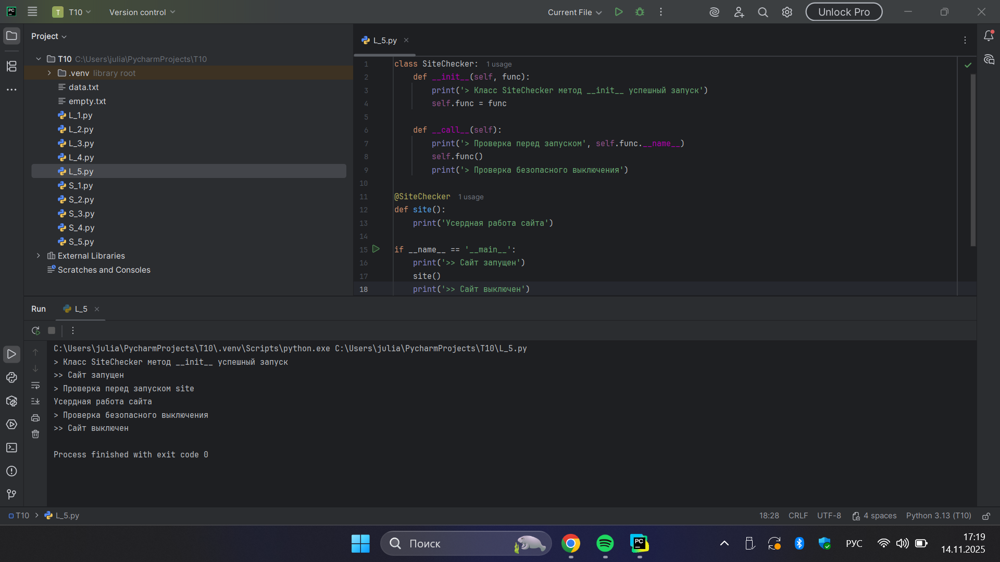
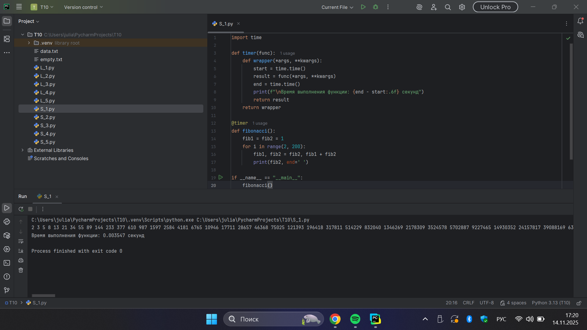
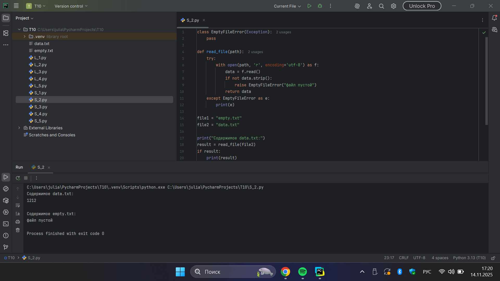
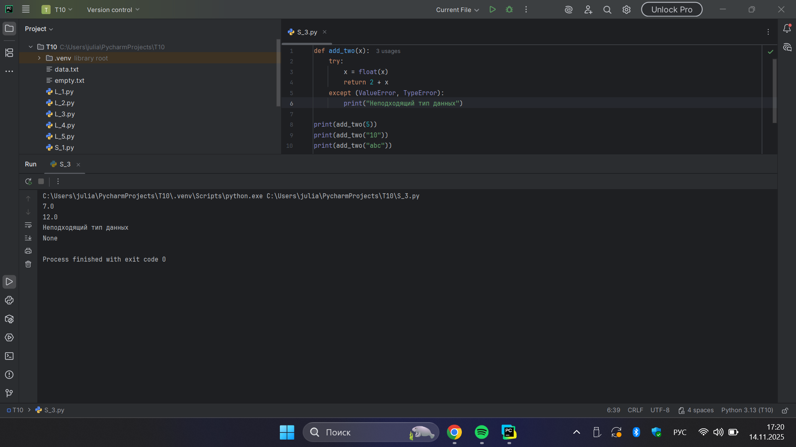
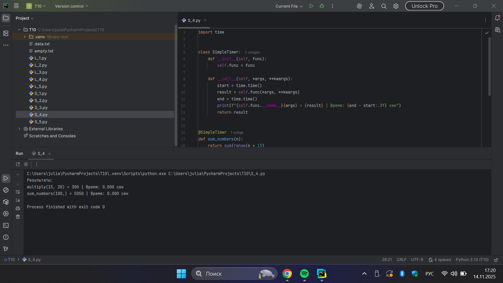
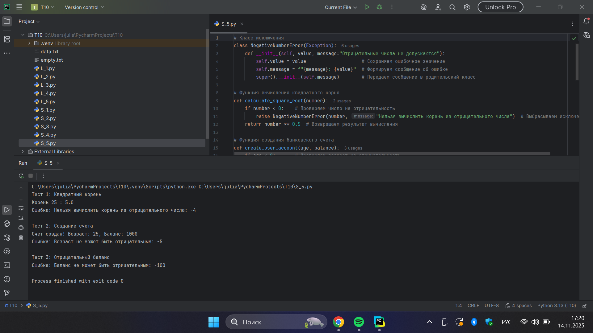

# Тема 10. Декораторы и исключения
Отчет по Теме #10 выполнил(а):
- Бобовский Яков Евгеньевич
- ИВТ-23-1

| Задание | Лаб_раб | Сам_раб |
| ------ | ------ | ------ |
| Задание 1 | + | + |
| Задание 2 | + | + |
| Задание 3 | + | + |
| Задание 4 | + | + |
| Задание 5 | + | + |

знак "+" - задание выполнено; знак "-" - задание не выполнено;

Работу проверили:
- к.э.н., доцент Панов М.А.	

## Лабораторная работа №1
### Напишите программу, которая вычисляет число Фибоначчи для n=40 с помощью рекурсивной функции сначала без декоратора @lru_cache, а затем с этим декоратором.

**Код:**

```python
from functools import lru_cache

@lru_cache(None)
def fibonacci(n):
    if n == 0:
        return 0
    elif n == 1:
        return 1
    return fibonacci(n - 1) + fibonacci(n - 2)

if __name__ == '__main__':
    print(fibonacci(100))```

**Результат:**



**Выводы:** Продемонстрирована эффективность декоратора @lru_cache для оптимизации рекурсивных вычислений чисел Фибоначчи.

## Лабораторная работа №2
### Напишите декоратор для функции вывода данных пользователя.

**Код:**

```python
def check(input_func):
    def output_func(*args):
        name, age = args[0], args[1]

        if age < 0 or age > 130:
            age = 'Недопустимый возраст'
        input_func(name, age)

    return output_func

@check
def personal_info(name, age):
    print(f"Name: {name}, Age: {age}")

if __name__ == '__main__':
    personal_info('Владимир', 38)
    personal_info('Александр', -5)
    personal_info('Петр', 138, 15, 48, 2)```

**Результат:**



**Выводы:** Создан декоратор для валидации входных данных пользователя с проверкой допустимого диапазона возраста.

## Лабораторная работа №3
### Напишите функцию для обработки данных пользователя на сайте, которая использует обработку исключений для проверки типа входных данных.

**Код:**

```python
def data(*args):
    try:
        for i in range(len(*args)):
            try:
                result = (args[0][i] * 15) // 10
                print(result)
            except Exception as ex:
                print(ex)
    except Exception as ex:
        print(ex)
    finally:
        print('Вся информация обработана')

if __name__ == '__main__':
    data([1, 15, 'Hello', 'i', 'try', 'to', 'crash', 'your', 'site', 38, 45])
```

**Результат:**



**Выводы:** Реализована обработка исключений для работы с разнотипными данными в списке с использованием блоков try/except/finally.

## Лабораторная работа №4
### Создайте собственное исключение для проверки длины имени пользователя при регистрации. Если имя длиннее 10 символов - вызывайте исключение, если имя допустимой длины - выводите "Успешная регистрация".

**Код:**

```python
class NegativeValueException(Exception):
    pass

def check_name(name):
    if len(name) > 100:
        raise NegativeValueException('Длина более 10 символов')
    else:
        print('Успешная регистрация')

if __name__ == '__main__':
    name = '12345678910'
    check_name(name)
```

**Результат:**



**Выводы:** Создано пользовательское исключение для проверки длины имени с генерацией ошибки при превышении лимита.

## Лабораторная работа №5
### Создайте класс-декоратор для логирования работы функций. Реализуйте методы init() и call(), чтобы декоратор выводил в консоль логи о вызовах функций и их выполнении.

**Код:**

```python
class SiteChecker:
    def __init__(self, func):
        print('> Класс SiteChecker метод __init__ успешный запуск')
        self.func = func

    def __call__(self):
        print('> Проверка перед запуском', self.func.__name__)
        self.func()
        print('> Проверка безопасного выключения')

@SiteChecker
def site():
    print('Усердная работа сайта')

if __name__ == '__main__':
    print('>> Сайт запущен')
    site()
    print('>> Сайт выключен')
```

**Результат:**



**Выводы:** Реализован класс-декоратор с методами init и call для логирования работы функций.

## Самостоятельная работа №1  
### Создайте декоратор, который измеряет и выводит время выполнения функции. Используйте модуль time для замера времени.

**Код:**

```python
import time

def timer(func):
    def wrapper(*args, **kwargs):
        start = time.time()
        result = func(*args, **kwargs)
        end = time.time()
        print(f"\nВремя выполнения функции: {end - start:.6f} секунд")
        return result
    return wrapper

@timer
def fibonacci():
    fib1 = fib2 = 1
    for i in range(2, 200):
        fib1, fib2 = fib2, fib1 + fib2
        print(fib2, end=' ')

if __name__ == "__main__":
    fibonacci()
```

**Результат:**



**Выводы:** Создан декоратор для измерения времени выполнения функции с использованием модуля time.

## Самостоятельная работа №2
### Напишите программу для чтения данных из файла с обработкой исключений. Создайте два файла - пустой и с информацией. Если файл пустой - вызовите исключение с выводом "файл пустой", если файл не пустой - выведите его содержимое.

**Код:**

```python
class EmptyFileError(Exception):
    pass

def read_file(path):
    try:
        with open(path, 'r', encoding='utf-8') as f:
            data = f.read()
            if not data.strip():
                raise EmptyFileError("файл пустой")
            return data
    except EmptyFileError as e:
        print(e)

file1 = "empty.txt"
file2 = "data.txt"

print("Содержимое data.txt:")
result = read_file(file2)
if result:
    print(result)

print("\nСодержимое empty.txt:")
read_file(file1)
```

**Результат:**



**Выводы:** Реализована обработка исключений при чтении файлов с созданием пользовательского исключения для пустых файлов.

## Самостоятельная работа №3
### Напишите функцию, которая складывает число 2 с введенным пользователем числом, обрабатывая исключение при вводе неподходящего типа данных с выводом ошибки "Неподходящий тип данных. Ожидалось число." через try/except. Проведите тесты с корректным и некорректным вводом.

**Код:**

```python
def add_two(x):
    try:
        x = float(x)
        return 2 + x
    except (ValueError, TypeError):
        print("Неподходящий тип данных")

print(add_two(5))
print(add_two("10"))
print(add_two("abc"))
```

**Результат:**



**Выводы:** Написана функция с обработкой исключений для сложения чисел с проверкой типа входных данных.

## Самостоятельная работа №4
### Создайте собственный декоратор в виде класса, который будет использоваться для двух связанных функций. Не используйте декораторы, которые применялись ранее.

**Код:**

```python
import time


class SimpleTimer:
    def __init__(self, func):
        self.func = func

    def __call__(self, *args, **kwargs):
        start = time.time()
        result = self.func(*args, **kwargs)
        end = time.time()
        print(f"{self.func.__name__}{args} = {result} | Время: {end - start:.3f} сек")
        return result


@SimpleTimer
def sum_numbers(n):
    return sum(range(n + 1))


@SimpleTimer
def multiply(a, b):
    return a * b


print("Результаты:")
multiply(15, 20)
sum_numbers(100)
```

**Результат:**



**Выводы:** Создан класс-декоратор для измерения времени выполнения нескольких функций.

## Самостоятельная работа №5
### Создайте собственное исключение, которое будет использоваться в двух разных фрагментах кода. Не используйте исключения, которые применялись ранее.

**Код:**

```python
# Класс исключения
class NegativeNumberError(Exception):
    def __init__(self, value, message="Отрицательные числа не допускаются"):
        self.value = value                    # Сохраняем ошибочное значение
        self.message = f"{message}: {value}"  # Формируем сообщение об ошибке
        super().__init__(self.message)        # Передаем сообщение в родительский класс

# Функция вычисления квадратного корня
def calculate_square_root(number):
    if number < 0:    # Проверяем число на отрицательность
        raise NegativeNumberError(number, "Нельзя вычислить корень из отрицательного числа")  # Выбрасываем исключение
    return number ** 0.5  # Возвращаем результат вычисления

# Функция создания банковского счета
def create_user_account(age, balance):
    if age < 0:       # Проверяем возраст на отрицательность
        raise NegativeNumberError(age, "Возраст не может быть отрицательным")  # Выбрасываем исключение
    if balance < 0:   # Проверяем баланс на отрицательность
        raise NegativeNumberError(balance, "Баланс не может быть отрицательным")  # Выбрасываем исключение
    return f"Счет создан! Возраст: {age}, Баланс: {balance}"  # Возвращаем успешный результат

# Тестирование работы исключений
print("Тест 1: Квадратный корень")
try:
    print(f"Корень 25 = {calculate_square_root(25)}")  # Успешный вызов функции
    calculate_square_root(-4)                     # Вызов с отрицательным числом
except NegativeNumberError as e:
    print(f"Ошибка: {e}")                         # Обработка исключения

print("\nТест 2: Создание счета")
try:
    print(create_user_account(25, 1000))          # Успешный вызов функции
    create_user_account(-5, 500)                  # Вызов с отрицательным возрастом
except NegativeNumberError as e:
    print(f"Ошибка: {e}")                         # Обработка исключения

print("\nТест 3: Отрицательный баланс")
try:
    create_user_account(30, -100)                 # Вызов с отрицательным балансом
except NegativeNumberError as e:
    print(f"Ошибка: {e}")                         # Обработка исключения
```

**Результат:**



**Выводы:** Реализовано пользовательское исключение для проверки отрицательных чисел в разных контекстах.

## Общие выводы по теме
В ходе выполнения лабораторных и самостоятельных работ по теме №10 были освоены ключевые аспекты работы с декораторами и обработкой исключений в Python. Рассмотрены различные типы декораторов: функциональные и класс-декораторы, их применение для кеширования, валидации, логирования и измерения производительности. Освоены механизмы обработки исключений с использованием try/except/finally, создание пользовательских исключений для специфических бизнес-правил. Особое внимание уделено практическому применению декораторов для улучшения кода и обработки ошибок для повышения надежности программ.