# Тема 2. Базовые операции языка Python
Отчет по Теме #2 выполнил(а):
- Бобовский Яков Евгеньевич
- ИВТ-23-1

| Задание | Лаб_раб | Сам_раб |
| ------ | ------ | ------ |
| Задание 1 | + | + |
| Задание 2 | + | + |
| Задание 3 | + | + |
| Задание 4 | + | + |
| Задание 5 | + | + |
| Задание 6 | + | + |
| Задание 7 | + | + |
| Задание 8 | + | + |
| Задание 9 | + | + |
| Задание 10 | + | + |

знак "+" - задание выполнено; знак "-" - задание не выполнено;

Работу проверили:
- к.э.н., доцент Панов М.А.	

## Лабораторная работа №1
### Выведите в консоль три строки. Первая – любое число. Вторая – любое число в виде строки. Третья – любое число с плавающей точкой.

**Код:**

```python
print(123)
print('123')
print(1.23)
```

**Результат:**


**Выводы:** В консоль успешно выведены три типа данных: целое число, строка и число с плавающей точкой.

## Лабораторная работа №2
### Выведите в консоль три строки. Первая – результат сложения или вычитания минимум двух переменных типа int. Вторая – результат сложения или вычитания минимум двух переменных типа float. Третья – результат сложения или вычитания минимум двух переменных типа int и float.

**Код:**

```python
print(1823 - 486)
print(5.1 + 8.27)
print(3 + 7.04 + 1 + 2.33)
```

**Результат:**

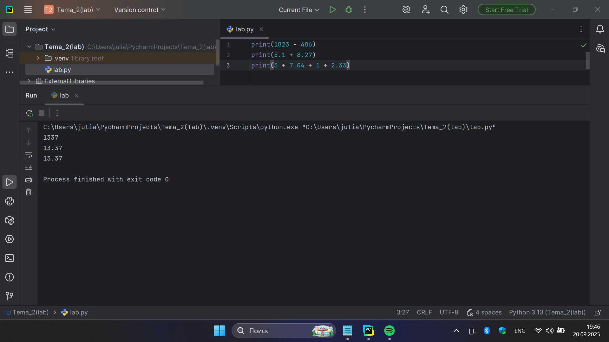

**Выводы:** Успешно выполнены арифметические операции с разными типами числовых данных.

## Лабораторная работа №3
### Выведите в консоль три строки. Первая – обычная строка. Вторая – F строка с использованием заранее объявленной переменной. Третья – сложите две или более строк в одну.

**Код:**

```python
print('Привет, Мир!')
world = 'Мир'
print(f"Привет, {world}!")
one = 'Привет, '
two = 'Мир!'
print(one + two)
```

**Результат:**

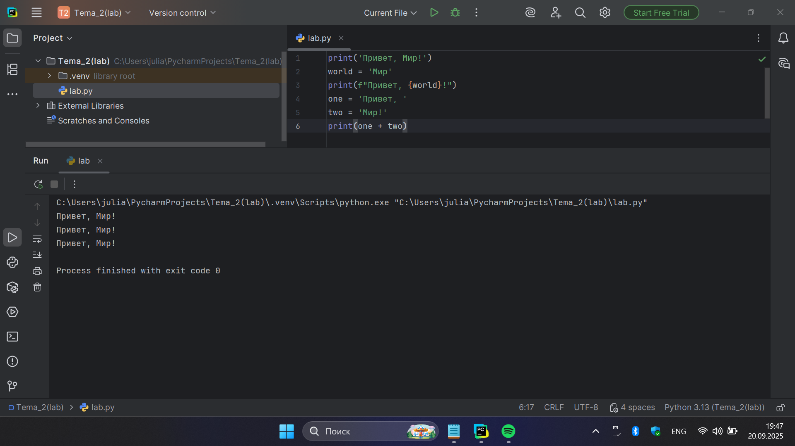

**Выводы:** Успешно выведены три строки разными способами: обычная строка, f-строка с переменной и конкатенация строк.

## Лабораторная работа №4
### Выведите в консоль три строки. Первая – трансформация любого типа переменной в bool. Вторая – трансформация любого типа переменной в float или int. Третья – трансформация любого типа переменной в str.

**Код:**

```python
one = 'Hello'
print(bool(one))
two = 142
print(float(two))
three = None
print((str(three)))
```

**Результат:**

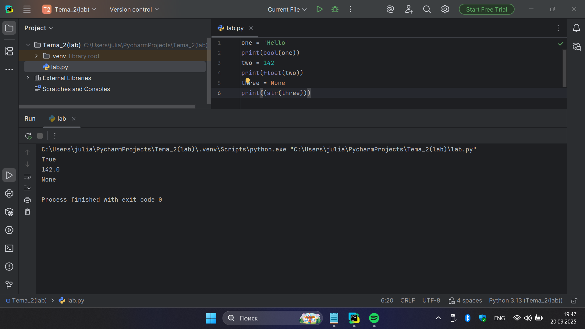

**Выводы:** Успешно выполнено преобразование типов данных: в bool, float и str.

## Лабораторная работа №5
### Присвойте трем переменным различные значения, воспользовавшись функцией input()

**Код:**

```python
one = input('one: ')
two = input('two: ')
three = input('three: ')
print(one, two, three)
```

**Результат:**

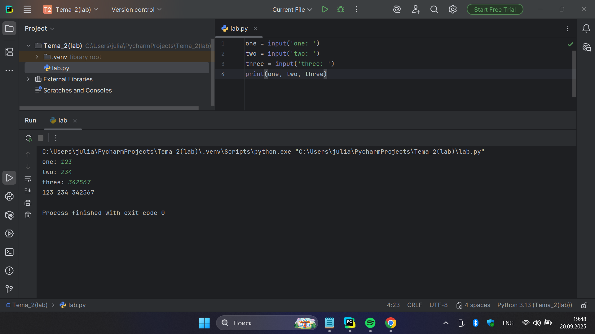

**Выводы:** Успешно получены три значения через функцию input() и выведены в консоль.

## Лабораторная работа №6
### Создайте две любые числовые переменные и выполните над ними несколько математических операций: возведение в степень, обычное деление, целочисленное деление, нахождение остатка от деления.

**Код:**

```python
a = 12
b = 5
print('Возведение в степень', a ** b)
print('Обычное деление', a / b)
print('Целочисленое деление', a // b)
print('Остаток от деления', a % b)
```

**Результат:**

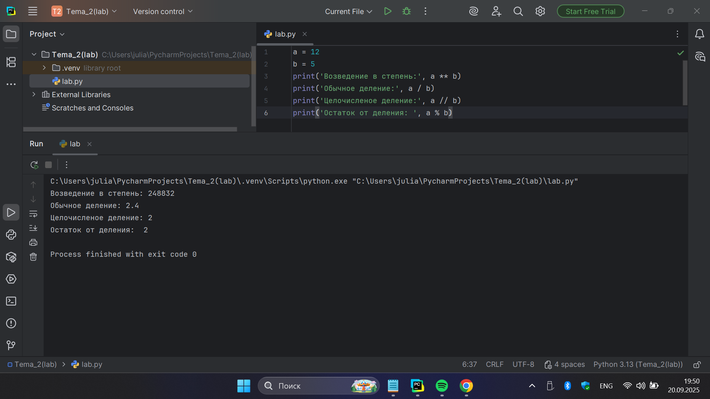

**Выводы:** Успешно выполнены математические операции: возведение в степень, обычное деление, целочисленное деление и нахождение остатка от деления.

## Лабораторная работа №7
### Создайте любую строковую переменную и произведите над ней математическое действие умножение на любое число.

**Код:**

```python
line = 'Hello!'
print(line * 6)
```

**Результат:**

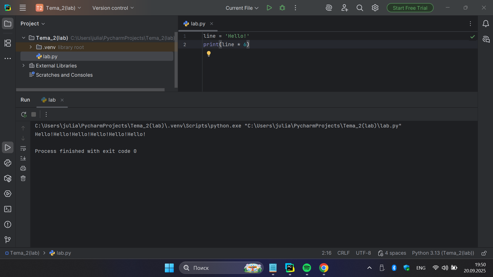

**Выводы:** Успешно выполнено умножение строки на число, результатом стала повторенная строка.

## Лабораторная работа №8
### Посчитайте сколько раз символ ‘o’ встречается в строке ‘Hello World’.

**Код:**

```python
sentence = 'Hello World'
print(sentence.count('o'))
```

**Результат:**

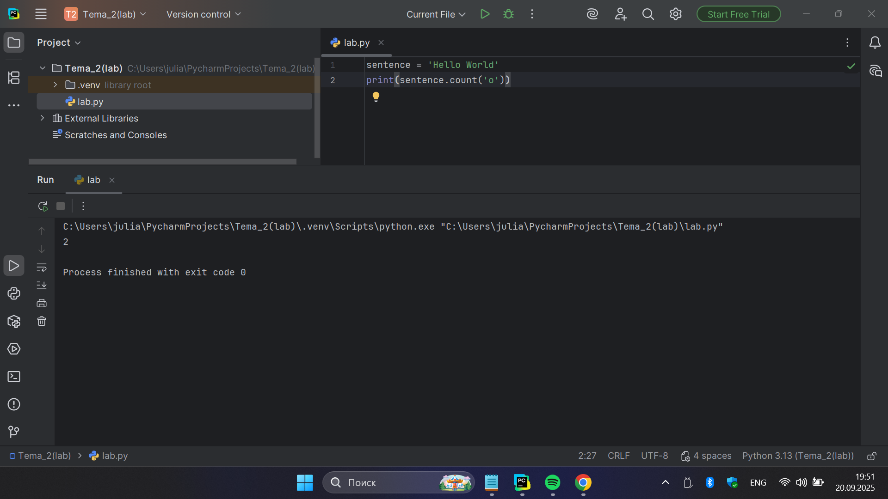

**Выводы:** Успешно подсчитано количество символов 'o' в строке с помощью метода count().

## Лабораторная работа №9
### Напишите предложение ‘Hello World’ в две строки. Написанная программа должна занимать одну строку в редакторе кода.

**Код:**

```python
print('Hello\nWorld')
```

**Результат:**

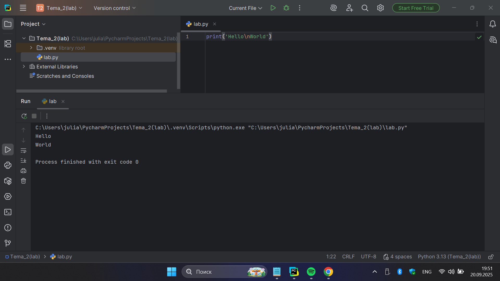

**Выводы:** Успешно выведена фраза "Hello World" в две строки с использованием одной строки кода.

## Лабораторная работа №10
### Из предложения ‘Hello World’ выведите в консоль только 2 символ, а затем выведите слово ‘Hello’.

**Код:**

```python
sentence = 'Hello World'
print(sentence[1])
print(sentence[:5])
```

**Результат:**


**Выводы:** Успешно получен второй символ строки и выведено слово "Hello" с использованием срезов.

## Самостоятельная работа №1  
### Выведите в консоль булевую переменную False, не используя слово False в строке или изначально присвоенную булевую переменную. Программа должна занимать не более двух строк редактора кода.  

**Код:**

```python
print(1 > 2)
```

**Результат:**

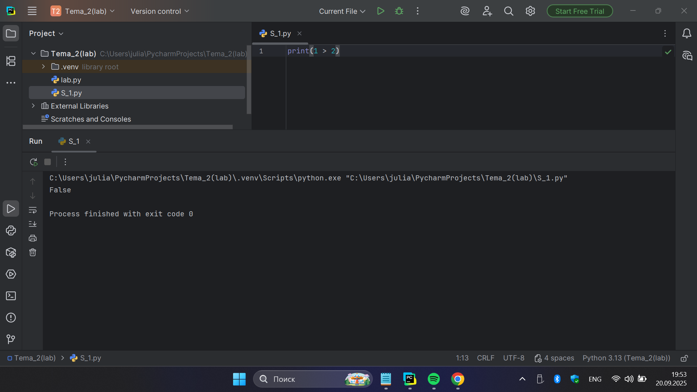

**Выводы:** В консоль выведено значение False с помощью операции сравнения чисел.  

## Самостоятельная работа №2
### Присвоить значения трем переменным и вывести их в консоль, используя только две строки редактора кода.  

**Код:**

```python
a, b, c = 1, 2, 3
print(a, b, c)
```

**Результат:**

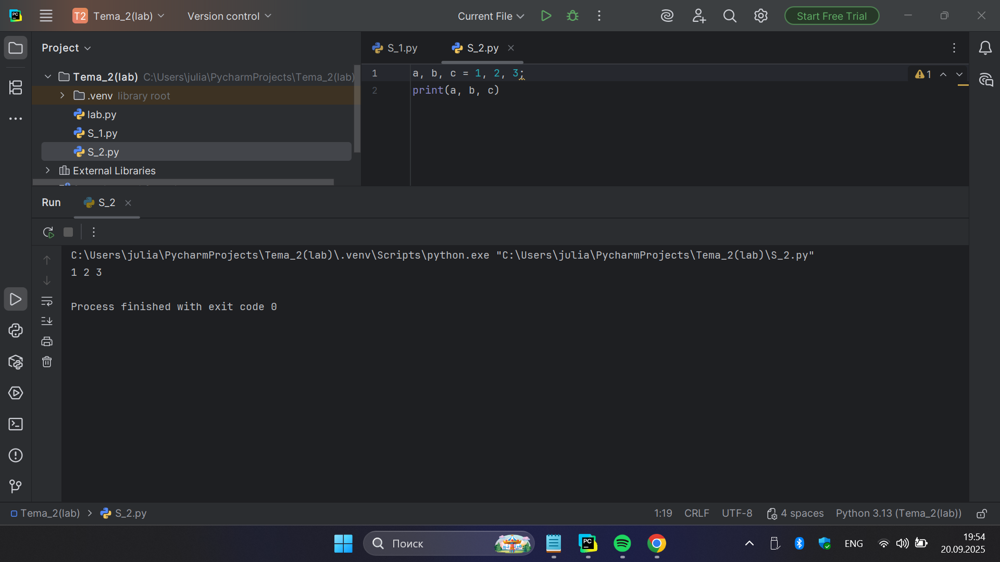

**Выводы:** Три переменные успешно выведены одной строкой.  

## Самостоятельная работа №3
### Реализуйте ввод данных в программу, через консоль, в виде только целых чисел (тип данных int). То есть при вводе буквенных символов в консоль, программа не должна работать. Программа должна занимать не более двух строк редактора кода.  

**Код:**

```python
n = int(input("Введите число: "))
print("Ваше число:", n)
```

**Результат:**

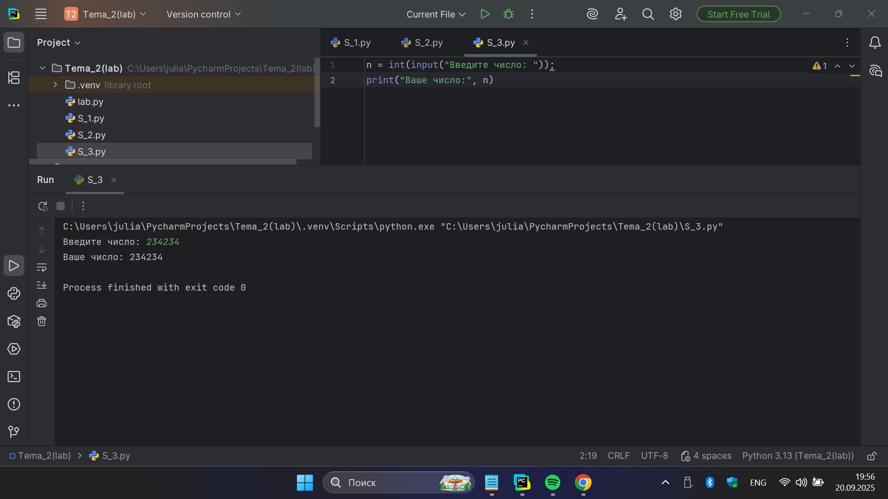

**Выводы:** Ввод ограничен числами, программа корректно работает.  

## Самостоятельная работа №4
### Создайте только одну строковую переменную. Длина строки должна не превышать 5 символов. На выходе мы должны получить строку длиной не менее 16 символов. Программа должна занимать не более двух строк редактора кода.  

**Код:**

```python
s = "qwe"
print(s * 6)
```

**Результат:**

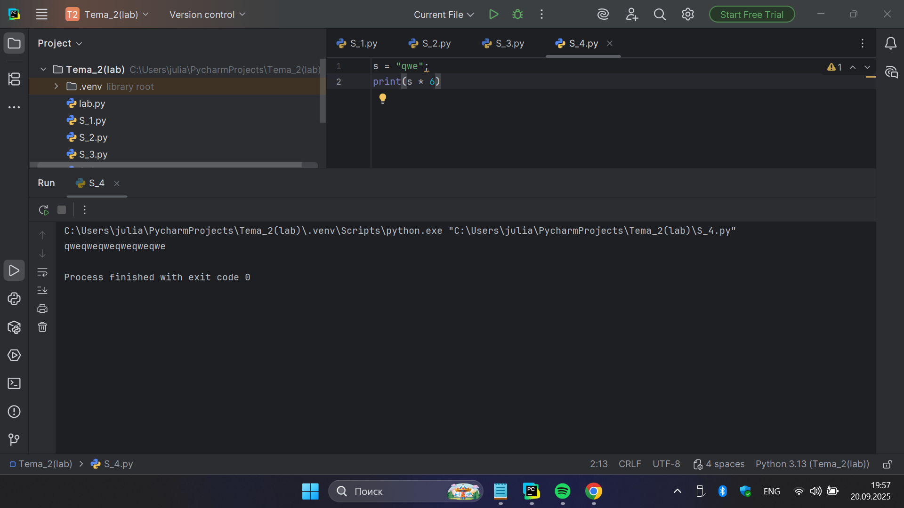

**Выводы:** Строка увеличена умножением.  

## Самостоятельная работа №5
### Создайте три переменные: день (тип данных - числовой), месяц (тип данных - строка), год (тип данных - числовой) и выведите в консоль текущую дату в формате: "Сегодня день месяц год. Всего хорошего!" используя F строку и оператор end внутри print(), в котором вы должны написать фразу "Всего хорошего!". Программа должна занимать не более двух строк редактора кода.  

**Код:**

```python
day, month, year = 20, "сентября", 2025
print(f"Сегодня {day} {month} {year}.", end=" Всего хорошего!")
```

**Результат:**

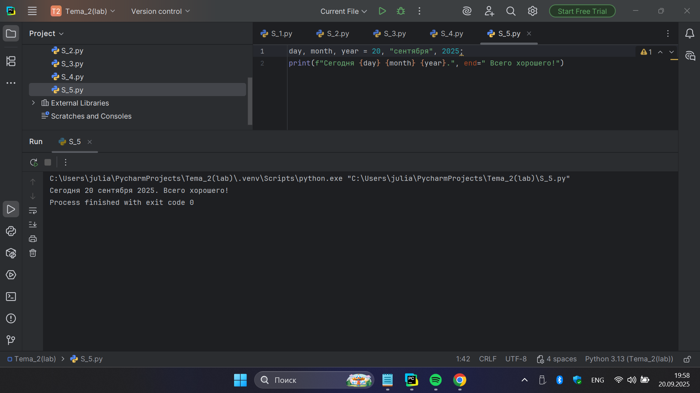

**Выводы:** Дата и сообщение выведены одной строкой.  

## Самостоятельная работа №6
### В предложении 'Hello World' вставьте 'my' между двумя словами. Выведите полученное предложение в консоль в одну строку. Программа должна занимать не более двух строк редактора кода.  

**Код:**

```python
str = 'Hello World'
print(str[0:5] + ' my' + str[5:len(str)])
```

**Результат:**

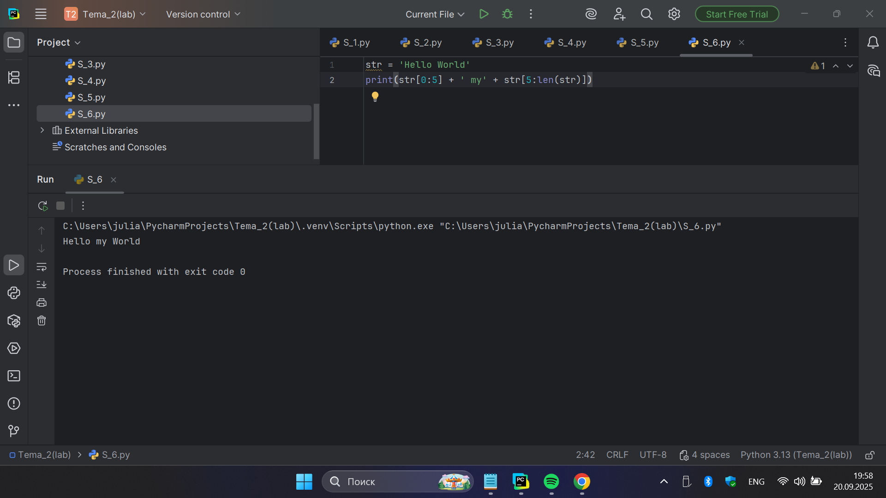

**Выводы:** Слово вставлено в предложение.  

## Самостоятельная работа №7
### Узнайте длину предложения 'Hello World', результат выведите в консоль. Программа должна занимать не более двух строк редактора кода.  

**Код:**

```python
print(len("Hello World"))
```

**Результат:**

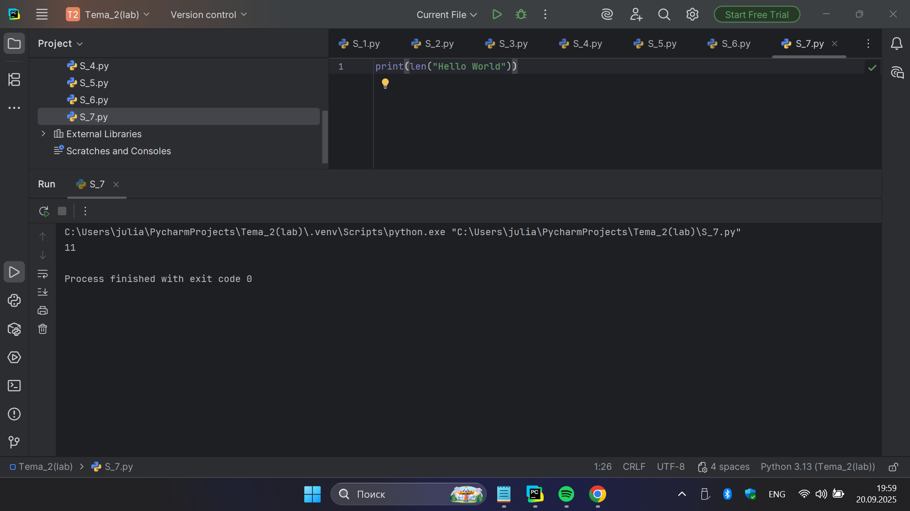

**Выводы:** Определена длина строки.  

## Самостоятельная работа №8
### Переведите предложение 'HELLO WORLD' в нижний регистр. Программа должна занимать не более двух строк редактора кода.  

**Код:**

```python
print("HELLO WORLD".lower())
```

**Результат:**

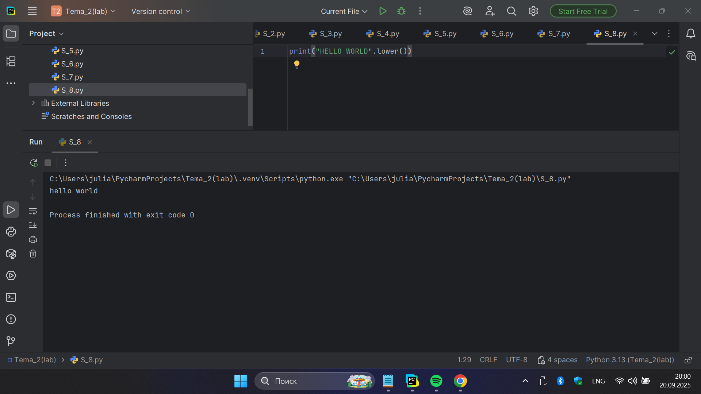

**Выводы:** Строка переведена в нижний регистр.  

## Самостоятельная работа №9
### Самостоятельно придумайте задачу по проходимой теме и решите ее. Задача должна быть связана со взаимодействием с числовыми значениями.  

**Код:**

```python
n = int(input("Введите число: "))
print("Квадрат:", n**2)
```

**Результат:**


**Выводы:** Программа считает квадрат числа.  

## Самостоятельная работа №10
### Самостоятельно придумайте задачу по проходимой теме и решите ее. Задача должна быть связана со взаимодействием со строковыми значениями.  

**Код:**

```python
s = input("Введите строку: ")
print("Обратная строка:", s[::-1])
```

**Результат:**

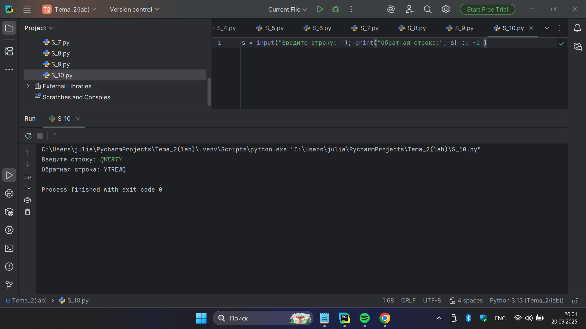

**Выводы:** Строка выведена в обратном порядке.  

## Общие выводы по теме:
В ходе выполнения лабораторных и самостоятельных работ по теме №2 были закреплены базовые навыки работы с языком Python. Рассмотрены и отработаны основные типы данных (int, float, str, bool), операции над ними, преобразования типов, арифметические действия, а также работа со строками и вводом данных через консоль.
