# Тема 3. Операторы, условия, циклы
Отчет по Теме #3 выполнил(а):
- Бобовский Яков Евгеньевич
- ИВТ-23-1

| Задание | Лаб_раб | Сам_раб |
| ------ | ------ | ------ |
| Задание 1 | + | + |
| Задание 2 | + | + |
| Задание 3 | + | + |
| Задание 4 | + | + |
| Задание 5 | + | + |
| Задание 6 | + |   |
| Задание 7 | + |   |
| Задание 8 | + |   |
| Задание 9 | + |   |
| Задание 10 | + |   |

знак "+" - задание выполнено; знак "-" - задание не выполнено;

Работу проверили:
- к.э.н., доцент Панов М.А.	

## Лабораторная работа №1
### Создайте две переменные, значение которых будете вводить через консоль. Также составьте условие, в котором созданные ранее переменные будут сравниваться, если условие выполняется, то выведете в консоль «Выполняется», если нет, то «Не выполняется».

**Код:**

```python
one = int(input('Введите значение первой переменной: '))
two = int(input('Введите значение второй переменной: '))
if one >= two:
    print('Выполняется')
else:
    print('Не выполняется')
```

**Результат:**

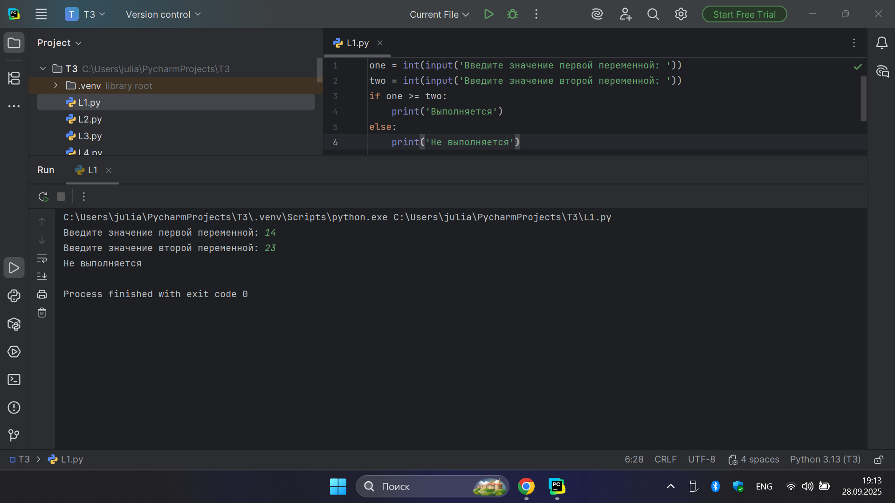

**Выводы:** Программа корректно сравнивает два введенных числа и выводит результат проверки.

## Лабораторная работа №2
### Напишите программу, которая будет определять значения переменной меньше 0, больше 0 и меньше 10 или больше 10. Это нужно реализовать при помощи одной переменной, значение которой будет вводится через консоль, а также при помощи конструкций if, elif, else.

**Код:**

```python
one = int(input('Введите значение переменной: '))
if one < 0:
    print('Переменная меньше 0')
elif 0 < one < 10:
    print('Переменная больше 0 и меньше 10')
else:
    print('Переменная больше 10')
```

**Результат:**

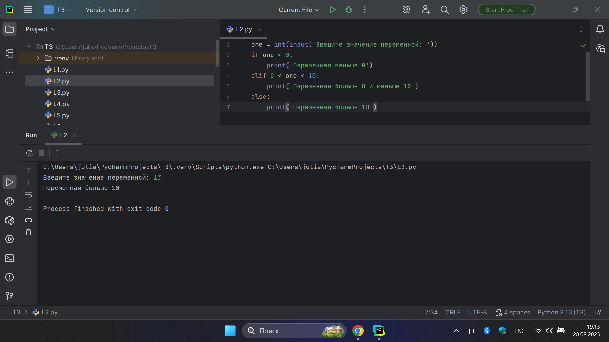

**Выводы:** Программа правильно определяет положение числа относительно 0 и 10.

## Лабораторная работа №3
### Напишите программу, в которой будет проверяться есть ли переменная в указанном массиве используя логический оператор in.

**Код:**

```python
numbers = [1, 3, 4, 6, 8, 9]
value = int(input('Введите значение переменной: '))
if value in numbers:
    print('Переменная есть в данном массиве')
else:
    print('Переменной нет в этом массиве')
```

**Результат:**

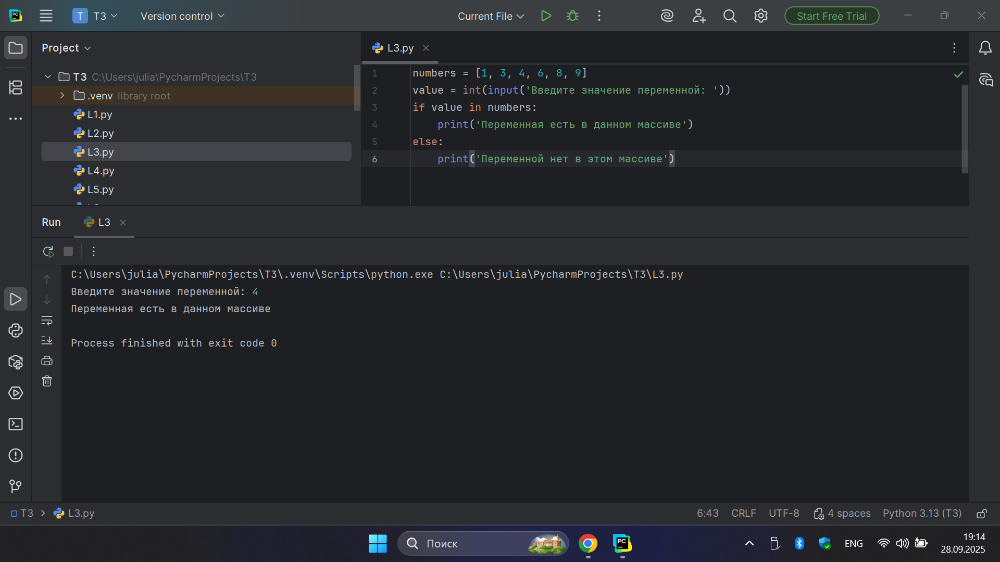

**Выводы:** Программа успешно проверяет, присутствует ли введенное число в заданном списке.

## Лабораторная работа №4
### Напишите программу, которая будет определять находится ли переменная в указанном массиве и если да, то проверьте четная она или нет.

**Код:**

```python
numbers = [1, 3, 4, 6, 8, 9, 15, 16, 73, 321, 322]
value = int(input('Введите значение переменной: '))
if value in numbers:
    if value % 2 == 0:
        print('Переменная четная и есть в массиве numbers')
    else:
        print('Переменная нечетная и есть в массиве numbers')
else:
    print(f"Переменной нет в массиве numbers и она равна {value}")
```

**Результат:**

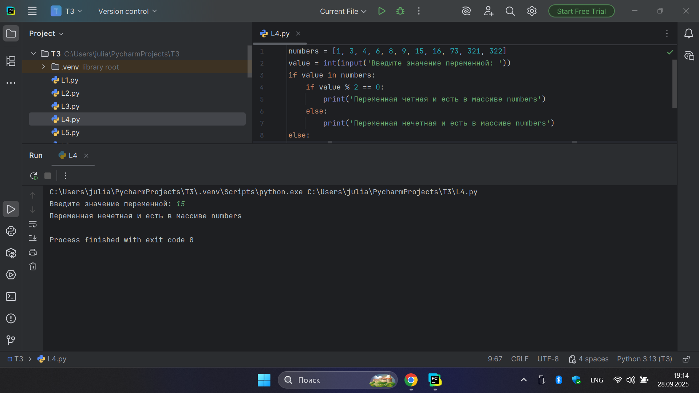

**Выводы:** Программа проверяет число на наличие в списке и, если оно там есть, определяет его четность.

## Лабораторная работа №5
### Напишите программу, в которой циклом for значения переменной i будут меняться от 0 до 10 и посмотрите, как разные виды сравнений и операций работают в цикле.

**Код:**

```python
for i in range(10):
    print('i = ', i)
    if i == 0:
        i += 2
    if i == 1:
        continue
    if i == 2 or i == 3:
        print('Переменная равна 2 или 3')
    elif i in [4, 5, 6]:
        print('Переменная равна 4,5 или 6')
    else:
        break
```

**Результат:**

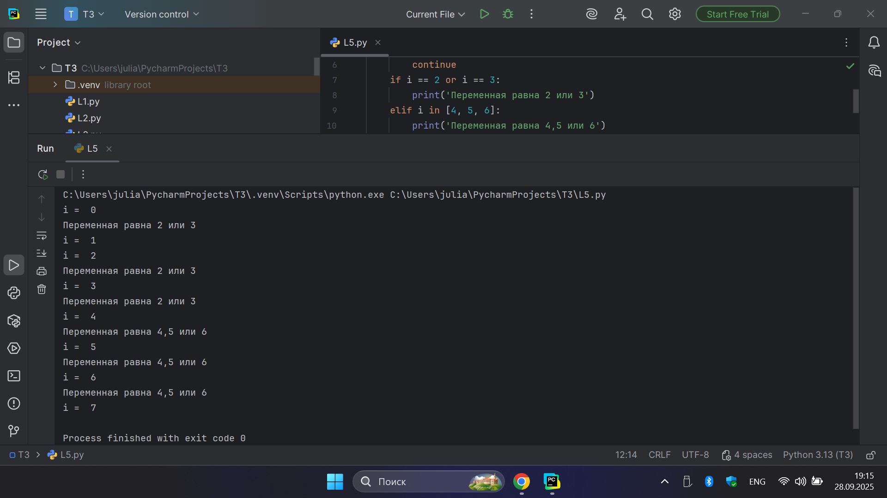

**Выводы:** Цикл наглядно демонстрирует работу операторов continue и break при разных значениях счетчика.

## Лабораторная работа №6
### Напишите программу, в которой при помощи цикла for определяется есть ли переменная value в строке string и посмотрите, как работает оператор else для циклов.

**Код:**

```python
string = 'Привет всем изучающим Python!'
value = input()
for i in string:
    if i == value:
        index = string.find(value)
        print(f"Буква {value} есть в строке под {index} индексом")
        break
else:
    print(f"Буквы '{value}' нет в указанной строке")
```

**Результат:**

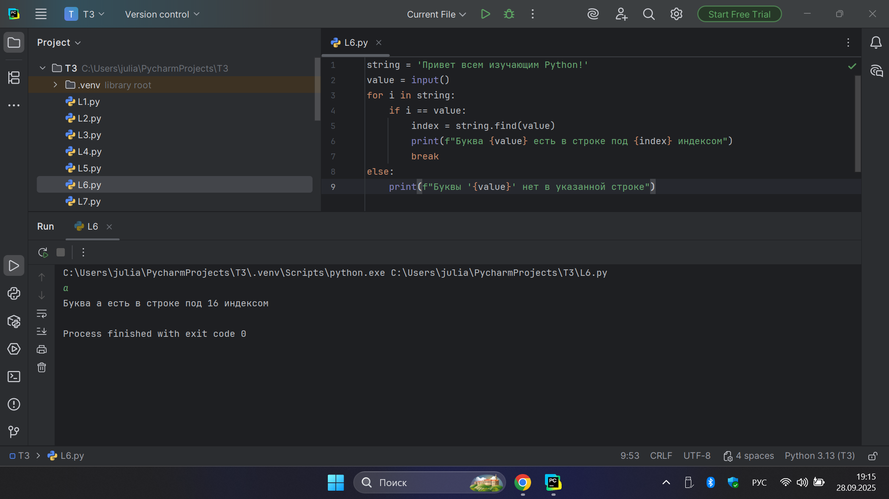

**Выводы:** Программа ищет символ в строке и показывает его индекс, а блок else для цикла срабатывает, если символ не найден.

## Лабораторная работа №7
### Напишите программу, в которой вы наглядно посмотрите, как работает цикл for проходя в обратном порядке, то есть, к примеру не от 0 до 10, а от 10 до 0.

**Код:**

```python
value = 100
for i in range(10, -1, -1):
    value -= i
    print(i, value)
```

**Результат:**

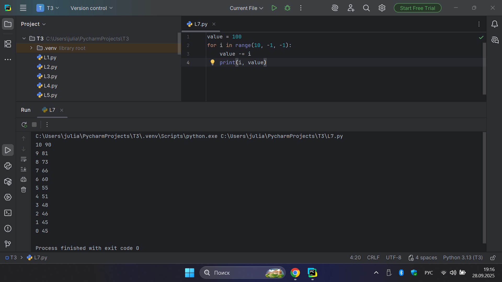

**Выводы:** Цикл работает в обратном порядке, что наглядно видно по убывающим значениям и результату вычислений.

## Лабораторная работа №8
### Напишите программу используя цикл while, внутри которого есть какие-либо проверки.

**Код:**

```python
value = 0
while value < 100:
    if value == 0:
        value += 10
    elif value // 5 > 2:
        value *= 5
    else:
        value -=5
    print(value)
```

**Результат:**

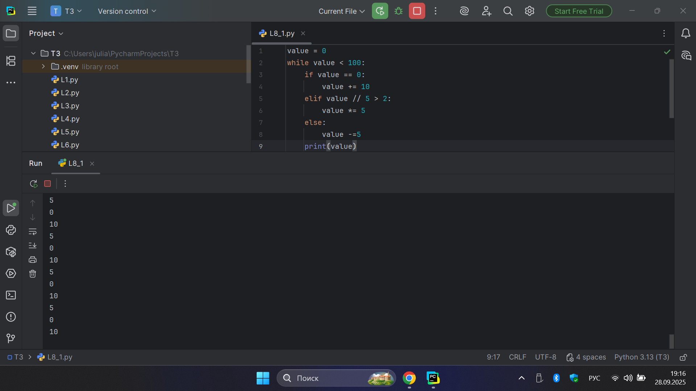

**Выводы:** Получился бесконечный цикл, но если мы поменяем значения в 5 строке с 2 на 1, то код заработает.

**Код:**

```python
value = 0
while value < 100:
    if value == 0:
        value += 10
    elif value // 5 > 1:
        value *= 5
    else:
        value -=5
    print(value)
```

**Результат:**

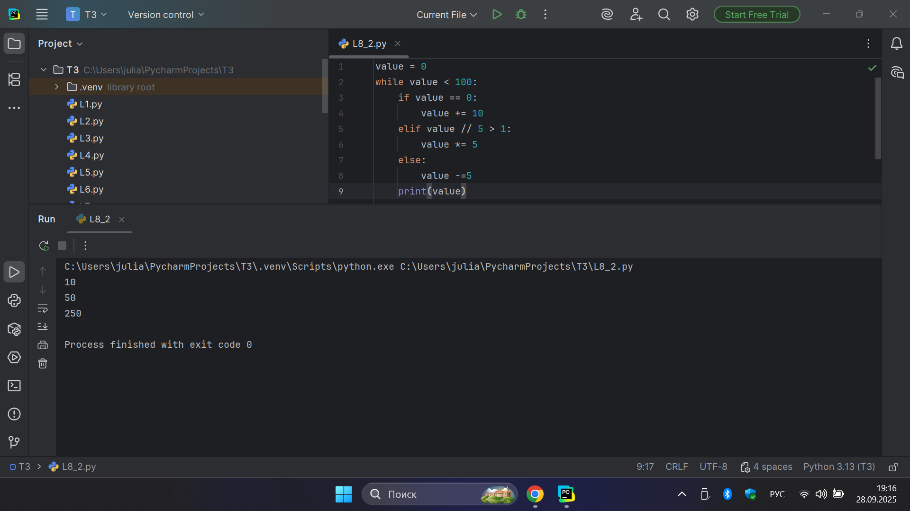

**Выводы:** Цикл while изменяет значение переменной по разным правилам в зависимости от условий, пока оно не станет больше 100.

## Лабораторная работа №9
### Напишите программу с использованием вложенных циклов и одной проверкой внутри них.

**Код:**

```python
value = 0
for i in range(10):
    for j in range(10):
        if i != j:
            value += j
        else:
            pass
print(value)
```

**Результат:**

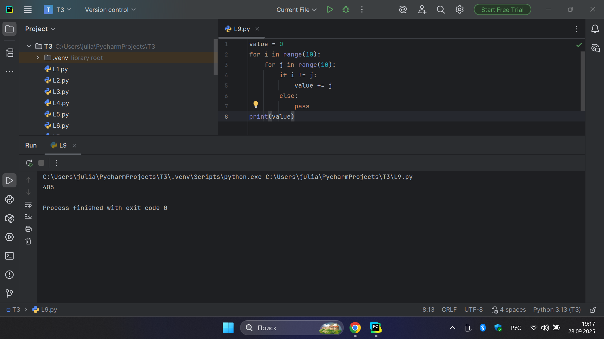

**Выводы:** Вложенные циклы прошли все комбинации i и j, и программа вывела итоговую сумму.

## Лабораторная работа №10
### Напишите программу с использованием flag, которое будет определять есть ли нечетное число в массиве. В данной задаче flag выступает в роли индикатора встречи нечетного числа в исходном массиве, четных чисел.

**Код:**

```python
array = [2, 4, 6, 8, 9]
flag = False
for value in array:
    if value % 2 == 1:
        flag = True
if flag:
    print('В массиве есть нечетное число')
else:
    print('В массиве все числа четные')
```

**Результат:**

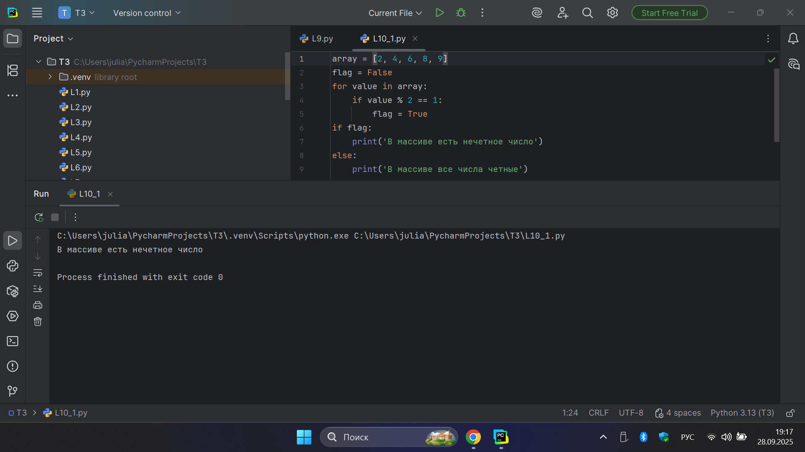

**Код:**

```python
string = 'hello'
values = [0, 2, 4, 6, 8, 10]
counter = 0
while ' world' not in string:
    memory = string
    if counter in values:
        string = string +' world'
    print(string)
    if counter < 10:
        string = memory
    counter += 1
```

**Результат:**

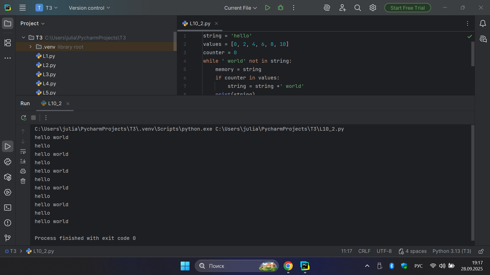

**Выводы:** Флаг успешно сработал как индикатор, показав, что в массиве есть хотя бы одно нечетное число.

## Самостоятельная работа №1  
### Напишите программу, которая преобразует 1 в 31. Для выполнения поставленной задачи необходимо обязательно и только один раз использовать: Цикл for; *= 5; += 1. Никаких других действий или циклов использовать нельзя.

**Код:**

```python
x = 1
for _ in range(2):
    x *= 5
    x += 1
print(x)
```

**Результат:**

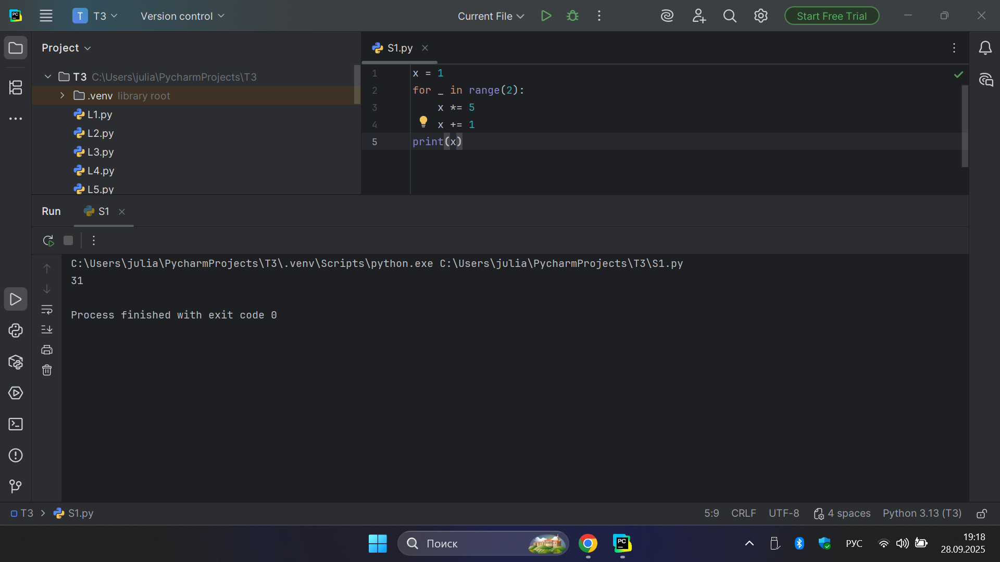

**Выводы:** Число успешно преобразовано из 1 в 31 с использованием указанных операций. 

## Самостоятельная работа №2
### Напишите программу, которая фразу «Hello World» выводит в обратном порядке, и каждая буква находится в одной строке консоли.

**Код:**

```python
text = "Hello World"
for char in text[::-1]: print(char)
```

**Результат:**

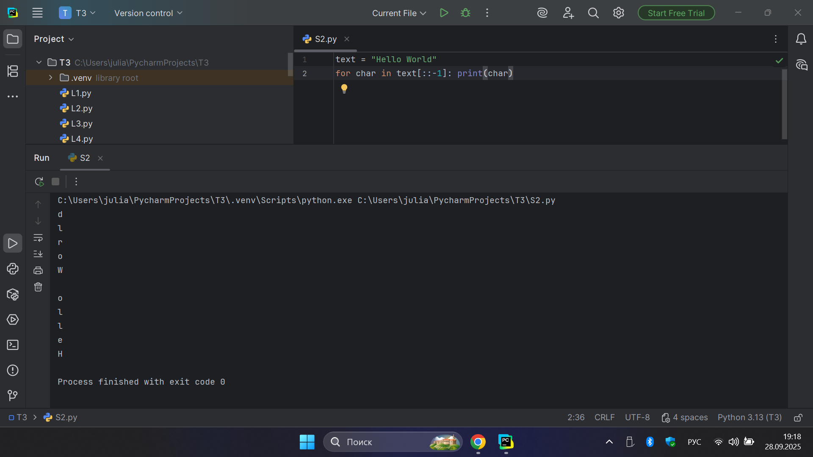

**Выводы:** Фраза «Hello World» выведена посимвольно в обратном порядке. 

## Самостоятельная работа №3
### Напишите программу, на вход которой поступает значение из консоли, оно должно быть числовым и в диапазоне от 0 до 10 включительно (это необходимо учесть в программе). Если вводимое число не подходит по требованиям, то необходимо вывести оповещение об этом в консоль иостановить программу. Код должен вычислять в каком диапазоне находится полученное число. Результатом работы программы будет выведенный в консоль диапазон. Программа должна занимать не более 10 строчек в редакторе кода.

**Код:**

```python
num = int(input())
if not 0 <= num <= 10:
    print("Число не в диапазоне от 0 до 10")
    exit()
if num <= 3:
    print("от 0 до 3 включительно")
elif num <= 6:
    print("от 3 до 6")
else:
    print("от 6 до 10 включительно")
```

**Результат:**

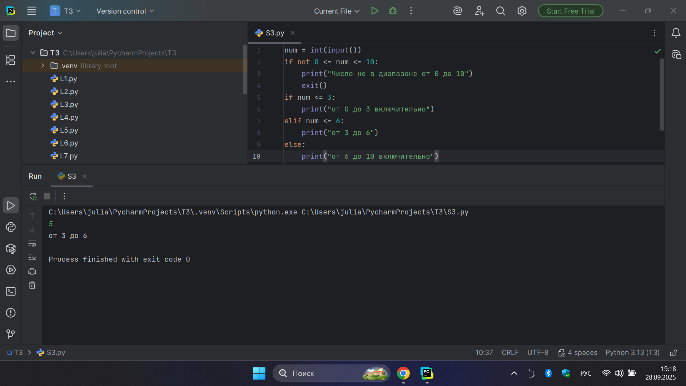

**Выводы:** Программа корректно проверяет ввод и определяет диапазон числа. 

## Самостоятельная работа №4
### Манипулирование строками. Напишите программу на Python, которая принимает предложение (на английском) в качестве входных данных от пользователя. Выполните следующие операции и отобразите результаты: Выведите длину предложения; Переведите предложение в нижний регистр; Подсчитайте количество гласных (a, e, i, o, u) в предложении; Замените все слова "ugly" на "beauty"; Проверьте, начинается ли предложение с "The" и заканчивается ли на "end". Проверьте работу программы минимум на 3 предложениях, чтобы охватить проверку всех поставленных условий.

**Код:**

```python
sentence = input("Введите предложение: ")
print("Длина предложения:", len(sentence))
print("В нижнем регистре:", sentence.lower())

vowels = sum(1 for char in sentence.lower() if char in 'aeiou')
print("Количество гласных:", vowels)

new_sentence = sentence.replace('ugly', 'beauty')
print("После замены:", new_sentence)

print("Начинается с 'The':", sentence.startswith('The'))
print("Заканчивается на 'end':", sentence.endswith('end'))
print()
```

**Результат:**

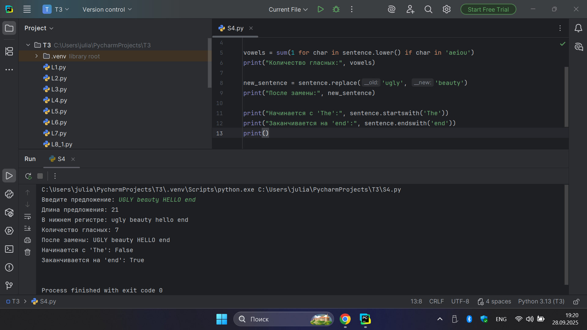

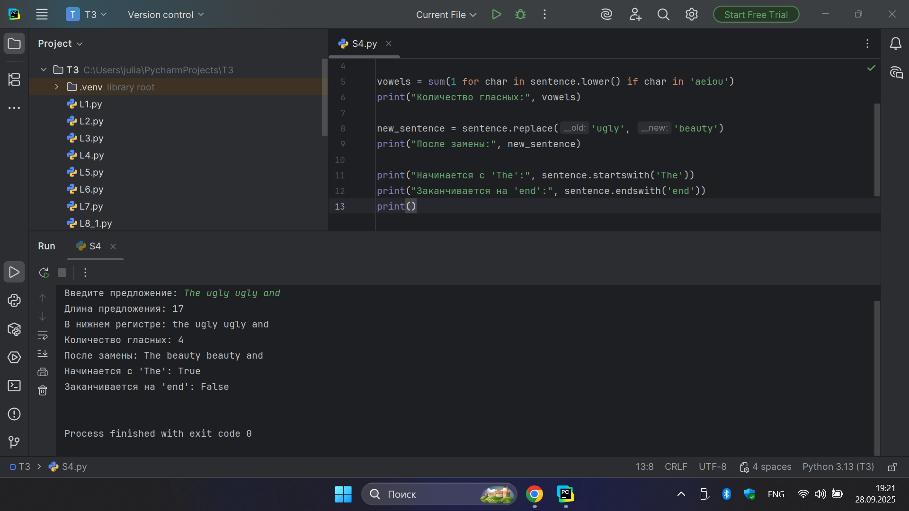

**Выводы:** Строка обработана по всем условиям: длина, регистр, гласные, замена слов и проверки начала/конца.

## Самостоятельная работа №5
### Составьте программу, результатом которой будет определенный вывод в консоль. Программу нужно составить из данных фрагментов кода. 

**Код:**

```python
string = 'hello'
values = [0, 2, 4, 6, 8, 10]
counter = 0
while counter <= 10:
    memory = string
    if counter in values:
        string = string + ' world'
    print(string)
    if counter < 10:
        string = memory
    counter += 1
```

**Результат:**

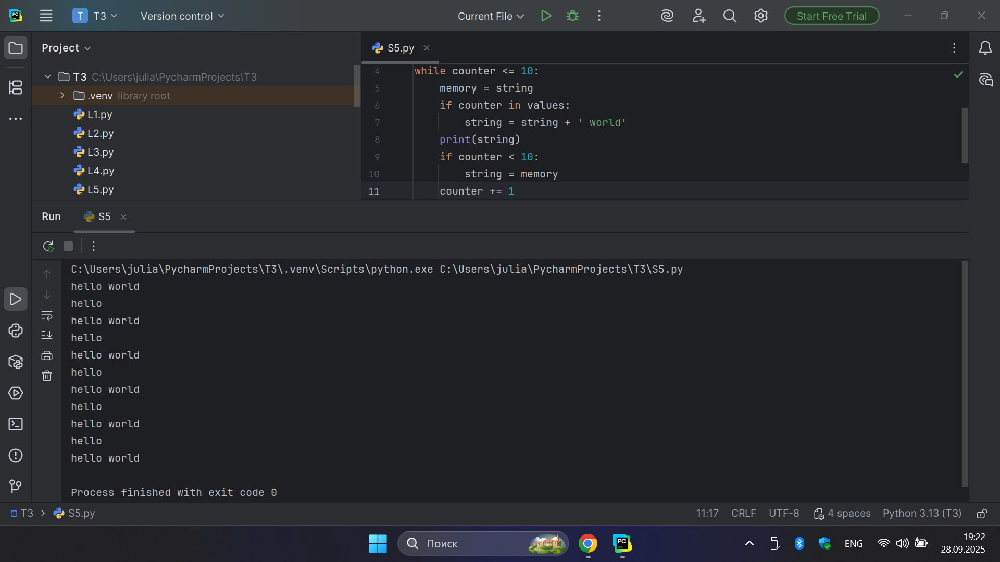

**Выводы:** Вывод организован последовательно, строка дополняется и обнуляется по заданным условиям. 

## Общие выводы по теме:
В ходе выполнения лабораторных и самостоятельных работ по теме №3 были закреплены навыки работы с условными операторами и циклами в языке Python. Рассмотрены конструкции if, elif, else, логические проверки, работа с оператором in, использование циклов for и while, включая вложенные и обратные циклы, а также применение операторов break, continue и блока else в циклах. Задания позволили на практике отработать проверку условий, организацию повторяющихся действий и комбинирование операторов для решения различных задач.
