# Тема 4. Функции и стандартные модули/библиотеки
Отчет по Теме #4 выполнил(а):
- Бобовский Яков Евгеньевич
- ИВТ-23-1

| Задание | Лаб_раб | Сам_раб |
| ------ | ------ | ------ |
| Задание 1 | + | + |
| Задание 2 | + | + |
| Задание 3 | + | + |
| Задание 4 | + | + |
| Задание 5 | + | + |
| Задание 6 | + |  |
| Задание 7 | + |  |
| Задание 8 | + |  |
| Задание 9 | + |  |
| Задание 10 | + |  |

знак "+" - задание выполнено; знак "-" - задание не выполнено;

Работу проверили:
- к.э.н., доцент Панов М.А.	

## Лабораторная работа №1
### Напишите функцию, которая выполняет любые арифметические действия и выводит результат в консоль. Вызовите функцию используя “точку входа”. 

**Код:**

```python
def main():
    print(2+2)

if __name__ == '__main__':
    main()
```

**Результат:**

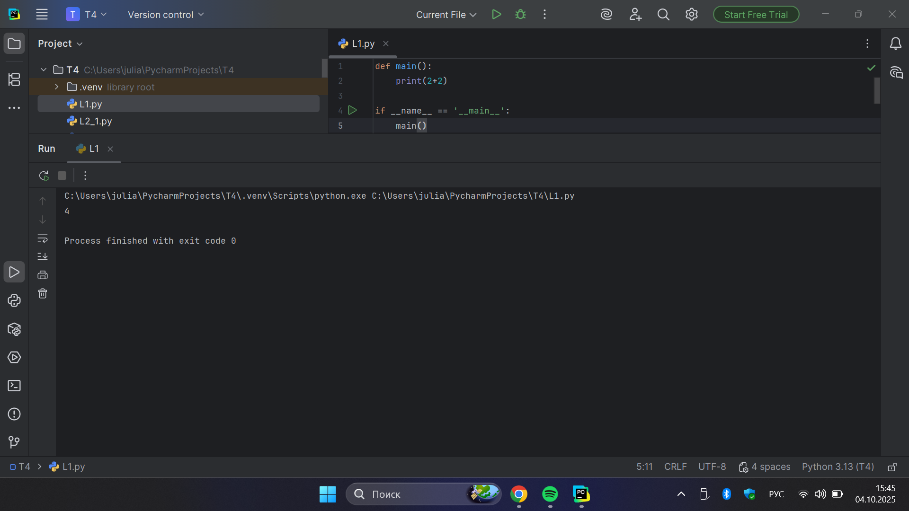

**Выводы:** Программа выполняет арифметическое действие и корректно выводит результат в консоль.

## Лабораторная работа №2
### Напишите функцию, которая выполняет любые арифметические действия, возвращает при помощи тейлга значение B место, откуда вызывали функцию. Выведите результат в консоль. Вызовите функцию используя “точку входа”. 

**Код:**

```python
def main():
    return 2+2

if __name__ == '__main__':
    print(main())
```

**Результат:**

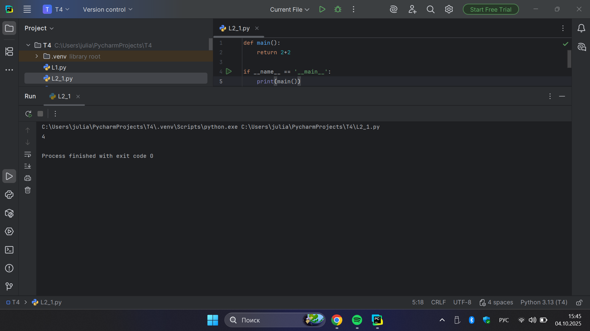

**Код:**

```python
def main():
    result = 2 + 2
    return result

if __name__ == '__main__':
    answer = main()
    print(answer)
```

**Результат:**

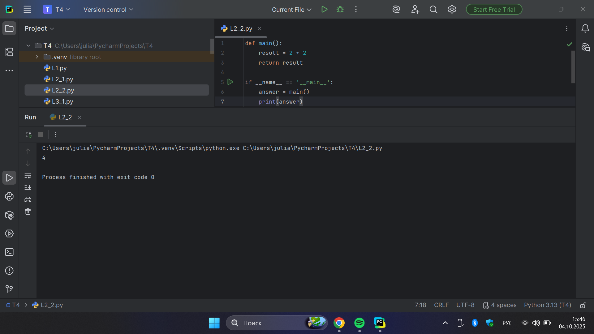

**Выводы:** Функция корректно возвращает результат арифметической операции, который успешно выводится в консоль.

## Лабораторная работа №3
### Напишите функцию, в которую передаются два аргумента, над ними производится арифметическое действие, результат возвращается туда, откуда эту функцию вызывали. Выведите результат в консоль. Вызовите функцию в любом небольшом цикле. 

**Код:**

```python
def main(one, two):
    result = one+two
    return result

for i in range(5):
    x = 1
    y = 10
    answer = main(x, y)
    print(answer)
```

**Результат:**

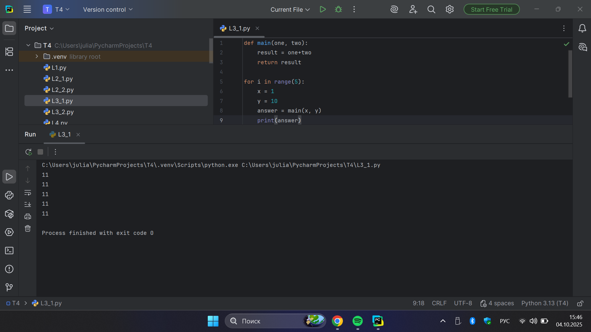

**Код:**

```python
def main(one, two):
    return one+two

for i in range(5):
    answer = main(one=1,two=10)
    print(answer)
```

**Результат:**

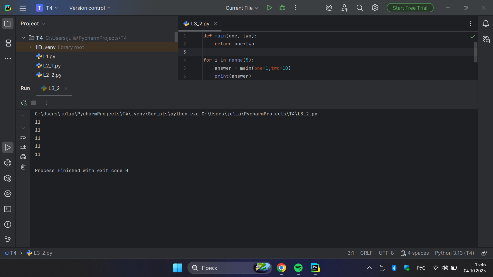

**Выводы:** Функция принимает два аргумента, выполняет над ними вычисление и корректно возвращает результат в цикле.

## Лабораторная работа №4
### Напишите функцию, на вход которой подается какое-то изначальное неизвестное количество аргументов, над которыми будет производится арифметические действия. Для выполнения задания необходимо использовать кортеж “*args”. 

**Код:**

```python
def main(x, *args):
    one = x
    two = sum(args)
    three = float(len(args))

    print(f"one = {one}\ntwo = {two}\nthree = {three}")

    return x + sum(args) / float(len(args))

if __name__ == "__main__":
    result = main(10, 0, 1, 2, -1, 0, -1, 1, 2)
    print(f"\nresult = {result}")
```

**Результат:**

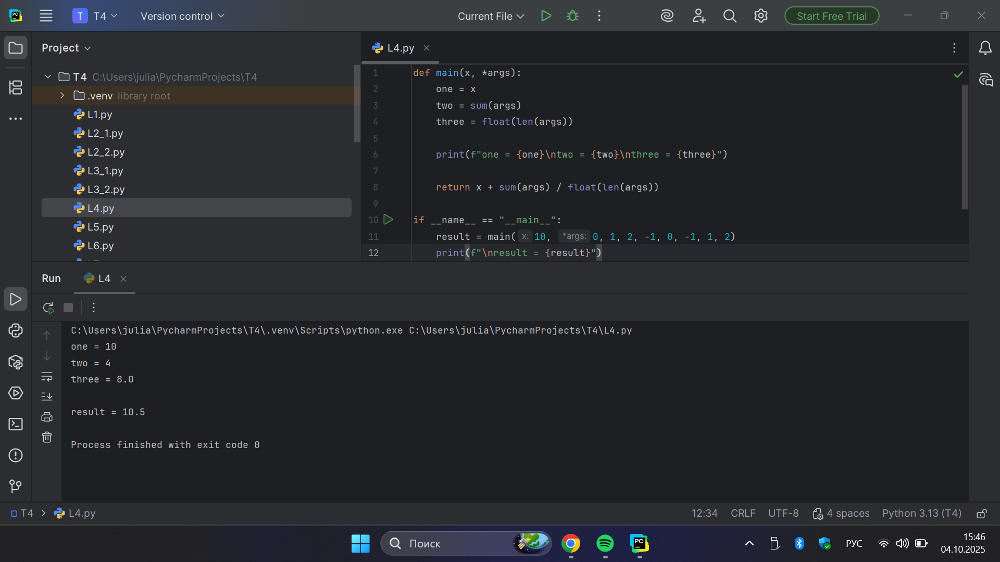

**Выводы:** Программа корректно обрабатывает переменное количество аргументов и вычисляет результат с использованием *args.

## Лабораторная работа №5
### Напишите функцию, которая на вход получает кортеж “**kwargs” и при помощи цикла выводит значения, поступившие в функцию. На скриншоте ниже указаны два варианта вызова функции с “**kwargs” и два варианта работы с данными, поступившими в эту функцию. 

**Код:**

```python
def main(**kwargs):
    for i in kwargs.items():
        print(i[0], i[1])

    print()

    for key in kwargs:
        print(f"{key} = {kwargs[key]}")

if __name__ == "__main__":
    main(x = [1, 2, 3], y = [3, 3, 0], z = [2, 3, 0], q = [3, 3, 0], w = [3, 3, 0])
    print()
    main(**{'x': [1, 2, 3], 'y': [3, 3, 0]})
```

**Результат:**

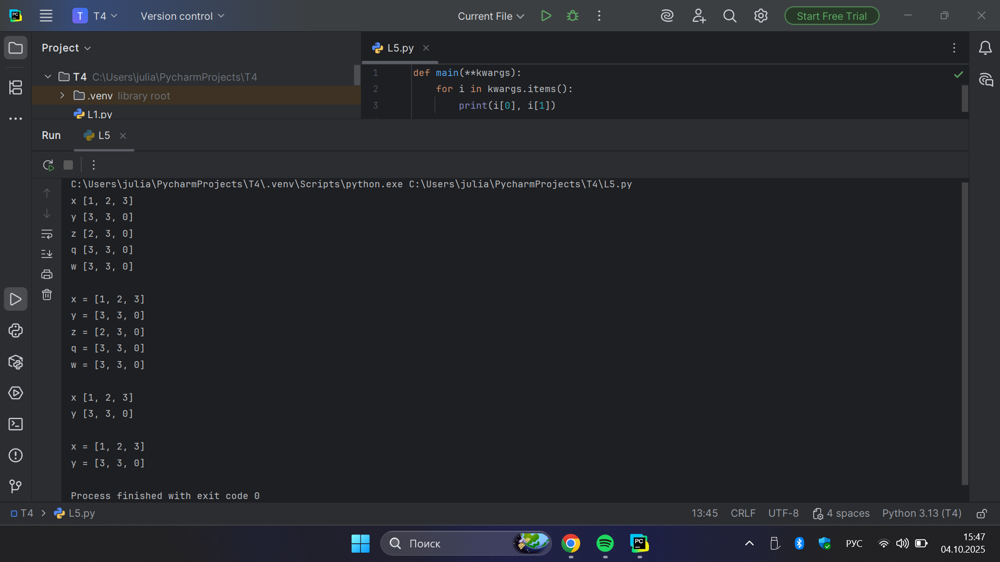

**Выводы:** Функция правильно обрабатывает именованные аргументы **kwargs и выводит их значения в различных форматах.

## Лабораторная работа №6
### Напишите две функции. Первая — получает B виде параметра “**kwargs”. Вторая считает среднее арифметическое из значений первой функции. Вызовите первую функцию используя “точку входа” и минимум 4 аргумента. 

**Код:**

```python
def main(**kwargs):
    for i, j in kwargs.items():
        print(f"{i}. Mean =  {mean(j)}")

def mean(data):
    return sum(data) / float (len(data))

if __name__ == "__main__":
    main(x = [1, 2, 3], y = [3, 3, 0])
```

**Результат:**

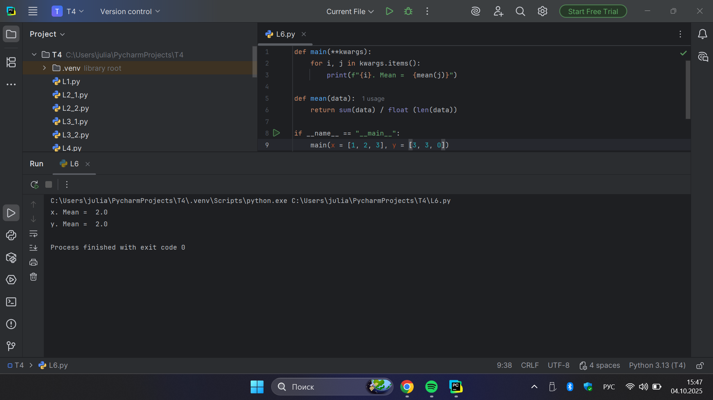

**Выводы:** Программа верно вычисляет среднее арифметическое для каждого набора данных, переданного через **kwargs.

## Лабораторная работа №7
### Создайте дополнительный файл .py. Напишите B HeM любую функцию, которая будет что угодно выводить в консоль, но не вызывайте ее в нем. Откройте файл main.py, импортируйте B него функцию из нового файла и при помощи “точки входа” вызовите эту функцию. 


**Код:**

```python
from L7_import import say_hello

if __name__ == "__main__":
    say_hello()
```

**Результат:**

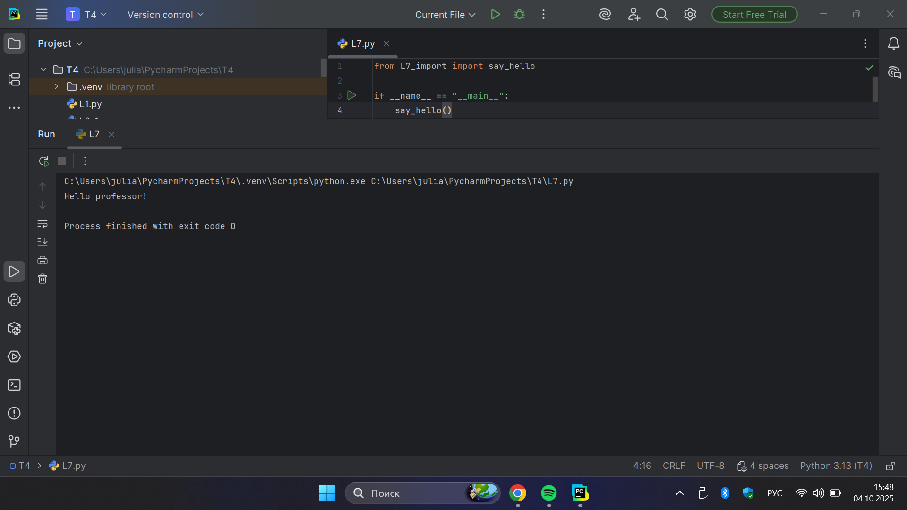

**Код:**

```python
def say_hello():
    print("Hello professor!")
```

**Результат:**

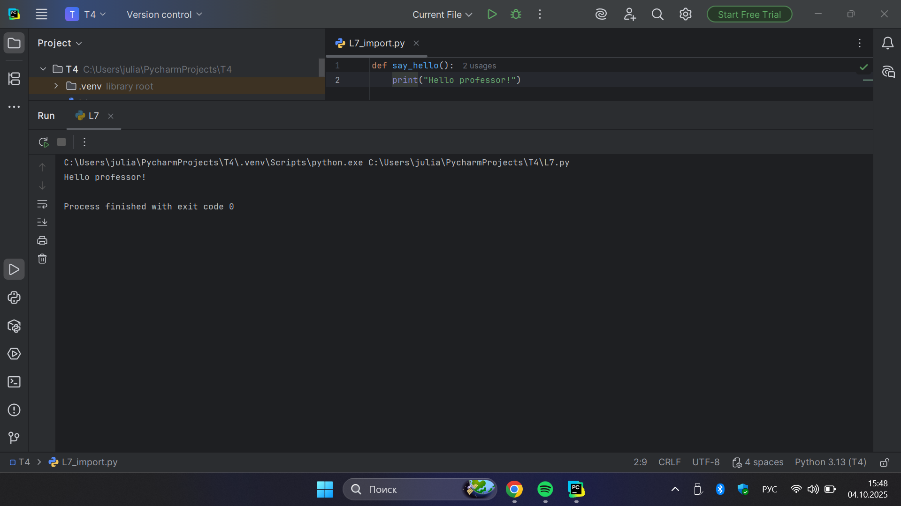

**Выводы:** Импорт функции из внешнего файла выполнен успешно, программа корректно вызывает её через точку входа.

## Лабораторная работа №8
### Напишите программу, которая будет выводить корень, CHHYC, косинус полученного от пользователя числа. 

**Код:**

```python
import math

def main():
    value = int (input("Введите значение: "))
    print(math.sqrt(value))
    print(math.sin(value))
    print(math.cos(value))

if __name__ == "__main__":
    main()
```
**Результат:**

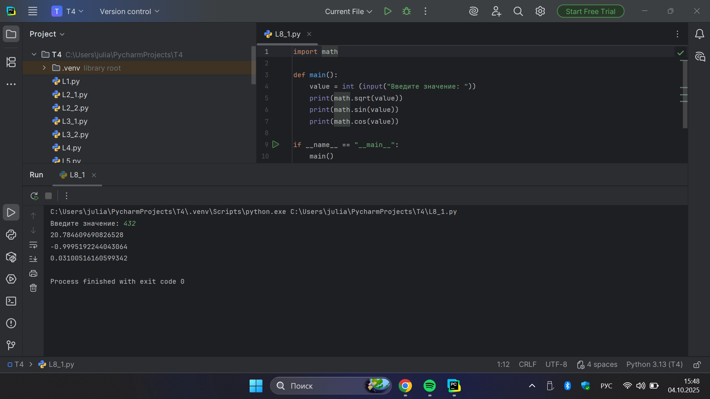

**Код:**

```python
from math import sqrt, sin, cos

def main():
    value = int (input("Введите значение: "))
    print(sqrt(value))
    print(sin(value))
    print(cos(value))

if __name__ == "__main__":
    main()
```
**Результат:**


**Код:**

```python
from math import *

def main():
    value = int (input("Введите значение: "))
    print(sqrt(value))
    print(sin(value))
    print(cos(value))

if __name__ == "__main__":
    main()
```
**Результат:**

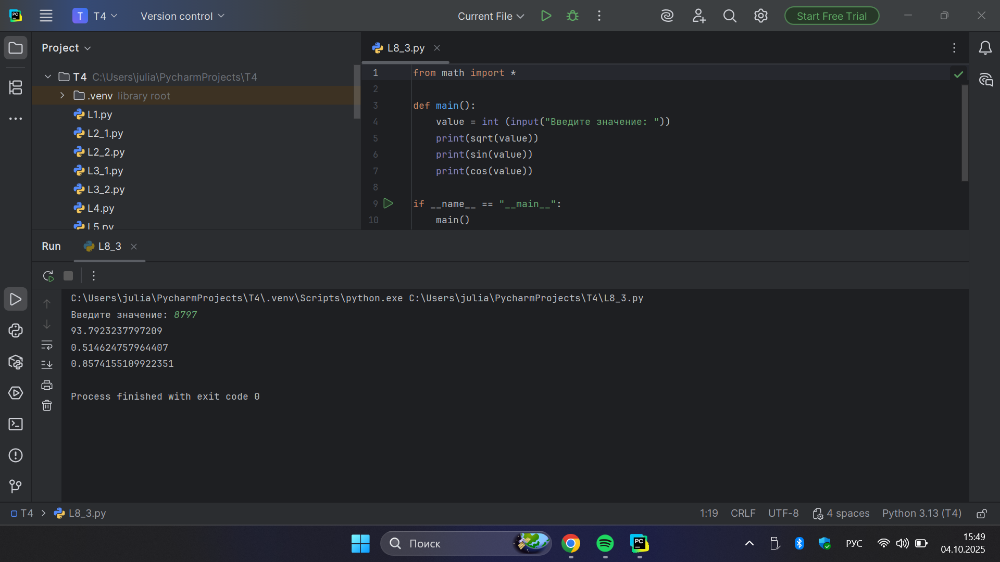

**Выводы:** Программа корректно использует функции из модуля math и выводит корень, синус и косинус введённого числа.

## Лабораторная работа №9
### Напишите программу, которая будет рассчитывать какой день недели будет через п-нное количество дней, которые укажет пользователь.

**Код:**

```python
from datetime import datetime as dt
from datetime import timedelta as td

def main():
    print(
        f"Сегодня {dt.today().date()}. "
        f"День недели - {dt.today().isoweekday()}"
    )
    n = int(input('Введите количество дней: '))
    today = dt.today()
    result = today + td(days=n)
    print(
        f"Через {n} дней будет {result.date()}. "
        f"День недели - {result.isoweekday()}"
    )

if __name__ == "__main__":
    main()
```

**Результат:**


**Выводы:** Программа верно вычисляет дату и день недели через заданное количество дней, используя модуль datetime.

## Лабораторная работа №10
### Напишите программу с использованием глобальных переменных, которая будет считать площадь треугольника или прямоугольника в зависимости от того, что выберет пользователь. Получение всей необходимой информации реализовать через input(), а подсчет площадей выполнить при помощи функций. Результатом программы будет число, равное площади, необходимой фигуры.

**Код:**

```python
global result

def rectangle():
    a = float(input("Ширина: "))
    b = float(input("Высота: "))
    global result
    result = a * b

def triangle():
    a = float(input("Основание: "))
    h = float(input("Высота: "))
    global result
    result = 0.5 * a * h

figure = input("1 - прямоугольник, 2 - треугольник: ")
if figure == "1":
    rectangle()
elif figure == "2":
    triangle()

print(f"Площадь: {result}")
```
**Результат:**

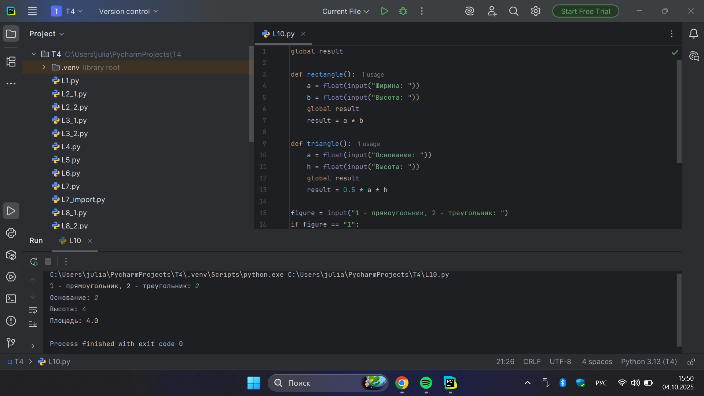

**Выводы:** Программа корректно рассчитывает площадь прямоугольника или треугольника на основе выбора пользователя.

## Самостоятельная работа №1  
### Дайте подробный комментарий для кода, написанного ниже. Комментарий нужен для каждой строчки кода, нужно описать что она делает. He забудьте, что функции комментируются по-особенному. 


**Код:**

```python
from datetime import datetime  # Импорт класса datetime из модуля datetime для получения текущего времени и измерения интервалов.

from math import sqrt          # Импорт функции sqrt (square root) из модуля math для вычисления квадратного корня sqrt(x).

def main(**kwargs):            # Объявление функции main, принимающей произвольное количество именованных аргументов.
                               # **kwargs собирает все переданные именованные аргументы в словарь
    """
    Функция main принимает именованные аргументы (каждый — последовательность из двух чисел,
    например [x, y]) и для каждого аргумента вычисляет длину вектора по формуле sqrt(x^2 + y^2).
    """
    for key in kwargs.items(): # Итерация по элементам словаря kwargs. kwargs.items() возвращает последовательность кортежей (ключ, значение).
                               # На каждой итерации переменная key — это кортеж вида (имя_параметра, значение_параметра).

        result = sqrt(key[1][0] ** 2 + key[1][1] ** 2)
                               # key[1] - это значение из кортежа.
                               # key[1][0] - первый элемент (x), key[1][1] — второй элемент (y).
                               # Выражение ** 2 возводит в квадрат: x**2 + y**2.
                               # sqrt(...) берёт квадратный корень от суммы — получается длина вектора от (0,0) до (x,y).
        print(result)          # Печатаем вычисленный результат в консоль.

if __name__ == '__main__':
    start_time = datetime.now()  # Сохраняем текущее время до запуска вычислений.
                                 # Объект start_time — экземпляр datetime, хранит дату и время.

    main(                        # Вызов функции main с передачей нескольких именованных аргументов.
        one=[10, 3],             # Именованный аргумент 'one' со значением списка [10, 3] — координаты вектора.
        two=[5, 4],              # 'two' - [5, 4]
        three=[15, 13],          # 'three' - [15, 13]
        four=[93, 53],           # 'four' - [93, 53]
        five=[133, 15]           # 'five' - [133, 15]
    )

    time_costs = datetime.now() - start_time
                                 # Получаем текущее время и вычитаем start_time.
                                 # Результат - объект timedelta, представляющий длительность выполнения main().
    print(f"Время выполнения программы - {time_costs}")
                                 # Выводим строку с информацией о затраченном времени.
                                 # f-строка подставляет значение time_costs в строку.
```

**Результат:**

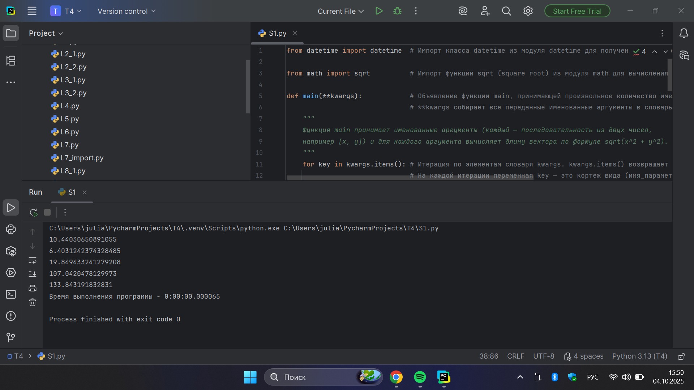

**Выводы:** Программа демонстрирует использование **kwargs и модулей datetime и math, корректно рассчитывая длину векторов и время выполнения.

## Самостоятельная работа №2
### Напишите программу, которая будет заменять игральную кость с 6 гранями. Если значение равно 5 или 6, то в консоль выводится «Вы победили», если значения 3 или 4, то вы рекурсивно должны вызвать эту жe функцию, если значение 1 или 2, то в консоль выводится «Вы проиграли». При этом каждый вызов функции необходимо выводить B консоль значение “кубика”. Для выполнения задания необходимо использовать стандартную библиотеку random. Программу нужно написать, используя одну функцию и “точку входа”.

**Код:**

```python
import random

def dice():
    roll = random.randint(1, 6)
    print(f"Выпало число: {roll}")
    if roll in [5, 6]:
        print("Вы победили!")
    elif roll in [3, 4]:
        dice()
    else:
        print("Вы проиграли!")

if __name__ == "__main__":
    dice()
```

**Результат:**

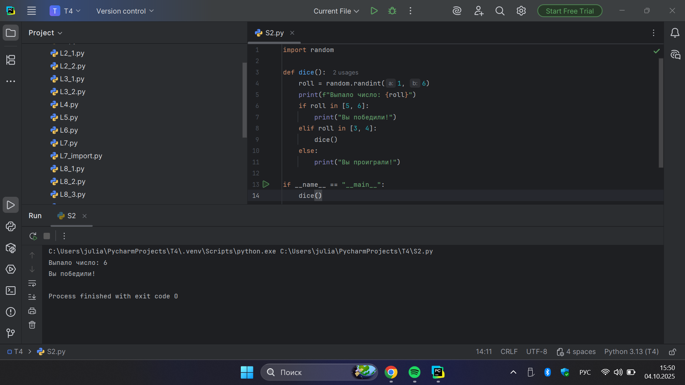

**Выводы:** Программа корректно моделирует бросок кубика, реализует рекурсию и выводит результаты в зависимости от значения.

## Самостоятельная работа №3
### Напишите программу, которая будет выводить текущее время, с точностью до секунд на протяжении 5 секунд. Программу нужно написать с использованием цикла. Подсказка: необходимо использовать модуль datetime и time, а также вам необходимо как-то “усыплять” программу на 1 секунду. 

**Код:**

```python
from datetime import datetime
import time

for i in range(5):
    print(datetime.now().strftime("%H:%M:%S"))
    time.sleep(1)
```

**Результат:**

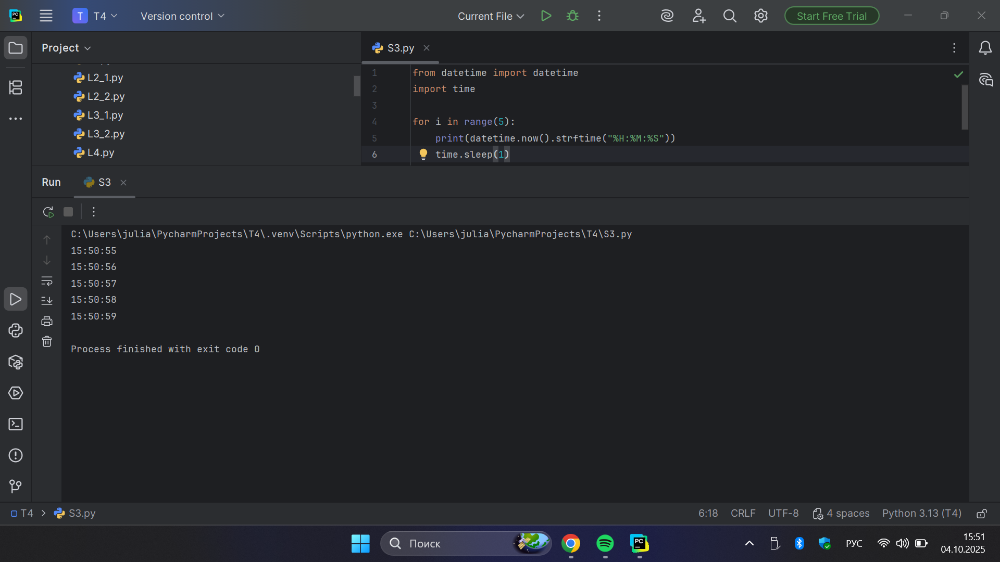

**Выводы:** Программа корректно выводит текущее время с интервалом в одну секунду на протяжении пяти секунд.

## Самостоятельная работа №4
### Напишите программу, которая считает среднее арифметическое от аргументов вызываемое функции, с условием того, что изначальное количество этих аргументов неизвестно. Программу необходимо реализовать используя одну функцию и “точку входа”. 

**Код:**

```python
def average(*args):
    return sum(args) / len(args)

if __name__ == "__main__":
    print(average(3, 5, 7, 9))
```

**Результат:**

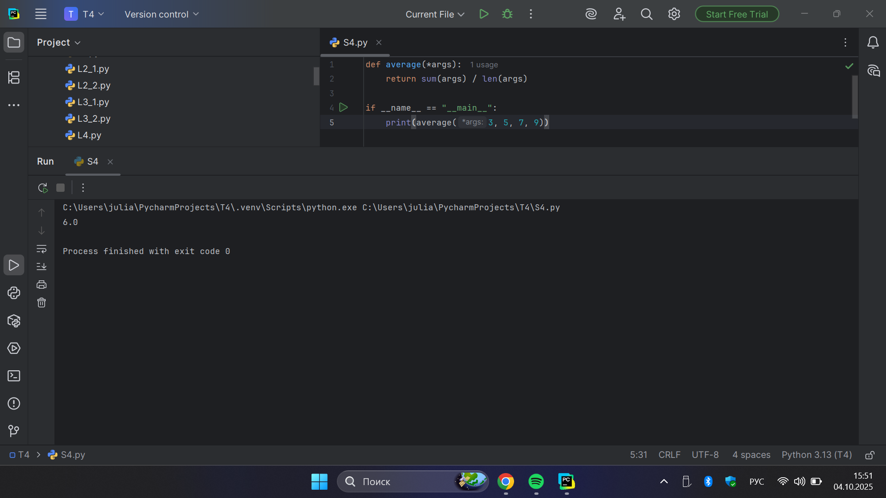

**Выводы:** Функция корректно вычисляет среднее арифметическое при неизвестном количестве аргументов.

## Самостоятельная работа №5
### Создайте два Python файла, в одном будет выполняться вычисление площади треугольника при помощи формулы Герона (необходимо реализовать через функцию), а во втором будет происходить взаимодействие с пользователем (получение всей необходимой информации и вывод результатов). Напишите эту программу и выведите в консоль полученную площадь.

**Код:**

```python
from S5_import import triangle_area

a = float(input("Введите сторону a: "))
b = float(input("Введите сторону b: "))
c = float(input("Введите сторону c: "))

area = triangle_area(a, b, c)
print(f"Площадь треугольника: {area}")
```

**Результат:**

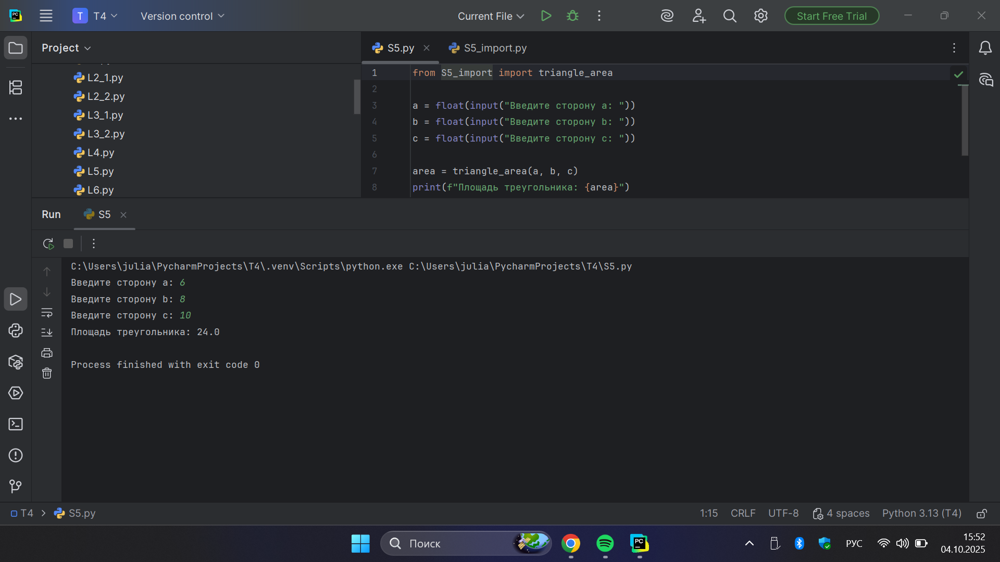

**Код:**

```python
from math import sqrt

def triangle_area(a, b, c):
    s = (a + b + c) / 2
    return sqrt(s * (s - a) * (s - b) * (s - c))
```

**Результат:**

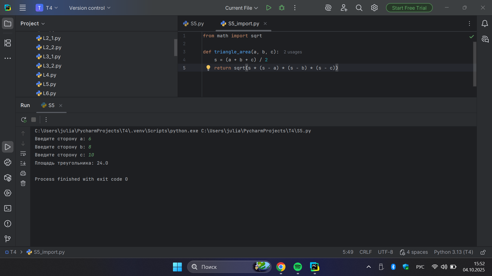

**Выводы:** Программа успешно вычисляет площадь треугольника по формуле Герона, используя модульный подход с импортом функции.

## Общие выводы по теме
В ходе выполнения лабораторных и самостоятельных работ по теме №4 были закреплены навыки создания и использования функций в языке Python. Рассмотрены различные способы передачи аргументов, включая позиционные, именованные, а также использование конструкций *args и **kwargs. Изучено применение стандартных модулей math, datetime, random и time, а также организация программной структуры с использованием точки входа и импорта функций из внешних файлов. Задания позволили на практике отработать принципы модульности, повторного использования кода и расширения функциональности программ.
