# Тема 5. Базовые коллекции: строки и списки
Отчет по Теме #5 выполнил(а):
- Бобовский Яков Евгеньевич
- ИВТ-23-1

| Задание | Лаб_раб | Сам_раб |
| ------ | ------ | ------ |
| Задание 1 | + | + |
| Задание 2 | + | + |
| Задание 3 | + | + |
| Задание 4 | + | + |
| Задание 5 | + | + |
| Задание 6 | + |  |
| Задание 7 | + |  |
| Задание 8 | + |  |
| Задание 9 | + |  |
| Задание 10 | + |  |

знак "+" - задание выполнено; знак "-" - задание не выполнено;

Работу проверили:
- к.э.н., доцент Панов М.А.	

## Лабораторная работа №1
### Друзья предложили вам поиграть в игру “найди отличия и убери повторения (версия для программистов)”. Суть игры состоит в тои, что на вход программы поступает два множества, а ваша задача вывести все элементы первого, которых нет во втором.

**Код:**

```python
set_1 = {'White', 'Black', 'Red', 'Pink'}
set_2 = {'Red', 'Green', 'Blue', 'Red'}
print('1', set_1 - set_2)

set_1 = {'White', 'Black', 'Red', 'Pink', 'Black', 'White'}
set_2 = {'Red', 'Green', 'Blue', 'Red'}
print('2', set_1 - set_2)

set_1 = {'White', 'Black', 'Red', 'Pink', 'Red', 'Red'}
set_2 = {'Red', 'Green', 'Red', 'Red', 'Red'}
print('3', set_1 - set_2)
```

**Результат:**

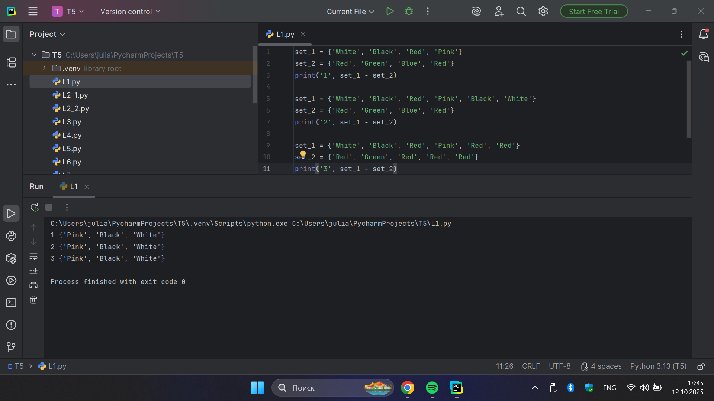

**Выводы:** Программа успешно выполняет операцию разности множеств и корректно выводит элементы первого множества, которых нет во втором.

## Лабораторная работа №2
### Напишите две одинаковые программы, только одна будет использовать set(), а вторая frozenset() и попробуйте к исходному множеству добавить несколько элементов, например, через цикл.

**Код:**

```python
a = set('abcdefg')
print(a)
for i in range(1, 5):
    a.add(i)
print(a)    
```

**Результат:**

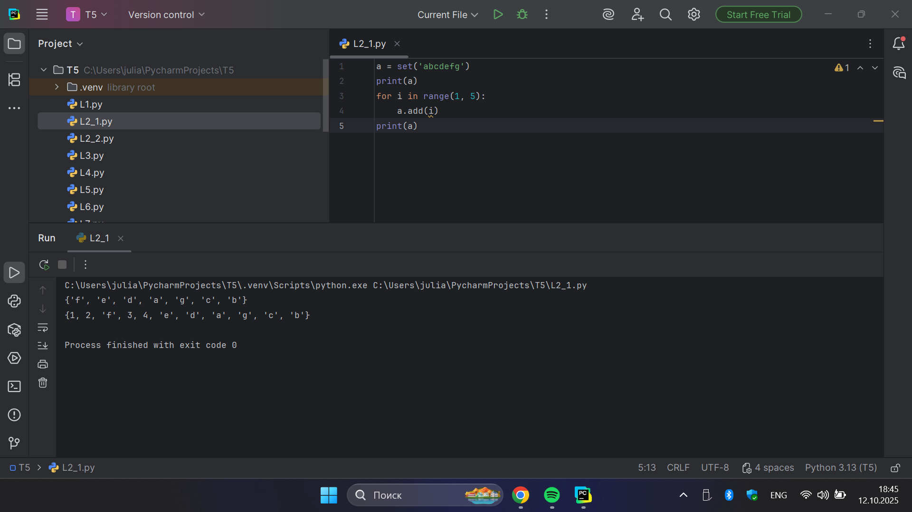

**Код:**

```python
a = frozenset('abcdefg')
print(a)
for i in range(1, 5):
    a.add(i)
print(a)
```

**Результат:**

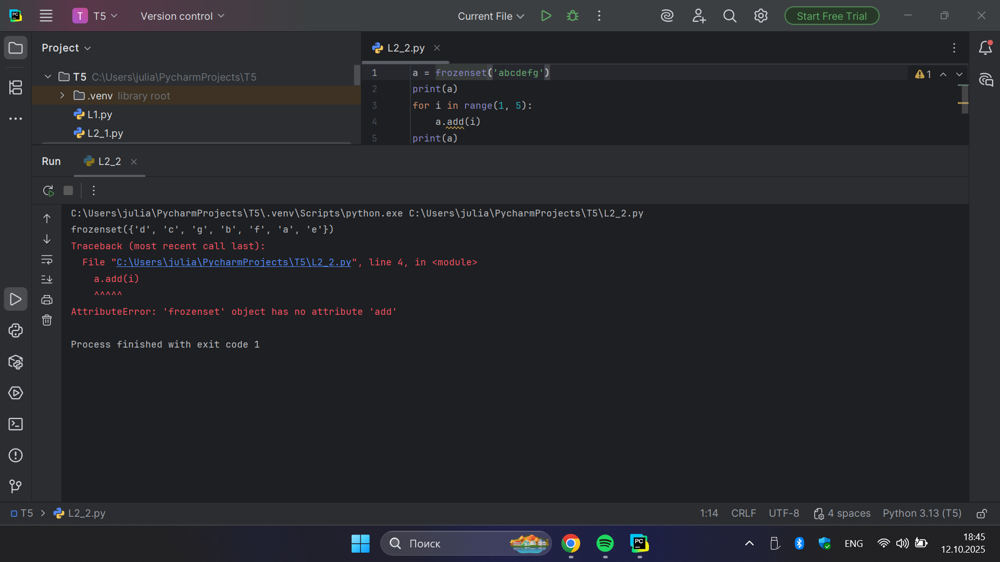

**Выводы:** Продемонстрированы различия между типами set и frozenset - первый является изменяемым, второй неизменяемым, что подтверждается попыткой добавить элементы через цикл.

## Лабораторная работа №3
### На вход в программу поступает список (минимальной длиной 2 символа). Напишите программу, которая будет менять первый и последний элемент списка. 

**Код:**

```python
def replace(input_list):
    memory = input_list[0]
    input_list[0] = input_list[-1]
    input_list[-1] = memory
    return input_list
print(replace([1, 2, 3, 4, 5]))
```

**Результат:**

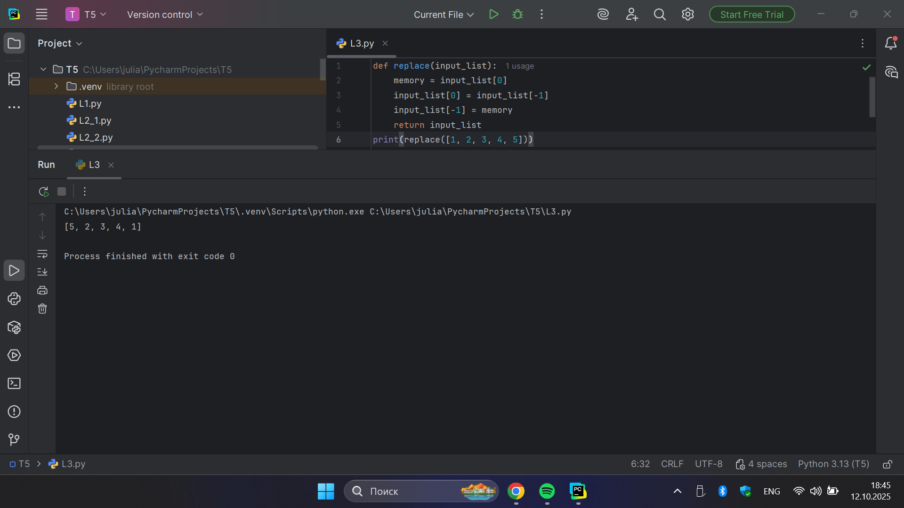

**Выводы:** Функция корректно меняет местами первый и последний элементы списка, демонстрируя работу с индексами.

## Лабораторная работа №4
###  На вход в программу поступает список (минимальной длиной 10 символов). Напишите программу, которая выводит элементы с индексами от 2 до 6. В программе необходимо использовать “срез”. 

**Код:**

```python
a = [12, 54, 32, 57, 843, 2346, 765, 75, 25, 234, 756, 23]
print(a[2:6])
```

**Результат:**

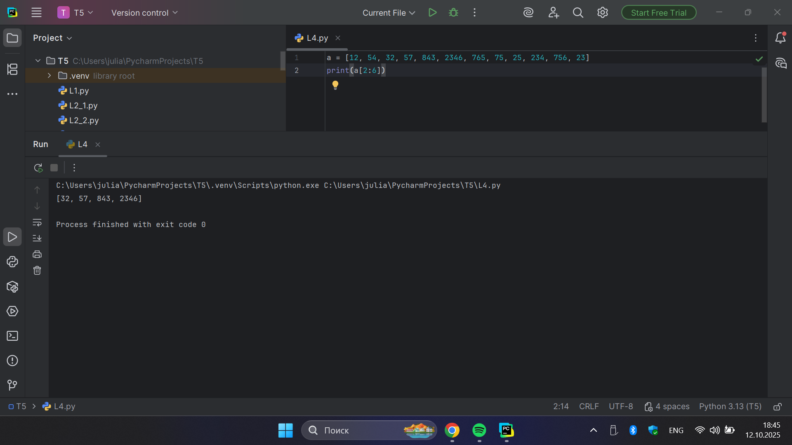

**Выводы:** Программа корректно использует срезы для вывода элементов списка по указанным индексам.

## Лабораторная работа №5
###  Иван задумался о поиске «бесполезного» числа, полученного из списка. Суть поиска в следующем: он берет произвольный список чисел, находит самое большое из них, а затем делит его на длину списка. Студент пока не придумал, где может пригодиться подобное значение, но ищет у вас помощи в реализации такой функции useless().

**Код:**

```python
def useless(lst):
    return max(lst) / len(lst)

print(useless([3, 5, 7, 3, 33]))
print(useless([-12.5, 54, 77.3, 0, -36, 98.2, -63, 21.7, 47, -89.6]))
print(useless([-25.8, 86, 12.5, -56, 73.2, 0, 43, -91.5, 65.9, -7]))
```

**Результат:**

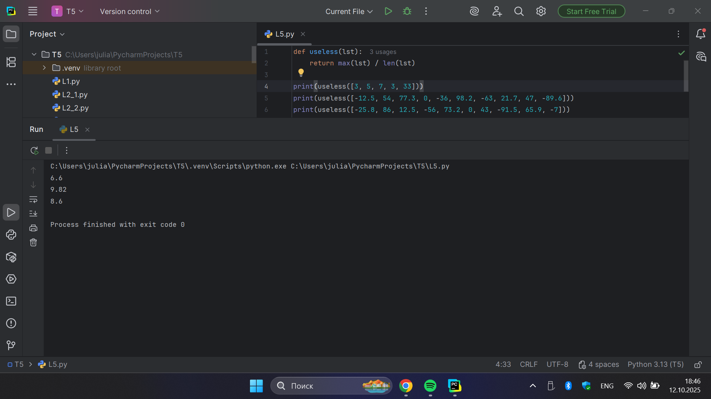

**Выводы:** Реализована функция, которая находит максимальный элемент списка и делит его на длину списка; результат вычисляется корректно.

## Лабораторная работа №6
### Ребята не могут определится каким супергероем они хотят стать. У них есть случайно составленный список супергероев, и вы должны определить кто из ребят будет каким супергероем. Необходимо использовать разделение списков.

**Код:**

```python
superheroes = ['superman', 'spiderman', 'batman']
nikolay, vasiliy, ivan = superheroes
print('Николай -', nikolay)
print('Василий -', vasiliy)
print('Иван -', ivan)
```

**Результат:**

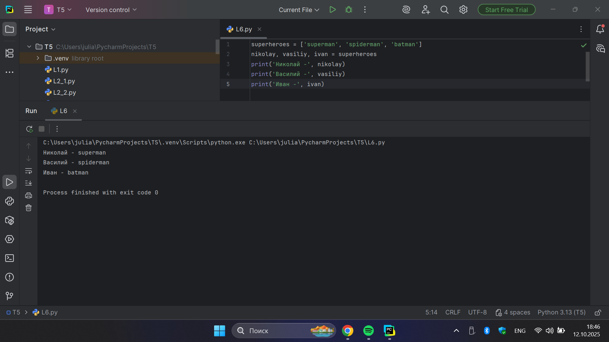

**Выводы:** Программа корректно выполняет распаковку списка и присваивает значения переменным.

## Лабораторная работа №7
###  Вовочка, насмотревшись передачи “Слабое звено” решил написать программу, которая также будет находить самое слабое звено (минимальный элемент) и удалять его, только делать он это хочет не с людьми, а со списком. Помогите Вовочке с реализацией программы. 

**Код:**

```python
a = [-25.8, 86, 12.5, -56, 73.2, 0, 43, -91.5, 65.9, -7]
a.sort()
print('Отсортированный список:\n', a)
a.pop(0)
print('Отсортированный список без наименьшего элемента:\n', a)
```

**Результат:**

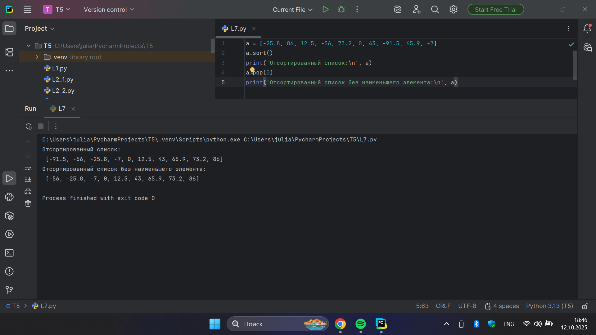

**Выводы:** Реализована сортировка списка и удаление минимального элемента; программа работает корректно.

## Лабораторная работа №8
### Михаил решил создать большой п-мерный список, для этого он случайным образом создал несколько списков, состоящих минимум из 3, а максимум из 10 элементов и поместил их B один большой список. Он также как и Иван He знает зачем ему это сейчас нужно, но надеется на то, что это пригодится ему в будущем.

**Код:**

```python
from random import randint

def list_maker():
    a = [randint(1, 100)] * randint(3, 10)
    return a

if __name__ == '__main__':
    result = []
    for i in range(randint(1, 5)):
        result.append(list_maker())
    print(result)
```

**Результат:**

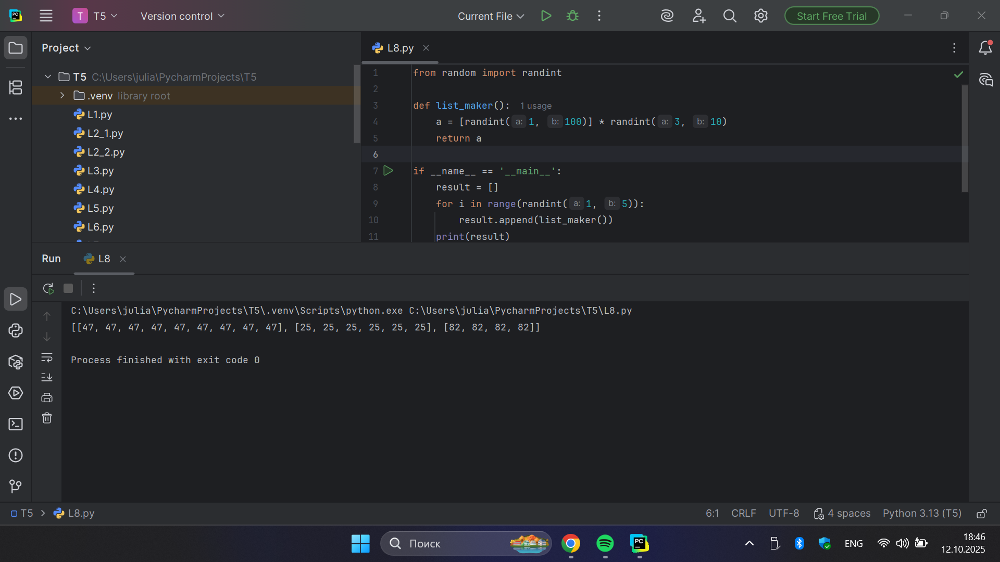

**Выводы:** Программа успешно создает вложенные списки случайной длины, демонстрируя работу с модулями и генерацией данных.

## Лабораторная работа №9
###  Вы работаете в ресторане и отвечает за статистику покупок, ваша задача сравнить между собой заказы покупателей, которые указаны в разном порядке. Реализуйте функцию superset(), которая принимает 2 множества.

**Код:**

```python
def superset(set_1, set_2):
    if set_1 > set_2:
        print(f'Объект {set_1} является чистым супермножеством')
    elif set_1 == set_2:
        print(f'Множества равны')
    elif set_1 < set_2:
        print(f'Объект {set_2} является чистым супермножеством')
    else:
        print('Супермножество не обнаружено')
        
if __name__ == '__main__':
    superset({1, 8, 3, 5}, {3, 5})
    superset({1, 8, 3, 5}, {5, 3, 8, 1})
    superset({3, 5}, {5, 3, 8, 1})
    superset({90, 100}, {3, 5})
```

**Результат:**

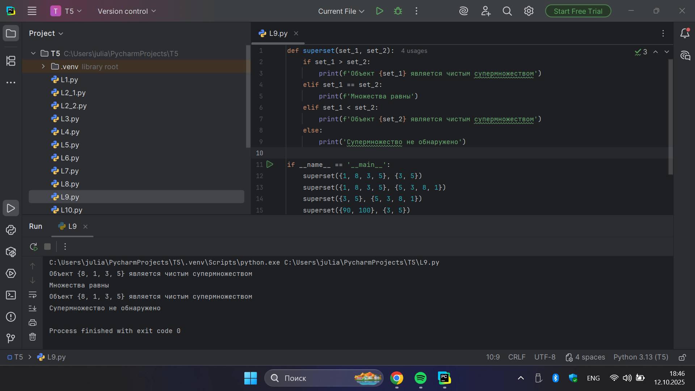

**Выводы:** Функция правильно определяет отношение супермножества между двумя множествами и выводит соответствующее сообщение.

## Лабораторная работа №10
### Вам дан произвольный список. Представьте его в обратном порядке. Программа должна занимать не более двух строк в редакторе кода. 

**Код:**

```python
my_list = [2, 5, 8, 3]
print(my_list[::-1])
```
**Результат:**

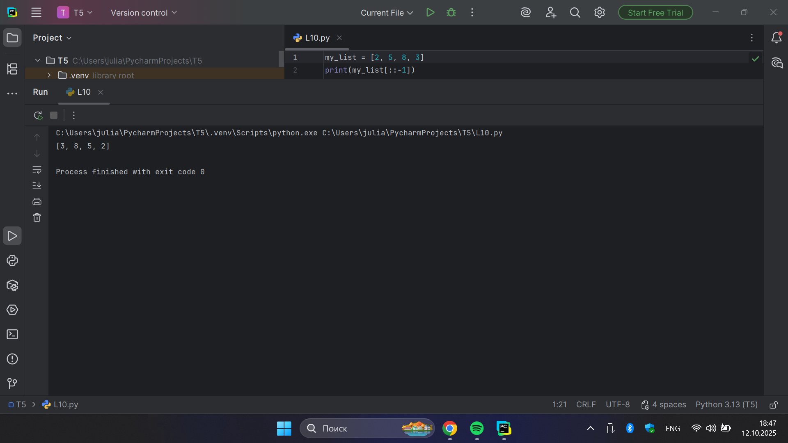

**Выводы:** Программа корректно переворачивает список с использованием среза, занимая минимум строк кода.

## Самостоятельная работа №1  
### Ресторан на предприятии ведет учет посещений за неделю при помощи кода работника. У них есть список со всеми посещениями за неделю. Ваша задача почитать: Сколько было выдано чеков; Сколько разных людей посетило ресторан; Какой работник посетил ресторан больше всех раз.

**Код:**

```python
from collections import Counter

checks = [8734, 2345, 8201, 6621, 9999, 1234, 5678, 8201, 8888, 4321, 3365,
          1478, 9865, 5555, 7777, 9998, 1111, 2222, 3333, 4444, 5556, 6666,
          5410, 7778, 8889, 4445, 1439, 9604, 8201, 3365, 7502, 3016, 4928,
          5837, 8201, 2643, 5017, 9682, 8530, 3250, 7193, 9051, 4506, 1987,
          3365, 5410, 7168, 7777, 9865, 5678, 8201, 4445, 3016, 4506, 4506]

counts = Counter(checks)
most_common = counts.most_common(1)[0]

print("Всего чеков:", len(checks))
print("Уникальных посетителей:", len(set(checks)))
print(f"Чаще всех посещал: {most_common[0]} - {most_common[1]} раз")
```

**Результат:**

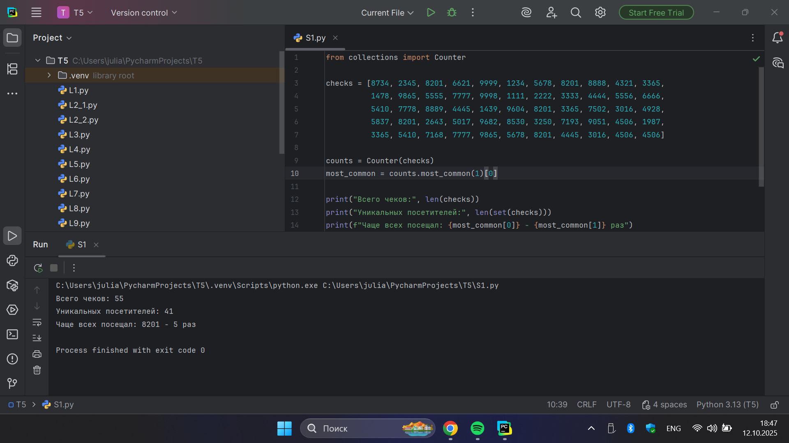

**Выводы:** Реализована обработка данных с использованием модуля collections; программа корректно считает количество чеков, уникальных посетителей и находит наиболее частого.

## Самостоятельная работа №2
### На физкультуре студенты сдавали бег, у преподавателя физкультуры есть список всех результатов, ему нужно узнать: Три лучшие результата; Три худшие результата; Все результаты начиная с 10. Ваша задача помочь ему в этом. 

**Код:**

```python
results = [10.2, 14.8, 19.3, 22.7, 12.5, 33.1, 38.9, 21.6, 26.4, 17.1,
           30.2, 35.7, 16.9, 27.8, 24.5, 16.3, 18.7, 31.9, 12.9, 37.4]

sorted_results = sorted(results)

print("Лучшие 3:", sorted_results[:3])
print("Худшие 3:", sorted_results[-3:])
print("Все результаты от 10:", [r for r in sorted_results if r >= 10])
```

**Результат:**

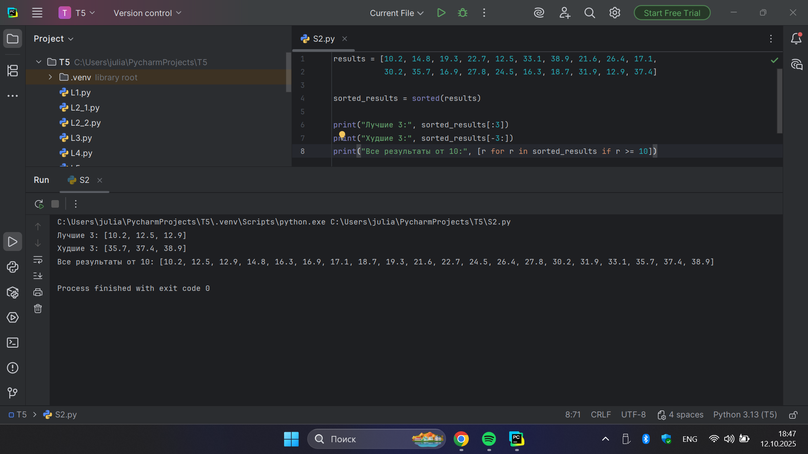

**Выводы:** Программа сортирует результаты и корректно определяет лучшие и худшие показатели, а также фильтрует данные по заданному условию.

## Самостоятельная работа №3
### У вас есть три списка с элементами, каждый элемент которых — длина стороны треугольника, ваша задача найти площади двух треугольников, составленные из максимальных и минимальных элементов полученных списков. Результатом выполнения задачи будет: листинг кода, и вывод в консоль, в котором будут указаны два этих значения. 

**Код:**

```python
import math

one = [12, 25, 3, 48, 71]
two = [5, 18, 40, 62, 98]
three = [4, 21, 37, 56, 84]

def triangle(a, b, c):
    if a + b > c and a + c > b and b + c > a:
        p = (a + b + c) / 2
        return math.sqrt(p * (p - a) * (p - b) * (p - c))
    return None

nums = one + two + three
min = sorted(nums)[:3]
max = sorted(nums)[-3:]

amin = triangle(*min)
amax = triangle(*max)

print(f"Площадь из минимальных {min}: {amin:.2f}")
print(f"Площадь из максимальных {max}: {amax:.2f}")
```

**Результат:**

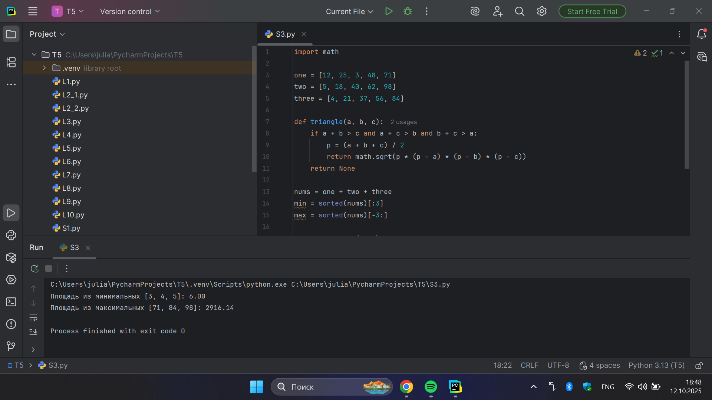

**Выводы:** Реализован расчет площадей треугольников по формуле Герона; программа корректно обрабатывает данные и выводит результаты.

## Самостоятельная работа №4
### Допустим, что все оценки студента за семестр хранятся B одном списке. Ваша задача удалить из этого списка все двойки, а все тройки заменить на четверки. 

**Код:**

```python
grades1 = [2, 3, 4, 5, 3, 4, 5, 2, 2, 5, 3, 4, 3, 5, 4]
grades2 = [4, 2, 3, 5, 3, 5, 4, 2, 2, 5, 4, 3, 5, 3, 4]
grades3 = [5, 4, 3, 3, 4, 3, 3, 5, 5, 3, 3, 3, 3, 4, 4]

def fixedGrades(grades):
    return [4 if g == 3 else g for g in grades if g != 2]

print("Исправленные оценки 1:", fixedGrades(grades1))
print("Исправленные оценки 2:", fixedGrades(grades2))
print("Исправленные оценки 3:", fixedGrades(grades3))
```

**Результат:**

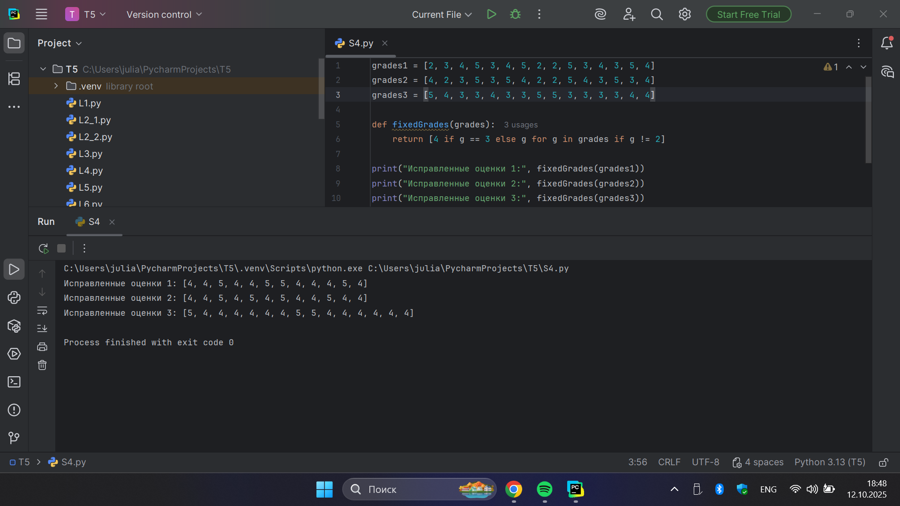

**Выводы:** Программа корректно модифицирует список оценок, удаляя двойки и заменяя тройки на четверки.

## Самостоятельная работа №5
### Вам предоставлены списки натуральных чисел, из них необходимо сформировать множества. При этом следует соблюдать это правило: если какое-либо число повторяется, то преобразовать его в строку по следующему образцу: например, если число 4 повторяется 3 раза, то B множестве будет следующая запись: само число 4, строка «44», строка «444». 

**Код:**

```python
from collections import Counter

list_1 = [1, 1, 3, 3, 1]
list_2 = [5, 5, 5, 5, 5, 5, 5, 5]
list_3 = [2, 2, 1, 2, 2, 5, 6, 7, 1, 3, 2, 2]

def newSet(numbers):
    result = set()
    counts = Counter(numbers)

    for num, count in counts.items():
        result.add(num)
        for i in range(2, count + 1):
            result.add(str(num) * i)
    return result

print(newSet(list_1))
print(newSet(list_2))
print(newSet(list_3))
```

**Результат:**

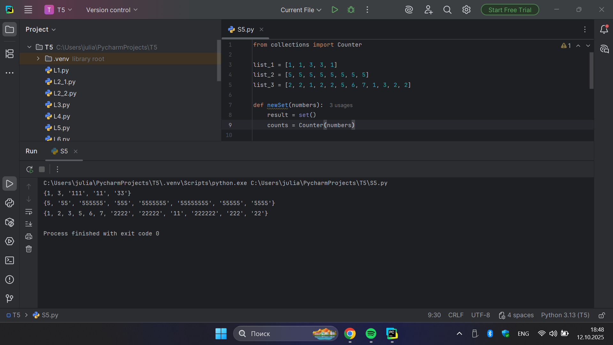

**Выводы:** Программа корректно формирует множества из списков, преобразуя повторяющиеся элементы в строковые значения по заданному правилу.

## Общие выводы по теме
В ходе выполнения лабораторных и самостоятельных работ по теме №5 были закреплены навыки работы с базовыми коллекциями Python - строками, списками и множествами. Рассмотрены основные операции над ними: создание, изменение, сортировка, срезы и объединение. Особое внимание уделено различиям между изменяемыми и неизменяемыми структурами данных (set и frozenset), а также использованию встроенных функций и модулей для обработки информации. Выполненные задания способствовали формированию практических навыков работы с коллекциями, что является основой для дальнейшего изучения алгоритмов и структур данных в языке Python.
