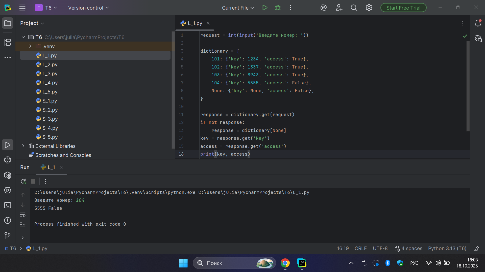
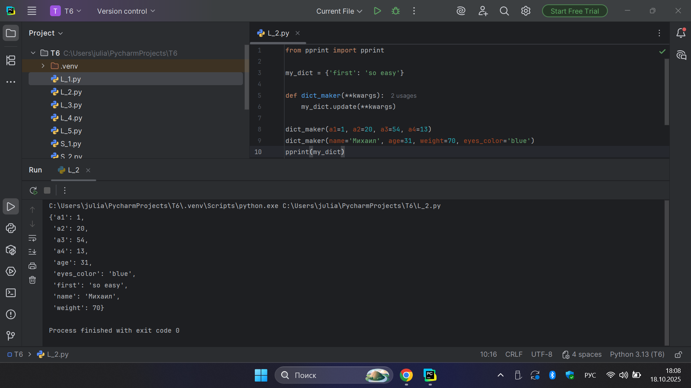
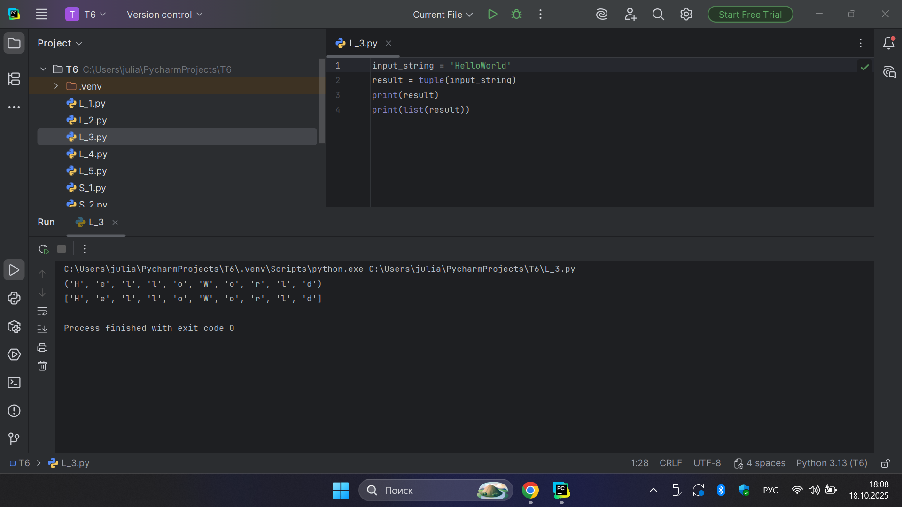
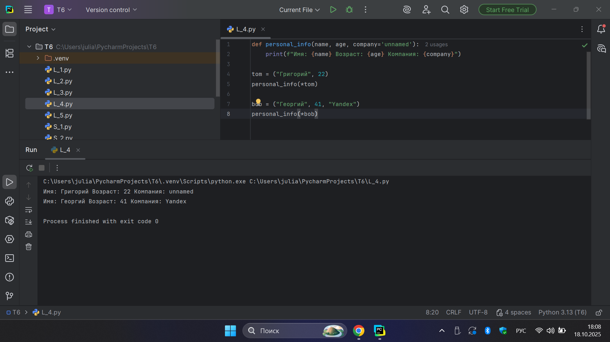
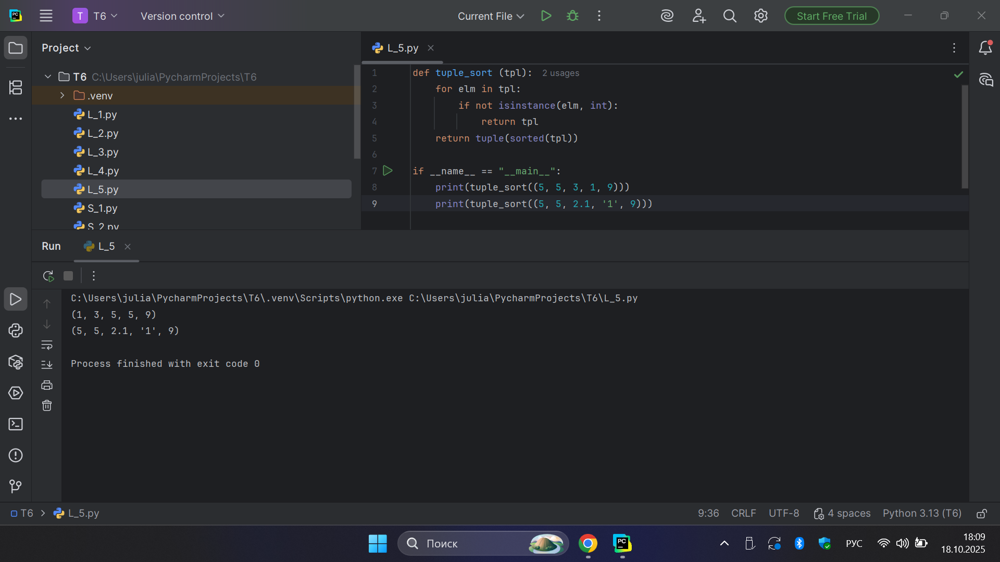
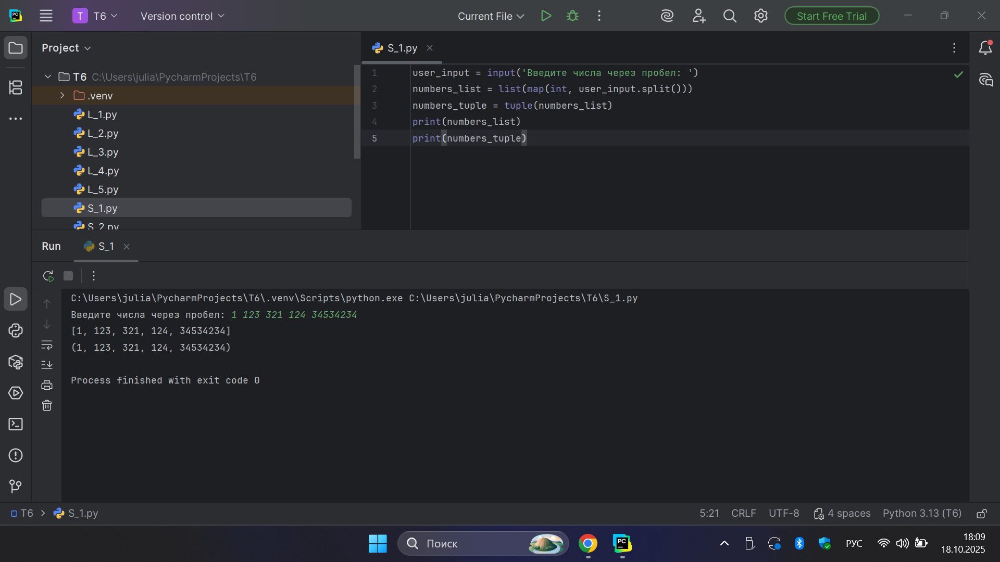
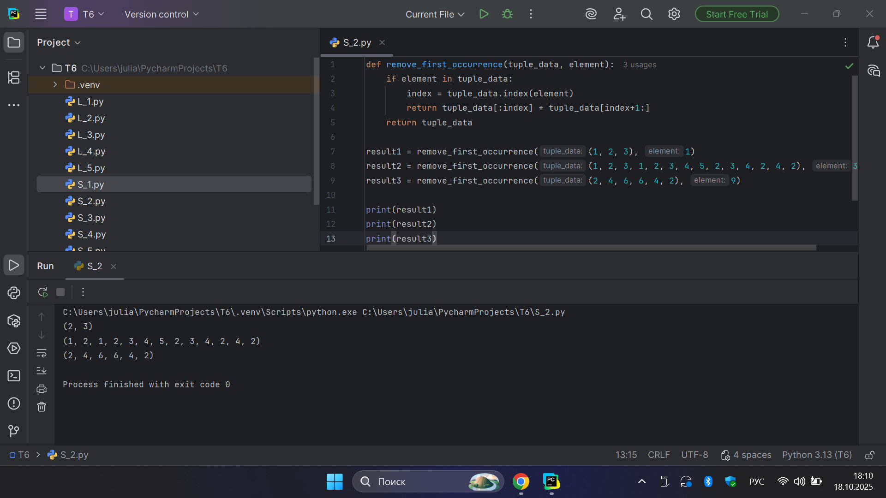
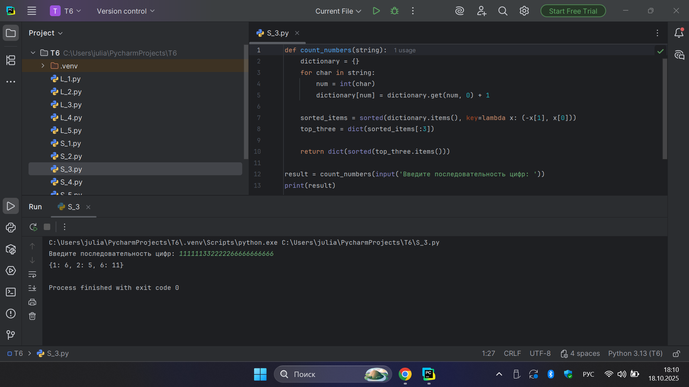
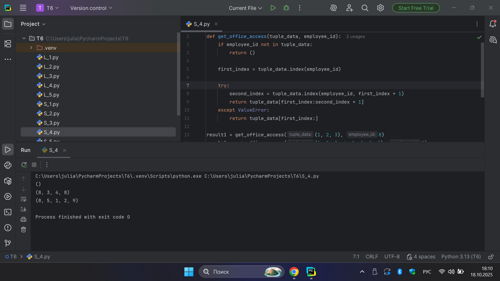
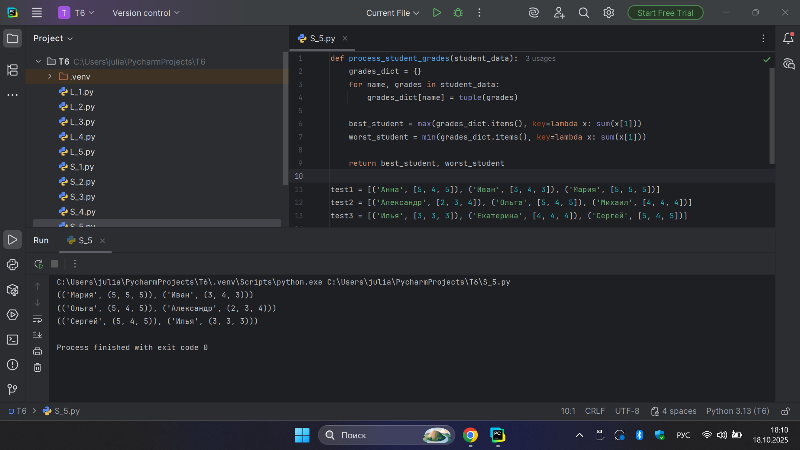

# Тема 6. Базовые коллекции: словари, кортежи
Отчет по Теме #6 выполнил(а):
- Бобовский Яков Евгеньевич
- ИВТ-23-1

| Задание | Лаб_раб | Сам_раб |
| ------ | ------ | ------ |
| Задание 1 | + | + |
| Задание 2 | + | + |
| Задание 3 | + | + |
| Задание 4 | + | + |
| Задание 5 | + | + |

знак "+" - задание выполнено; знак "-" - задание не выполнено;

Работу проверили:
- к.э.н., доцент Панов М.А.	

## Лабораторная работа №1
### Написать программу для учителей, которая будет при вводе кабинета писать для него ключ доступа и статус, занят кабинет или нет.

**Код:**

```python
request = int(input('Введите номер: '))

dictionary = {
    101: {'key': 1234, 'access': True},
    102: {'key': 1337, 'access': True},
    103: {'key': 8943, 'access': True},
    104: {'key': 5555, 'access': False},
    None: {'key': None, 'access': False},
}

response = dictionary.get(request)
if not response:
    response = dictionary[None]
key = response.get('key')
access = response.get('access')
print(key, access)
```

**Результат:**



**Выводы:** Программа выводит ключ и статус кабинета по введённому номеру.

## Лабораторная работа №2
### Алексей решил создать самый большой словарь в мире. Для этого он придумал функцию dict_maker (**kwargs), которая принимает неограниченное количество параметров «ключ: значение» и обновляет созданный им словарь my_dict, состоящий всего из одного элемента «first» со значением «so easy». Помогите Алексею создать данную функцию.

**Код:**

```python
from pprint import pprint

my_dict = {'first': 'so easy'}

def dict_maker(**kwargs):
    my_dict.update(**kwargs)

dict_maker(a1=1, a2=20, a3=54, a4=13)
dict_maker(name='Михаил', age=31, weight=70, eyes_color='blue')
pprint(my_dict)
```

**Результат:**



**Выводы:** Функция добавляет новые пары ключ–значение в словарь.

## Лабораторная работа №3
### Напишем любую строку, которую будем делить и “обвернем” ее в tuple и дальше мы можем как нам угодно с ней работать, например, сделать ее списком (тогда получится полный аналог split()) или же работать с ним дальше, как с кортежем.

**Код:**

```python
input_string = 'HelloWorld'
result = tuple(input_string)
print(result)
print(list(result))
```

**Результат:**



**Выводы:** Строка преобразуется в кортеж и список символов.

## Лабораторная работа №4
### Написать крутую функцию, которая будет писать имя, возраст и место работы, но при этом на вход этой функции будет поступать кортеж.

**Код:**

```python
def personal_info(name, age, company='unnamed'):
    print(f"Имя: {name} Возраст: {age} Компания: {company}")

tom = ("Григорий", 22)
personal_info(*tom)

bob = ("Георгий", 41, "Yandex")
personal_info(*bob)
```

**Результат:**



**Выводы:** Функция принимает кортеж с данными и выводит их форматированно.

## Лабораторная работа №5
### Для сопровождения первых лиц государства X нужен кортеж, но никто не может определиться с порядком машин, поэтому вам нужно написать функцию, которая будет сортировать кортеж, состоящий из целых чисел по возрастанию, и возвращает его.

**Код:**

```python
def tuple_sort (tpl):
    for elm in tpl:
        if not isinstance(elm, int):
            return tpl
    return tuple(sorted(tpl))

if __name__ == "__main__":
    print(tuple_sort((5, 5, 3, 1, 9)))
    print(tuple_sort((5, 5, 2.1, '1', 9)))
```

**Результат:**



**Выводы:** Кортеж чисел сортируется по возрастанию с проверкой типов.

## Самостоятельная работа №1  
### Вы хотите принимать от пользователя последовательность чисел, разделенных пробелом, а после переформатировать эти данные в список и кортеж. Реализуйте вашу задумку. Для получения начальных данных используйте input(). 

**Код:**

```python
user_input = input('Введите числа через пробел: ')
numbers_list = list(map(int, user_input.split()))
numbers_tuple = tuple(numbers_list)
print(numbers_list)
print(numbers_tuple)
```

**Результат:**



**Выводы:** Введённые числа преобразуются в список и кортеж.

## Самостоятельная работа №2
### Студент решил создать функцию, которая будет удалять первое появление определенного элемента из кортежа по значению и возвращать кортеж без него. Попробуйте повторить шедевр не признающего авторитеты начинающего программиста.

**Код:**

```python
def remove_first_occurrence(tuple_data, element):
    if element in tuple_data:
        index = tuple_data.index(element)
        return tuple_data[:index] + tuple_data[index+1:]
    return tuple_data

result1 = remove_first_occurrence((1, 2, 3), 1)
result2 = remove_first_occurrence((1, 2, 3, 1, 2, 3, 4, 5, 2, 3, 4, 2, 4, 2), 3)
result3 = remove_first_occurrence((2, 4, 6, 6, 4, 2), 9)

print(result1)
print(result2)
print(result3)
```

**Результат:**



**Выводы:** Из кортежа удаляется первое появление заданного элемента.

## Самостоятельная работа №3
### Ребята поспорили кто из них одним нажатием на numpad наберет больше повторяющихся цифр, но не понимают, как узнать победителя. Вам им нужно в этом помочь. Дана строка в виде случайной последовательности чисел от 0 до 9 (длина строки минимум 15 символов). Требуется создать словарь, который в качестве ключей будет принимать данные числа (т. е. ключи будут типом int), а в качестве значений – количество этих чисел в имеющейся последовательности.

**Код:**

```python
def count_numbers(string):
    dictionary = {}
    for char in string:
        num = int(char)
        dictionary[num] = dictionary.get(num, 0) + 1

    sorted_items = sorted(dictionary.items(), key=lambda x: (-x[1], x[0]))
    top_three = dict(sorted_items[:3])

    return dict(sorted(top_three.items()))

result = count_numbers(input('Введите последовательность цифр: '))
print(result)
```

**Результат:**



**Выводы:** Подсчитывается частота цифр в строке и выводятся наиболее частые.

## Самостоятельная работа №4
### Напишите функцию, которая на вход принимает кортеж и случайный элемент (id), его можно придумать самостоятельно. Требуется вернуть новый кортеж, начинающийся с первого появления элемента в нем и заканчивающийся вторым его появлением включительно.

**Код:**

```python
def get_office_access(tuple_data, employee_id):
    if employee_id not in tuple_data:
        return ()

    first_index = tuple_data.index(employee_id)

    try:
        second_index = tuple_data.index(employee_id, first_index + 1)
        return tuple_data[first_index:second_index + 1]
    except ValueError:
        return tuple_data[first_index:]

result1 = get_office_access((1, 2, 3), 8)
result2 = get_office_access((1, 8, 3, 4, 8, 8, 9, 2), 8)
result3 = get_office_access((1, 2, 8, 5, 1, 2, 9), 8)

print(result1)
print(result2)
print(result3)
```

**Результат:**



**Выводы:** Возвращается часть кортежа между двумя появлениями элемента.

## Самостоятельная работа №5
### Самостоятельно придумайте и решите задачу, в которой будут обязательно использоваться кортеж или список.

**Код:**

```python
def process_student_grades(student_data):
    grades_dict = {}
    for name, grades in student_data:
        grades_dict[name] = tuple(grades)

    best_student = max(grades_dict.items(), key=lambda x: sum(x[1]))
    worst_student = min(grades_dict.items(), key=lambda x: sum(x[1]))

    return best_student, worst_student

test1 = [('Анна', [5, 4, 5]), ('Иван', [3, 4, 3]), ('Мария', [5, 5, 5])]
test2 = [('Александр', [2, 3, 4]), ('Ольга', [5, 4, 5]), ('Михаил', [4, 4, 4])]
test3 = [('Илья', [3, 3, 3]), ('Екатерина', [4, 4, 4]), ('Сергей', [5, 4, 5])]

print(process_student_grades(test1))
print(process_student_grades(test2))
print(process_student_grades(test3))
```

**Результат:**



**Выводы:** Определяются лучший и худший студенты по сумме оценок.

## Общие выводы по теме
В ходе выполнения лабораторных и самостоятельных работ по теме №6 были закреплены навыки работы с базовыми коллекциями Python - словарями и кортежами. Рассмотрены основные операции над ними: создание, изменение, сортировка, обращение по ключам и индексам. Особое внимание уделено различиям между изменяемыми и неизменяемыми структурами данных, а также использованию функций и аргументов для передачи и обработки информации. Выполненные задания способствовали формированию практических навыков работы с коллекциями, что является основой для дальнейшего изучения структур данных и алгоритмов в Python.
