# Тема 7. Работа с файлами (ввод, вывод)
Отчет по Теме #7 выполнил(а):
- Бобовский Яков Евгеньевич
- ИВТ-23-1

| Задание | Лаб_раб | Сам_раб |
| ------ | ------ | ------ |
| Задание 1 | + | + |
| Задание 2 | + | + |
| Задание 3 | + | + |
| Задание 4 | + | + |
| Задание 5 | + | + |
| Задание 6 | + |  |
| Задание 7 | + |  |
| Задание 8 | + |  |
| Задание 9 | + |  |
| Задание 10 | + |  |

знак "+" - задание выполнено; знак "-" - задание не выполнено;

Работу проверили:
- к.э.н., доцент Панов М.А.	

## Лабораторная работа №1
### Составьте текстовый файл и положите его в одну директорию с программой на Python. Текстовый файл должен состоять минимум из двух строк.

**Результат:**

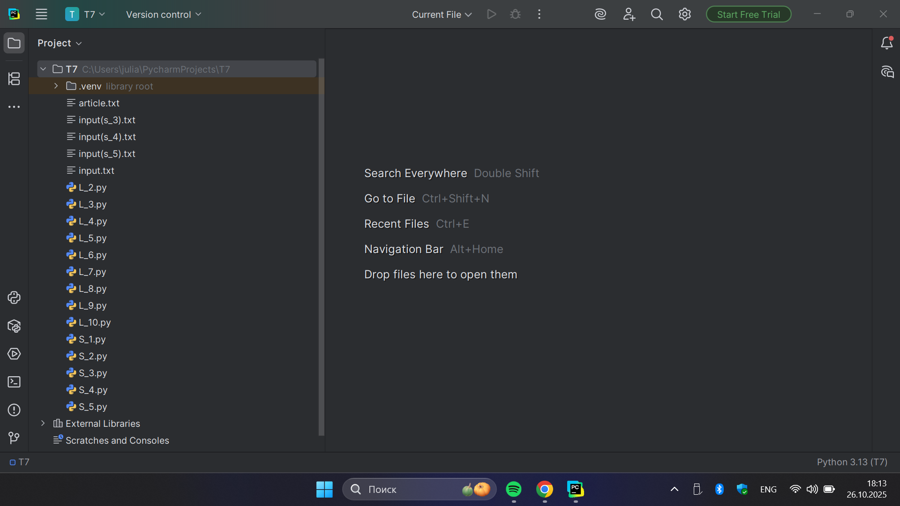

**Выводы:** Файл создан.

## Лабораторная работа №2
### Напишите программу, которая выведет только первую строку из вашего файла, при этом используйте конструкцию open()/close(). 

**Код:**

```python
f = open('input.txt', 'r')
print(f.readline())
f.close()
```

**Результат:**

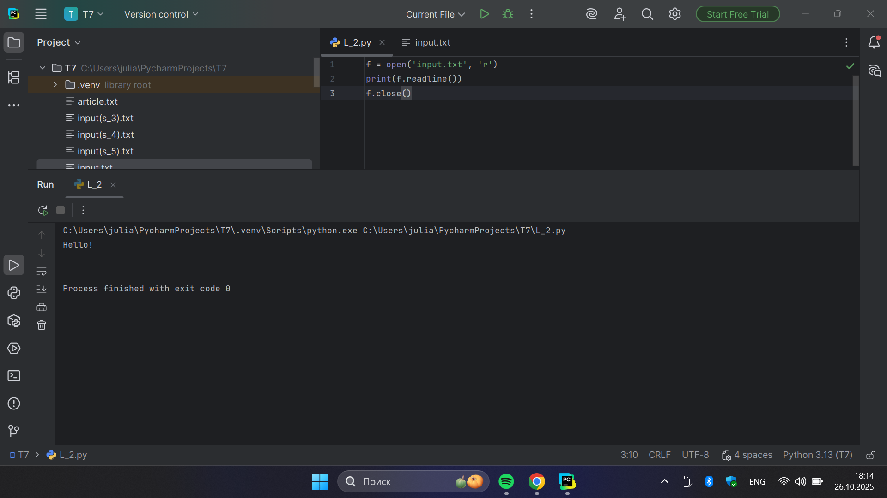

**Выводы:** Выводится первая строка файла с использованием open()/close().

## Лабораторная работа №3
### Напишите программу, которая выведет все строки из вашего файла в массиве, при этом используйте конструкцию open()/close().

**Код:**

```python
f = open('input.txt', 'r')
print(f.readlines())
f.close()
```

**Результат:**

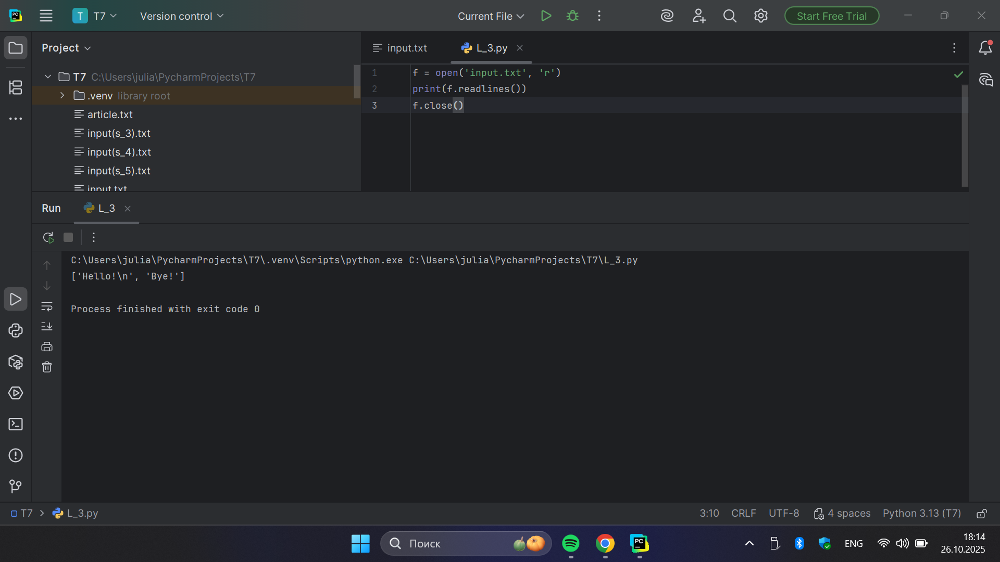

**Выводы:** Все строки файла читаются и выводятся списком.

## Лабораторная работа №4
### Напишите программу, которая выведет все строки из вашего файла в массиве, при этом используйте конструкцию with open().

**Код:**

```python
with open('input.txt') as f:
    print(f.readlines())
```

**Результат:**

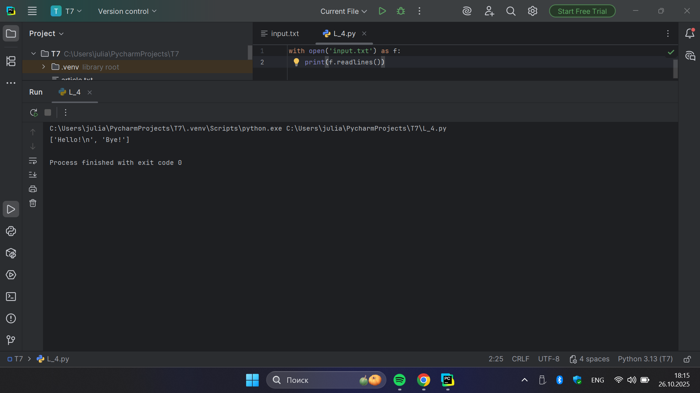

**Выводы:** Файл читается с помощью with open(), выводятся все строки.

## Лабораторная работа №5
### Напишите программу, которая выведет каждую строку из вашего файла отдельно, при этом используйте конструкцию with open().

**Код:**

```python
with open('input.txt') as f:
    for line in f:
        print(line)
```

**Результат:**

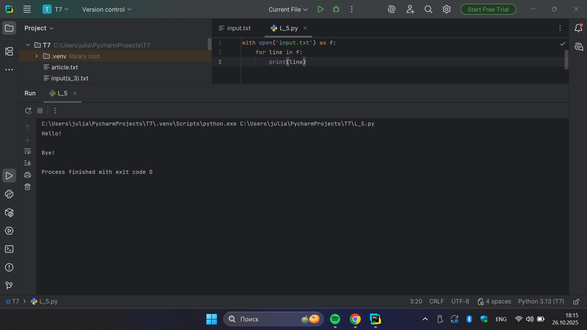

**Выводы:** Строки файла выводятся построчно.

## Лабораторная работа №6
### Напишите программу, которая будет добавлять новую строку в ваш файл, а потом выведет полученный файл в консоль.

**Код:**

```python
with open('input.txt', 'a+') as f:
    f.write('\nIm additional line')

with open('input.txt', 'r') as f:
    result = f.readlines()
    print(result)
```

**Результат:**

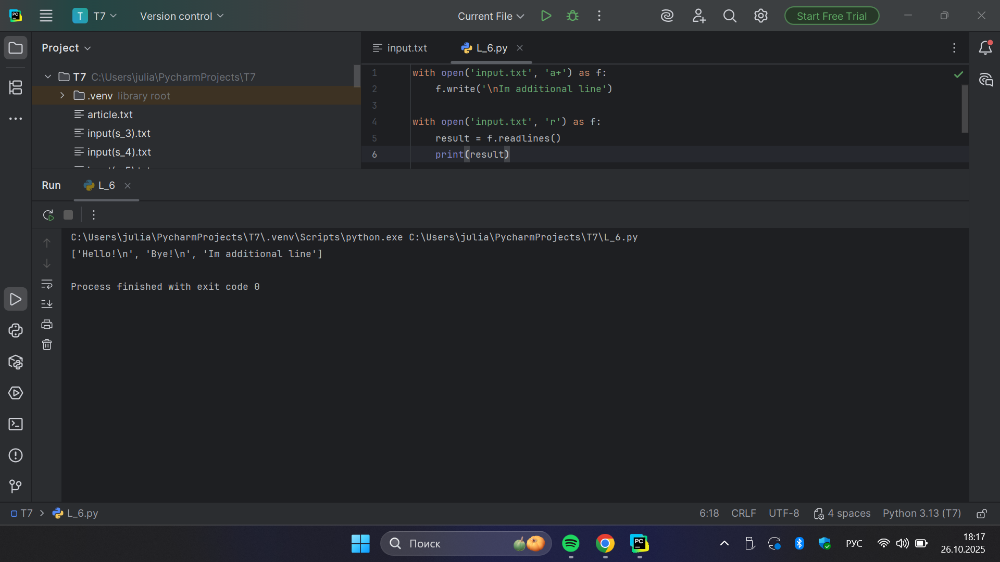
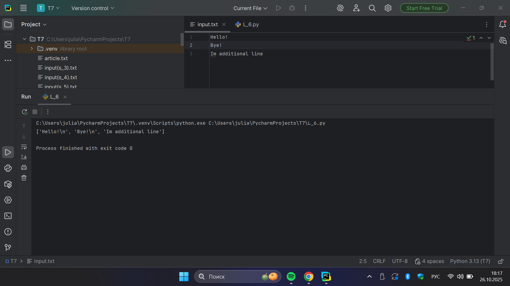

**Выводы:** В файл добавляется новая строка, результат выводится на экран.

## Лабораторная работа №7
### Напишите программу, которая перепишет всю информацию, которая была у вас в файле до этого, например напишет любые данные из произвольно вами составленного списка.

**Код:**

```python
lines = ['one', 'two', 'three']
with open('input.txt', 'w') as f:
    for line in lines:
        f.write('\nCycle run ' + line)
    print('Done!')
```

**Результат:**

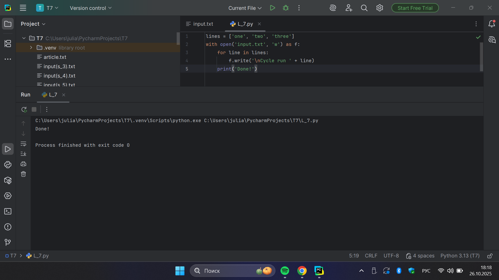
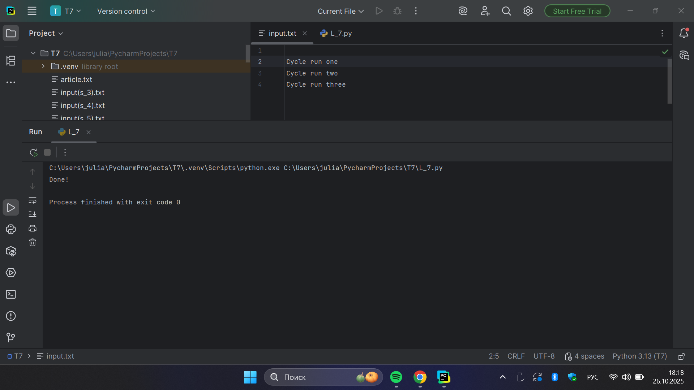

**Выводы:** Содержимое файла перезаписывается новыми данными.

## Лабораторная работа №8
### Выберите любую папку на своем компьютере, имеющую вложенные директории. Выведите на печать в терминал ее содержимое, как и всех подкаталогов при помощи функции print_docs(directory). 

**Код:**

```python
import os

def print_docs(directory):
    all_files = os.walk(directory)
    for catalog in all_files:
        print(f'Папка {catalog[0]} содержит: ')
    print (f'Директории: {", ".join([folder for folder in catalog[1]])}')
    print(f'Файлы: {", ".join([file for file in catalog[2]])}')
    print('-' * 40)

print_docs('C:/Users/julia/OneDrive/Рабочий стол/РМП')
```

**Результат:**

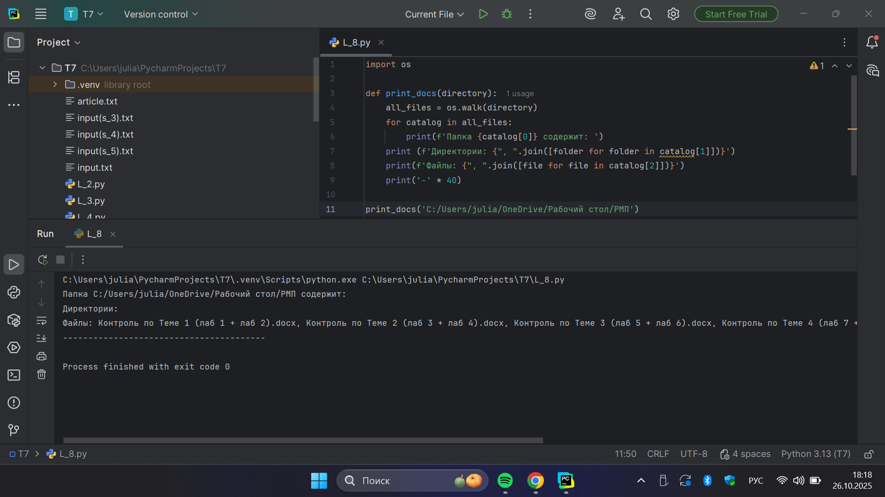

**Выводы:** Выводится структура каталогов и файлов указанной директории.

## Лабораторная работа №9
### Требуется реализовать функцию, которая выводит слово, имеющее максимальную длину (или список слов, если таковых несколько).

**Код:**

```python
def longest_words(file):
    with open(file, encoding='utf-8') as f:
        words = f.read().split()
        max_length = len(max(words, key=len))
        for word in words:
            if len(word) == max_length:
                sought_words = word
        if len(sought_words) == 1:
            return sought_words[0]
        return sought_words

print(longest_words('input.txt'))
```

**Результат:**

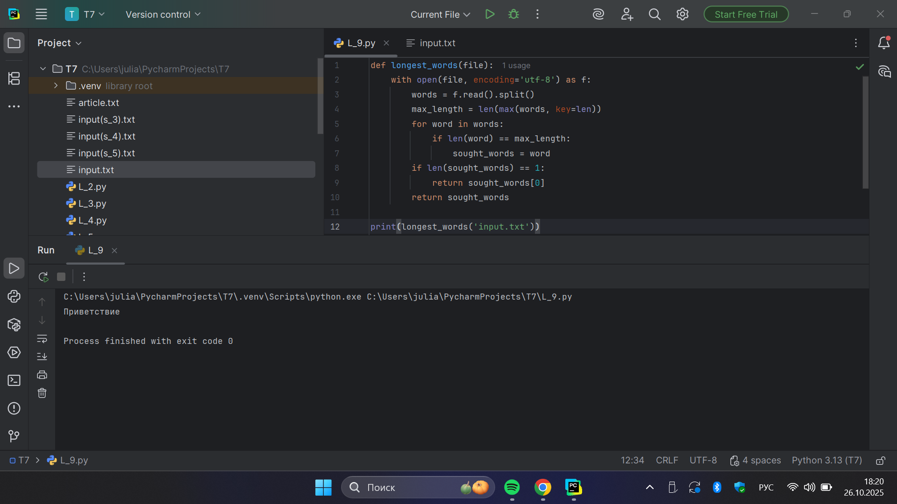

**Выводы:** Определяется и выводится самое длинное слово в файле.

## Лабораторная работа №10
### Требуется создать csv-файл «rows_300.csv» со следующими столбцами: № - номер по порядку (от 1 до 300); Секунда – текущая секунда на вашем ПК; Микросекунда – текущая миллисекунда на часах. Для наглядности на каждой итерации цикла искусственно приостанавливайте скрипт на 0,01 секунды. 

**Код:**

```python
import csv
import datetime
import time

with open('rows_300.csv', 'w', encoding='utf-8', newline='') as f:
    writer = csv.writer(f)
    writer.writerow(['№', 'Секунда', 'Микросекунда'])
    for line in range(1, 301):
        writer.writerow([line, datetime.datetime.now().second, datetime.datetime.now().microsecond])
        time.sleep(0.01)
```

**Результат:**

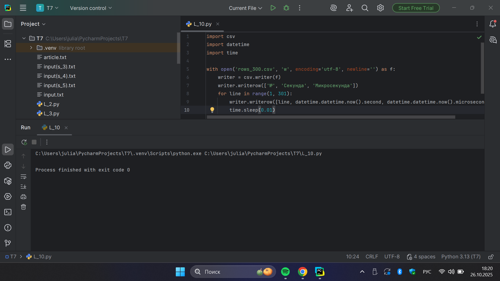
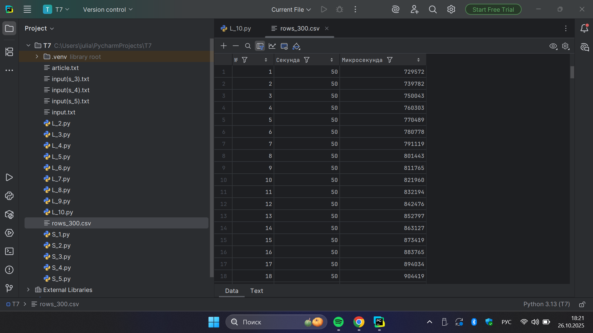

**Выводы:** Создаётся CSV-файл с данными секунд и микросекунд.

## Самостоятельная работа №1  
### Найдите в интернете любую статью (объем статьи не менее 200 слов), скопируйте ее содержимое в файл и напишите программу, которая считает количество слов в текстовом файле и определит самое часто встречающееся слово.

**Код:**

```python
from collections import Counter

prepositions = {'и', 'не', '–', 'в', 'на', 'с', 'по', 'у', 'о', 'от', 'до', 'за', 'из', 'к', 'но', 'а', 'или', 'то', 'же', 'бы', 'ли', 'как', 'что', 'the', 'a', 'an', 'and', 'or', 'but', 'in', 'on', 'at', 'to', 'for', 'of', 'with', 'by'}

with open('article.txt', 'r', encoding='utf-8') as file:
    text = file.read()

all_words = text.split()
filtered_words = [word for word in all_words if word.lower() not in prepositions]

word_count = len(all_words)
most_common = Counter(filtered_words).most_common(1)[0]

print(f"Количество слов: {word_count}")
print(f"Наиболее встречающееся слово: '{most_common[0]}' ({most_common[1]})")
```

**Результат:**

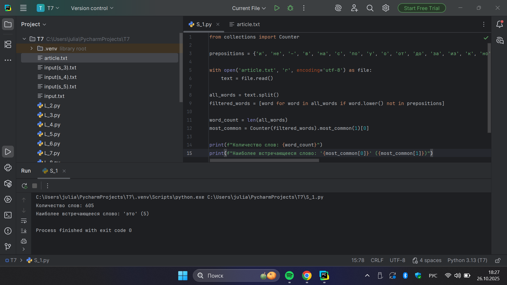
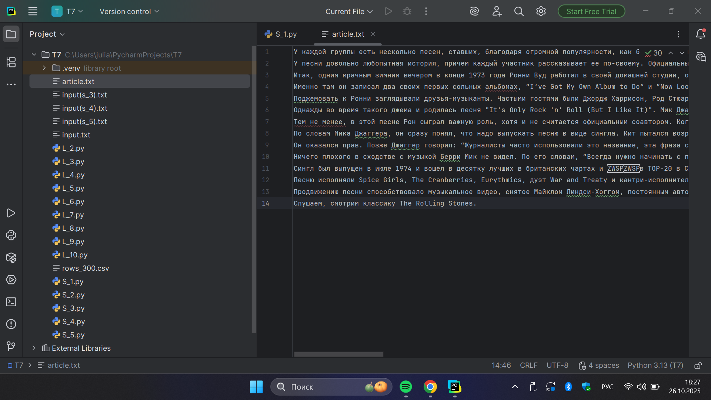

**Выводы:** Определяются количество слов и наиболее частое слово в тексте.

## Самостоятельная работа №2
### Напишите программу для учета расходов. Программа должна позволять вводить информацию о расходах, сохранять ее в файл и выводить существующие данные в консоль.

**Код:**

```python
import csv

def add_expense():
    item = input("На что потратили: ")
    amount = input("Сколько: ")

    with open('expenses.csv', 'a', newline='', encoding='utf-8') as file:
        writer = csv.writer(file)
        writer.writerow([item, amount])

    print("Запись добавлена!")

def show_expenses():
    try:
        with open('expenses.csv', 'r', encoding='utf-8') as file:
            reader = csv.reader(file)
            print("\n=== РАСХОДЫ ===")
            for row in reader:
                print(f"{row[0]} - {row[1]} руб.")
    except:
        print("Расходов нет")

while True:
    print("\n1. Добавить расход")
    print("2. Показать расходы")
    print("3. Выход")

    choice = input("Выберите: ")

    if choice == '1':
        add_expense()
    elif choice == '2':
        show_expenses()
    elif choice == '3':
        break
```

**Результат:**

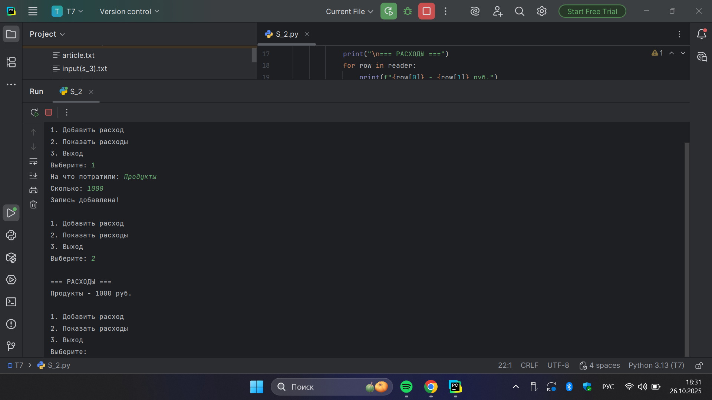
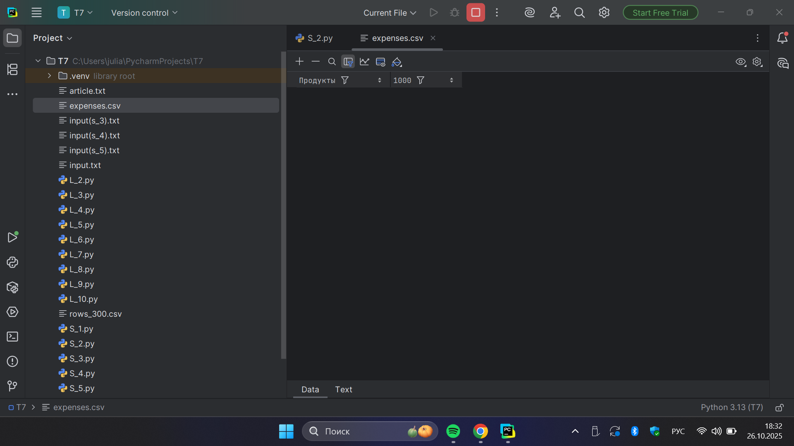

**Выводы:** Реализована программа учёта расходов с сохранением данных в CSV.

## Самостоятельная работа №3
### Имеется файл input.txt с текстом на латинице. Напишите программу, которая выводит следующую статистику по тексту: количество букв латинского алфавита; число слов; число строк. 

**Код:**

```python
with open('input(s_3).txt', 'r') as file:
    text = file.read()

lines = text.split('\n')
line_count = len(lines)

words = text.split()
word_count = len(words)

letter_count = sum(c.isalpha() for c in text)

print("Input file contains:")
print(f"{letter_count} letters")
print(f"{word_count} words")
print(f"{line_count} lines")
```

**Результат:**

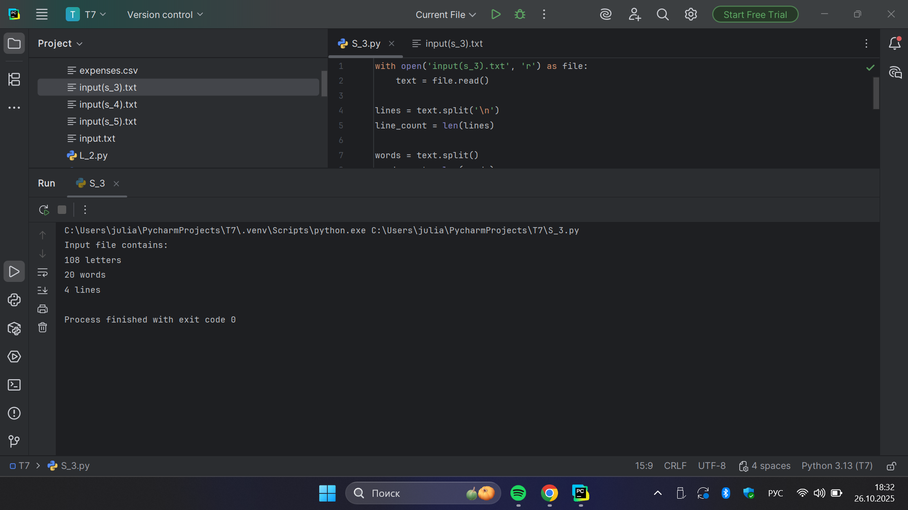

**Выводы:** Подсчитываются буквы, слова и строки в тексте.

## Самостоятельная работа №4
### Напишите программу, которая получает на вход предложение, выводит его в терминал, заменяя все запрещенные слова звездочками * (количество звездочек равно количеству букв в слове). Запрещенные слова, разделенные символом пробела, хранятся в текстовом файле input.txt. Все слова в этом файлезаписаны в нижнем регистре. Программа должна заменить запрещенные слова, где бы они ни встречались, даже в середине другого слова.

**Код:**

```python
with open('input(s_4).txt', 'r') as file:
    bad_words = file.read().split()

text = input()

result = text
for word in bad_words:
    result = result.replace(word, '*' * len(word))
    result = result.replace(word.upper(), '*' * len(word))
    result = result.replace(word.title(), '*' * len(word))

print(result)
```

**Результат:**

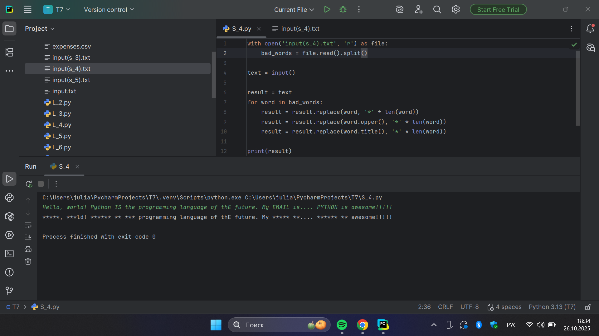

**Выводы:** Запрещённые слова заменяются символами * в тексте.

## Самостоятельная работа №5
### Самостоятельно придумайте и решите задачу, которая будет взаимодействовать с текстовым файлом.

**Код:**

```python
import string

with open('input(s_5).txt', 'r') as file:
    text = file.read()

if text.strip():
    words = text.split()
    word_count = len(words)

    char_count = len(text)
    letter_count = sum(c.isalpha() for c in text)
    digit_count = sum(c.isdigit() for c in text)
    space_count = sum(c.isspace() for c in text)

    print(f"Текст: {text}")
    print(f"Слов: {word_count}")
    print(f"Символов: {char_count}")
    print(f"Букв: {letter_count}")
    print(f"Цифр: {digit_count}")
    print(f"Пробелов: {space_count}")

    if words:
        longest_word = max(words, key=len)
        print(f"Самое длинное слово: '{longest_word}' ({len(longest_word)} букв)")
    else:
        print("В тексте нет слов")
else:
    print("Файл пустой")
```

**Результат:**

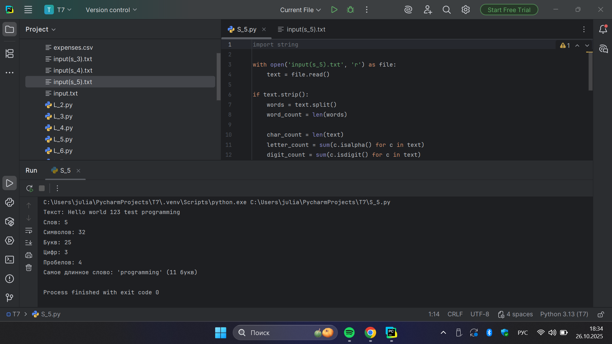

**Выводы:** Анализируется содержимое файла: количество символов, пробелов, слов и цифр, определяется самое длинное слово.

## Общие выводы по теме
В ходе выполнения лабораторных и самостоятельных работ по теме №7 были закреплены навыки работы с файловым вводом и выводом в Python. Рассмотрены основные операции над файлами: открытие, чтение, запись, добавление и закрытие с использованием различных конструкций. Особое внимание уделено различиям между режимами доступа к файлам, а также работе с различными форматами данных - текстовыми файлами и CSV. Выполненные задания способствовали формированию практических навыков обработки текстовой информации, анализа содержимого файлов и создания прикладных программ с постоянным хранением данных. Освоенные приемы работы с файлами являются основой для дальнейшего изучения обработки данных и разработки полноценных приложений в Python.