# Тема 8. Основы объектно-ориентированного программирования
Отчет по Теме #8 выполнил(а):
- Бобовский Яков Евгеньевич
- ИВТ-23-1

| Задание | Лаб_раб | Сам_раб |
| ------ | ------ | ------ |
| Задание 1 | + | + |
| Задание 2 | + | + |
| Задание 3 | + | + |
| Задание 4 | + | + |
| Задание 5 | + | + |

знак "+" - задание выполнено; знак "-" - задание не выполнено;

Работу проверили:
- к.э.н., доцент Панов М.А.	

## Лабораторная работа №1
### Создайте класс “Car” с атрибутами производитель и модель. Создайте объект этого класса. Напишите комментарии для кода, объясняющие его работу. 

**Код:**

```python
class Car: # Объявление класса Car
    def __init__(self, make, model): # Конструктор класса
        self.make = make    # Сохраняем марку автомобиля
        self.model = model  # Сохраняем модель автомобиля

# Создание объекта класса Car
my_car = Car("Toyota", "Corolla")  # Передаем марку и модель в конструктор
```

**Результат:**

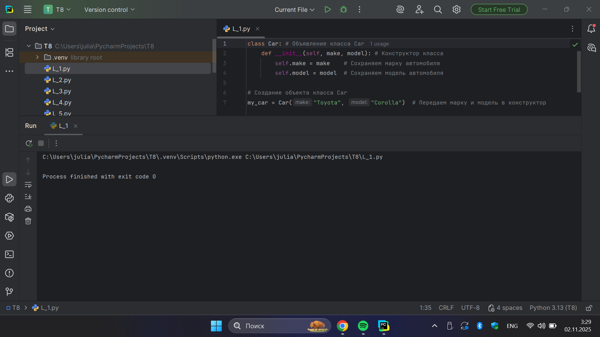

**Выводы:** Создан класс Car с конструктором для инициализации марки и модели автомобиля.

## Лабораторная работа №2
### Дополните код из первого задания, добавив в него атрибуты и методы класса, заставьте машину “поехать”. Напишите комментарии для кода, объясняющие его работу.

**Код:**

```python
class Car:  # Объявление класса Car
    def __init__(self, make, model):  # Конструктор класса
        self.make = make  # Сохраняем марку автомобиля
        self.model = model  # Сохраняем модель автомобиля

    def drive(self):  # Метод drive
        print(f"Driving the {self.make} {self.model}")  # Выводим информацию

# Создание объекта класса Car
my_car = Car("Toyota", "Corolla")  # Передаем марку и модель в конструктор
my_car.drive() # Вызов метода drive для объекта my_car
```

**Результат:**

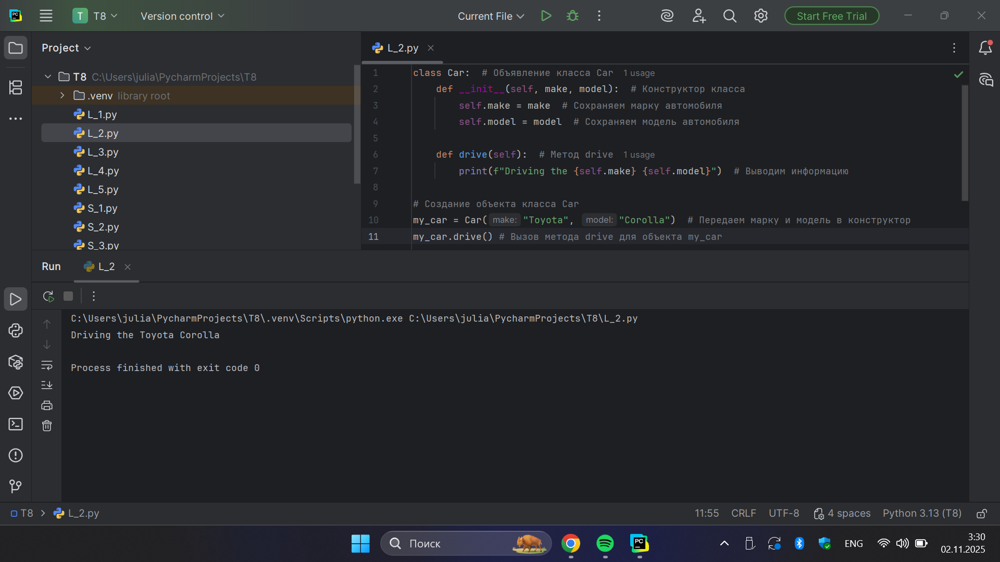

**Выводы:** Добавлен метод drive() для вывода информации о движении автомобиля.

## Лабораторная работа №3
### Создайте новый класс “ElectricCar” с методом “charge” и атрибутом емкость батареи. Реализуйте его наследование от класса, созданного в первом задании. Заставьте машину поехать, а потом заряжаться. Напишите комментарии для кода, объясняющие его работу. 

**Код:**

```python
class Car:  # Объявление класса Car
    def __init__(self, make, model):  # Конструктор класса
        self.make = make  # Сохраняем марку автомобиля
        self.model = model  # Сохраняем модель автомобиля

    def drive(self):  # Метод drive
        print(f"Driving the {self.make} {self.model}")  # Выводим информацию

# Создание объекта класса Car
my_car = Car("Toyota", "Corolla")  # Передаем марку и модель в конструктор
my_car.drive() # Вызов метода drive для объекта my_car


class ElectricCar(Car):  # Класс (наследник Car)
    def __init__(self, make, model, battery_capacity):  # Конструктор
        super().__init__(make, model)  # Вызов конструктора родителя
        self.battery_capacity = battery_capacity  # Емкость батареи

    def charge(self):  # Метод зарядки
        print(f"Charging the {self.make} {self.model} with {self.battery_capacity} kWh")  # Сообщение о зарядке

# Создаем объект ElectricCar
my_electric_car = ElectricCar("Tesla", "Model S", 75)  # Новая Tesla Model S
my_electric_car.drive() # Вызываем унаследованный метод
my_electric_car.charge() # Вызываем собственный метод
```

**Результат:**

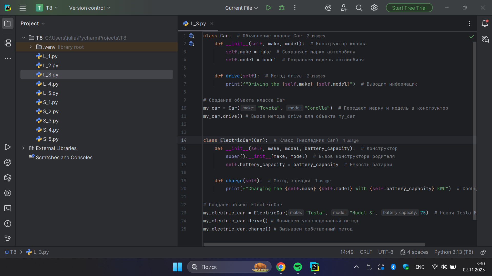
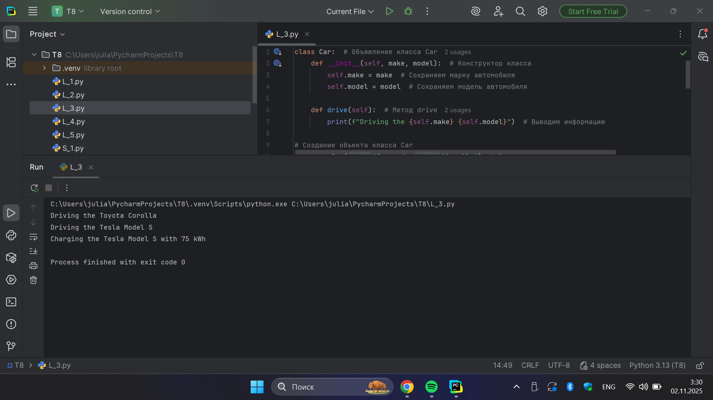

**Выводы:** Реализовано наследование класса ElectricCar от Car с добавлением метода charge().

## Лабораторная работа №4
### Реализуйте инкапсуляцию для класса, созданного в первом задании. Создайте защищенный атрибут производителя и приватный атрибут модели. Вызовите защищенный атрибут и заставьте машину поехать. Напишите комментарии для кода, объясняющие его работу. 

**Код:**

```python
class Car:  # Объявление класса Car
    def __init__(self, make, model):  # Конструктор класса
        self._make = make  # Защищенный атрибут марки
        self.__model = model  # Приватный атрибут модели

    def drive(self):  # Метод drive
        print(f"Driving the {self._make} {self.__model}")  # Выводим информацию

# Создание объекта класса Car
my_car = Car("Toyota", "Corolla")  # Передаем марку и модель в конструктор
print(my_car._make)  # Доступ к защищенному атрибуту
my_car.drive() # Вызов метода drive для объекта my_car
```

**Результат:**

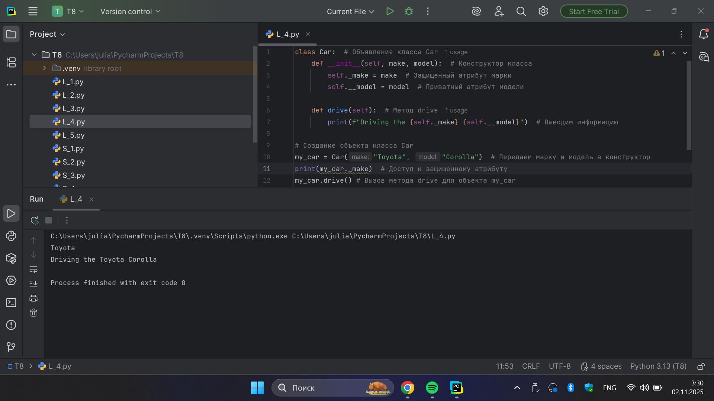

**Выводы:** Реализована инкапсуляция с защищенным (_make) и приватным (__model) атрибутами.

## Лабораторная работа №5
### Реализуйте полиморфизм создав основной (общий) класс “Shape”, а также еще два класса “Rectangle” и “Circle”. Внутри последних двух классов реализуйте методы для подсчета площади фигуры. После этого создайте массив с фигурами, поместите туда круг и прямоугольник, затем при помощи цикла выведите их площади. Напишите комментарии для кода, объясняющие его работу.

**Код:**

```python
# Базовый класс для всех фигур
class Shape:
    def area(self):
        pass  # Метод будет переопределен в дочерних классах

# Класс прямоугольника, наследуется от Shape
class Rectangle(Shape):
    def __init__(self, width, height):
        self.width = width   # Ширина прямоугольника
        self.height = height # Высота прямоугольника

    # Переопределяем метод area для прямоугольника
    def area(self):
        return self.width * self.height  # Площадь = ширина * высота

# Класс круга, наследуется от Shape
class Circle(Shape):
    def __init__(self, radius):
        self.radius = radius  # Радиус круга

    # Переопределяем метод area для круга
    def area(self):
        return 3.14 * self.radius * self.radius  # Площадь = π * r² (используем 3.14 как π)

# Создаем массив фигур
shapes = [
    Rectangle(5, 10),  # Прямоугольник 5x10
    Circle(7)          # Круг с радиусом 7
]

# Выводим площади всех фигур
for shape in shapes:
    print(f"Площадь фигуры: {shape.area()}")  # Полиморфизм: один метод для разных типов фигур
```

**Результат:**

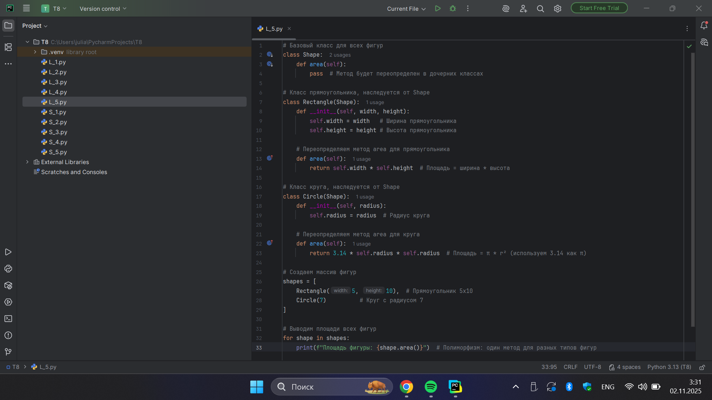
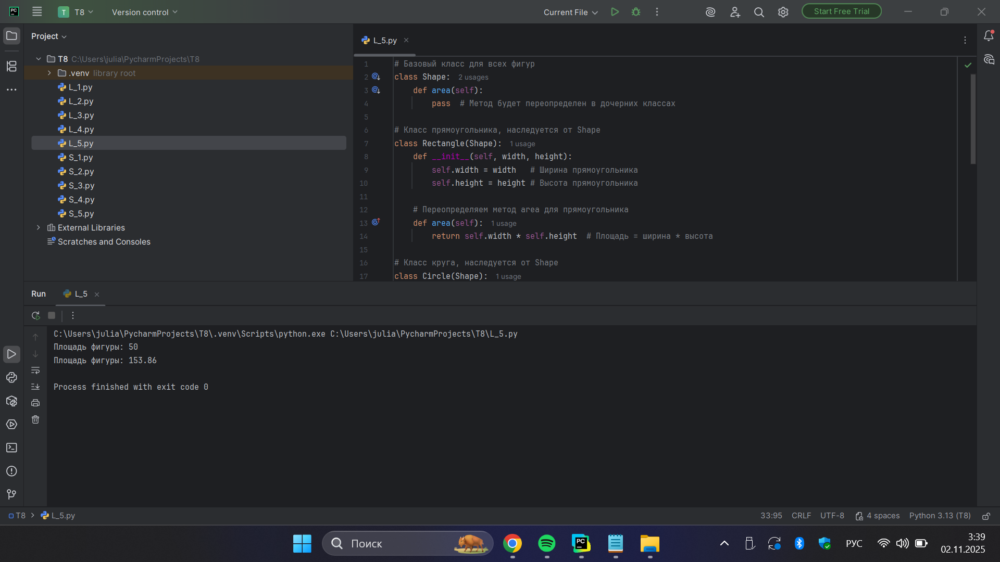

**Выводы:** Реализован полиморфизм через переопределение метода area() в классах-наследниках.

## Самостоятельная работа №1  
### Самостоятельно создайте класс и его объект. Они должны отличаться, от тех, что указаны в теоретическом материале (методичке) и лабораторных заданиях.

**Код:**

```python
class Guitar:
    def __init__(self, brand, model):
        self.brand = brand
        self.model = model

    def play(self):
        print(f"Играет {self.brand} {self.model}")

    def info(self):
        print(f"Гитара: {self.brand} {self.model}")

guitar = Guitar("Fender", "Stratocaster")

guitar.info()
guitar.play()
```

**Результат:**

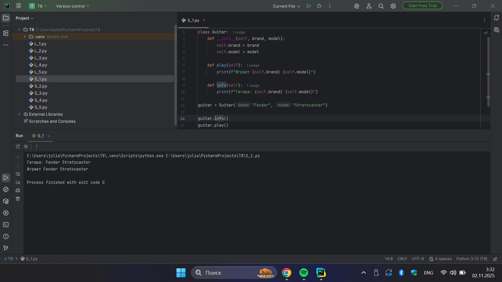

**Выводы:** Создан пользовательский класс Guitar с методами play() и info().

## Самостоятельная работа №2
### Самостоятельно создайте атрибуты и методы для ранее созданного класса. Они должны отличаться, от тех, что указаны в теоретическом материале (методичке) и лабораторных заданиях.

**Код:**

```python
class Guitar:
    def __init__(self, brand, model, year):
        self.brand = brand
        self.model = model
        self.year = year

    def play(self):
        print(f"Играет {self.brand} {self.model}")

    def info(self):
        print(f"Гитара: {self.brand} {self.model}")

guitar = Guitar("Fender", "Stratocaster", 1994)

guitar.info()
guitar.play()
print(f"Год выпуска: {guitar.year}")
```

**Результат:**

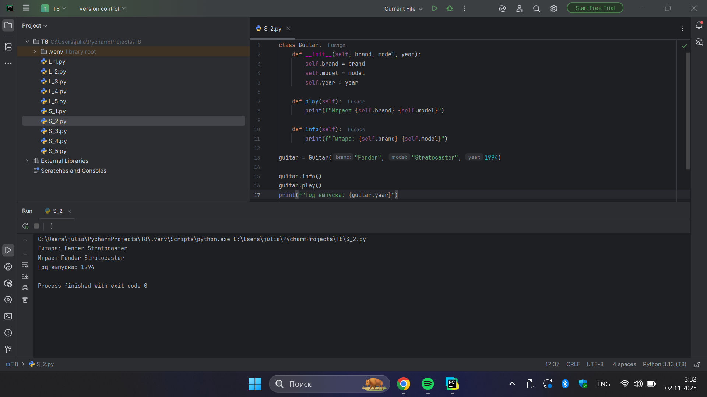

**Выводы:** Добавлен атрибут year и вывод года выпуска гитары.

## Самостоятельная работа №3
### Самостоятельно реализуйте наследование, продолжая работать с ранее созданным классом. Оно должно отличаться, от того, что указано в теоретическом материале (методичке) и лабораторных заданиях.

**Код:**

```python
class Guitar:
    def __init__(self, brand, model, year):
        self.brand = brand
        self.model = model
        self.year = year

    def play(self):
        print(f"Играет {self.brand} {self.model}")

    def info(self):
        print(f"Гитара: {self.brand} {self.model}")

guitar = Guitar("Fender", "Stratocaster", 1994)

guitar.info()
guitar.play()
print(f"Год выпуска: {guitar.year}")

class GibsonGuitar(Guitar):
    def __init__(self, model, year):
        super().__init__("Gibson", model, year)

gibson = GibsonGuitar("Les Paul", 2020)
gibson.info()
gibson.play()
print(f"Год выпуска: {gibson.year}")
```

**Результат:**

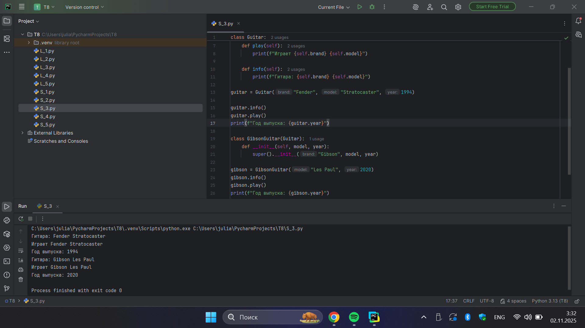

**Выводы:** Реализовано наследование класса GibsonGuitar от Guitar.

## Самостоятельная работа №4
### Самостоятельно реализуйте инкапсуляцию, продолжая работать с ранее созданным классом. Она должна отличаться, от того, что указана в теоретическом материале (методичке) и лабораторных заданиях.

**Код:**

```python
class Guitar:
    def __init__(self, brand, model, year):
        self._brand = brand
        self._model = model
        self.__year = year

    def play(self):
        print(f"Играет {self._brand} {self._model}")

    def info(self):
        print(f"Гитара: {self._brand} {self._model}")

    def get_year(self):
        return self.__year

    def set_year(self, new_year):
        if 1950 <= new_year <= 2024:
            self.__year = new_year


guitar = Guitar("Fender", "Stratocaster", 1994)

guitar.info()
guitar.play()
print(f"Год выпуска: {guitar.get_year()}")

guitar.set_year(2020)
print(f"Новый год выпуска: {guitar.get_year()}")
```

**Результат:**

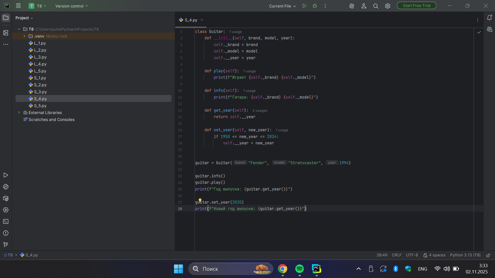
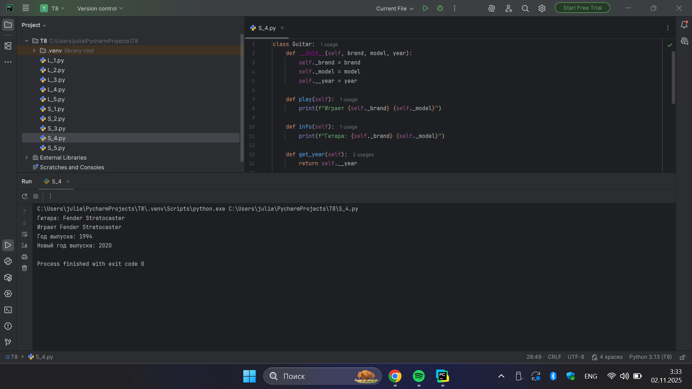

**Выводы:** Применена инкапсуляция с геттером и сеттером для года выпуска.

## Самостоятельная работа №5
### Самостоятельно реализуйте полиморфизм. Он должен отличаться, от того, что указан в теоретическом материале (методичке) и лабораторных заданиях.

**Код:**

```python
class Device:
    def turn_on(self):
        pass

class Lamp(Device):
    def turn_on(self):
        return "Лампа светит"

class Computer(Device):
    def turn_on(self):
        return "Компьютер запускается"

class TV(Device):
    def turn_on(self):
        return "Телевизор показывает"

devices = [Lamp(), Computer(), TV()]

for device in devices:
    print(device.turn_on())
```

**Результат:**

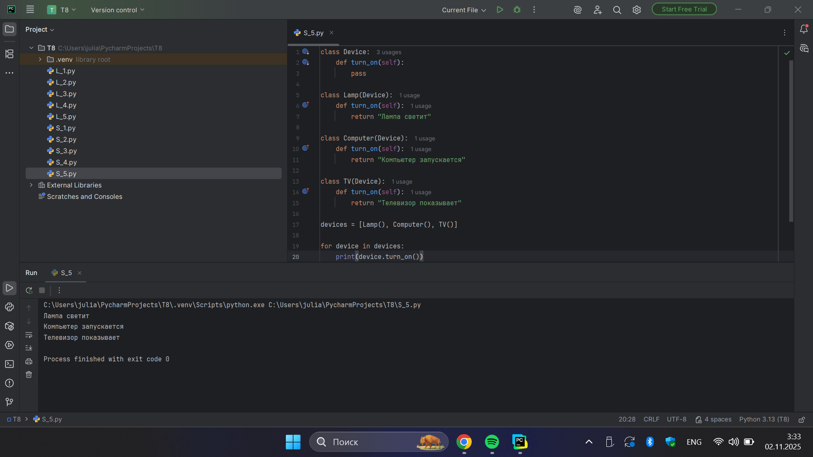

**Выводы:** Реализован полиморфизм через переопределение метода turn_on() в классах устройств.

## Общие выводы по теме
В ходе выполнения лабораторных и самостоятельных работ по теме №8 были закреплены основные принципы объектно-ориентированного программирования в Python. Рассмотрены ключевые концепции ООП: инкапсуляция, наследование и полиморфизм. Освоено создание классов и объектов, работа с конструкторами, атрибутами и методами. Особое внимание уделено практическому применению наследования для построения иерархии классов, использованию модификаторов доступа для защиты данных и реализации полиморфного поведения через переопределение методов. Выполненные задания способствовали формированию навыков проектирования объектно-ориентированных приложений, что является основой для разработки сложных программных систем на Python.