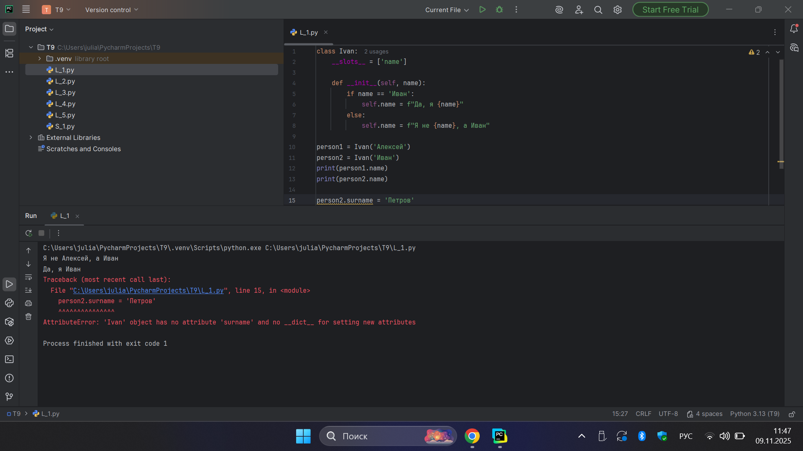
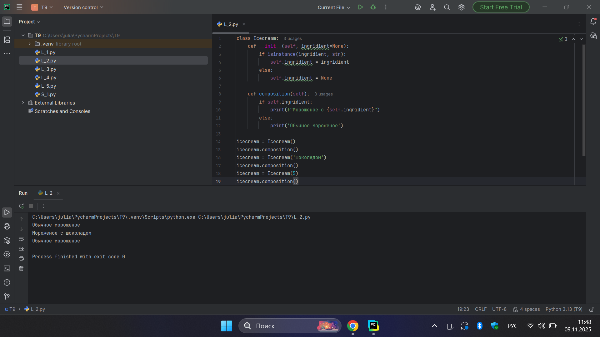
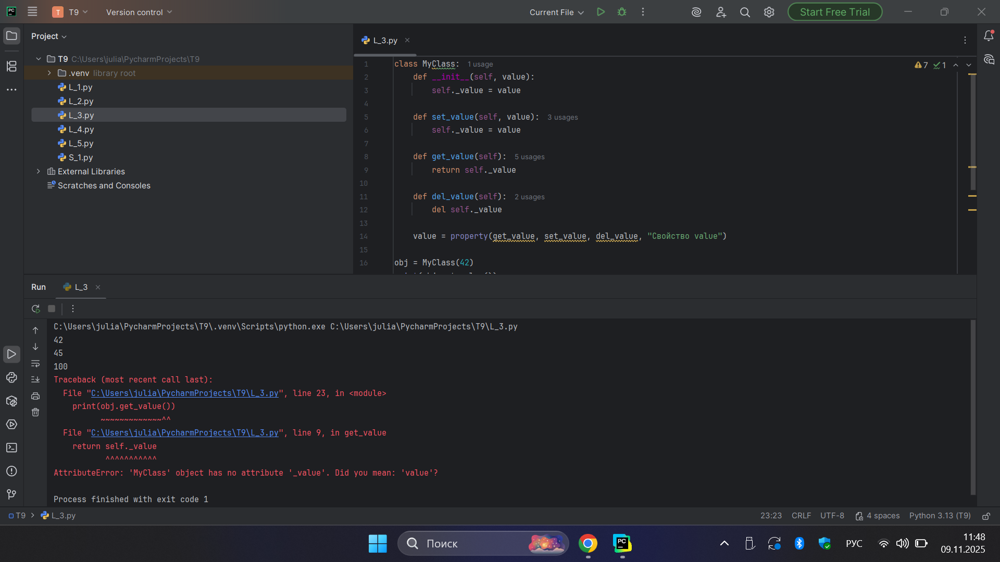
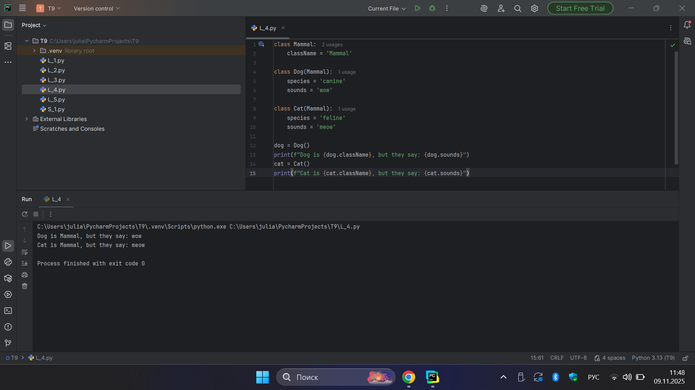
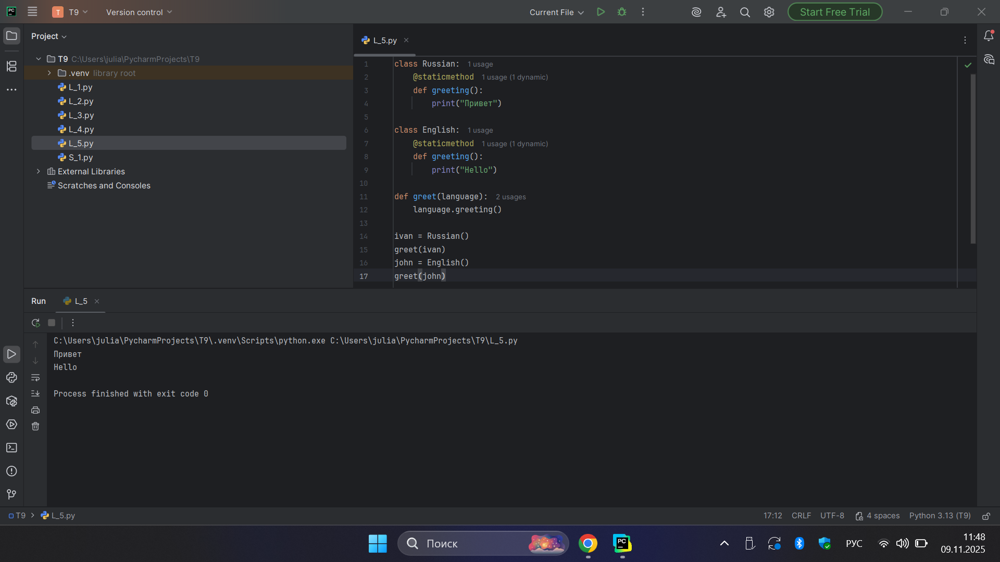
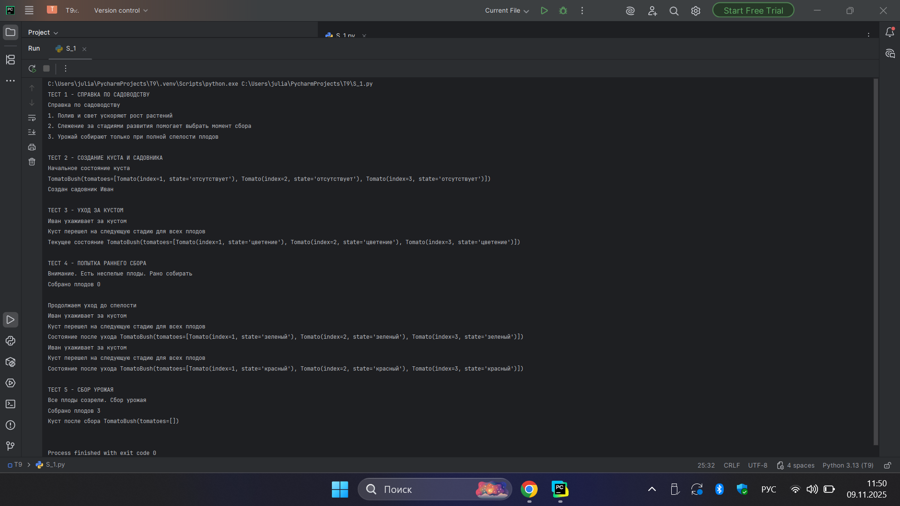

# Тема 9. ООП на Python: концепции, принципы и примеры реализации
Отчет по Теме #9 выполнил(а):
- Бобовский Яков Евгеньевич
- ИВТ-23-1

| Задание | Лаб_раб | Сам_раб |
| ------ | ------ | ------ |
| Задание 1 | + | + |
| Задание 2 | + |  |
| Задание 3 | + |  |
| Задание 4 | + |  |
| Задание 5 | + |  |

знак "+" - задание выполнено; знак "-" - задание не выполнено;

Работу проверили:
- к.э.н., доцент Панов М.А.	

## Лабораторная работа №1
### Создайте класс, который будет проверять угадал ли человек ваше имя или нет. Сделайте проверку в функции init(). Проверьте что будет, если вызвать атрибут, который не указан в классе.

**Код:**

```python
class Ivan:
    __slots__ = ['name']

    def __init__(self, name):
        if name == 'Иван':
            self.name = f"Да, я {name}"
        else:
            self.name = f"Я не {name}, а Иван"

person1 = Ivan('Алексей')
person2 = Ivan('Иван')
print(person1.name)
print(person2.name)

person2.surname = 'Петров'
```

**Результат:**



**Выводы:** Использован __slots__ для ограничения атрибутов класса. При попытке добавить несуществующий атрибут возникает ошибка AttributeError.

## Лабораторная работа №2
### Написать программу, которая будет писать добавили ли топпинг в мороженое и цену после возможного изменения.

**Код:**

```python
class Icecream:
    def __init__(self, ingridient=None):
        if isinstance(ingridient, str):
            self.ingridient = ingridient
        else:
            self.ingridient = None

    def composition(self):
        if self.ingridient:
            print(f"Мороженое с {self.ingridient}")
        else:
            print('Обычное мороженое')

icecream = Icecream()
icecream.composition()
icecream = Icecream('шоколадом')
icecream.composition()
icecream = Icecream(5)
icecream.composition()
```

**Результат:**



**Выводы:** Реализована проверка типа входных данных в конструкторе. Класс корректно обрабатывает строки и другие типы данных для топпинга.

## Лабораторная работа №3
### Реализуйте класс с инкапсуляцией, включающий сеттер, геттер и деструктор. Продемонстрируйте работу всех функций.

**Код:**

```python
class MyСlass:
    def __init__(self, value):
        self._value = value

    def set_value(self, value):
        self._value = value

    def get_value(self):
        return self._value

    def del_value(self):
        del self._value

    value = property(get_value, set_value, del_value, "Свойство value")

obj = MyСlass(42)
print(obj.get_value())
obj.set_value(45)
print(obj.get_value())
obj.set_value(100)
print(obj.get_value())
obj.del_value()
print(obj.get_value())
```

**Результат:**



**Выводы:** Создан класс с полной инкапсуляцией, включающий геттер, сеттер и деструктор для управления атрибутом value.

## Лабораторная работа №4
### Написать три класса: Кошки, Собаки, Млекопитающие. И при помощи “наследования” объяснить компьютеру что кошки и собаки – это млекопитающие. Добавьте уникальные атрибуты для кошек и собак.

**Код:**

```python
class Mammal:
    className = 'Mammal'

class Dog(Mammal):
    species = 'canine'
    sounds = 'wow'

class Cat(Mammal):
    species = 'feline'
    sounds = 'meow'

dog = Dog()
print(f"Dog is {dog.className}, but they say: {dog.sounds}")
cat = Cat()
print(f"Cat is {cat.className}, but they say: {cat.sounds}")
```

**Результат:**



**Выводы:** Построена иерархия наследования: классы Dog и Cat наследуются от Mammal, демонстрируя отношение "является".

## Лабораторная работа №5
### Реализуйте полиморфизм с классами для разных языков приветствия. Используйте декоратор @staticmethod.

**Код:**

```python
class Russian:
    @staticmethod
    def greeting():
        print("Привет")

class English:
    @staticmethod
    def greeting():
        print("Hello")

def greet(language):
    language.greeting()

ivan = Russian()
greet(ivan)
john = English()
greet(john)
```

**Результат:**



**Выводы:** Реализован полиморфизм через статические методы с декоратором @staticmethod для разных языков приветствия.

## Самостоятельная работа №1  
### Садовник и помидоры. Реализовать систему классов: Tomato, TomatoBush, Gardener с полным жизненным циклом выращивания томатов.

**Код:**

```python
class Tomato:
    states = ('отсутствует', 'цветение', 'зеленый', 'красный')

    def __init__(self, index: int):
        self._index = index
        self._state = Tomato.states[0]

    def grow(self) -> None:
        current_idx = Tomato.states.index(self._state)
        if current_idx < len(Tomato.states) - 1:
            self._state = Tomato.states[current_idx + 1]

    def is_ripe(self) -> bool:
        return self._state == Tomato.states[-1]

    def __repr__(self):
        return f"Tomato(index={self._index}, state='{self._state}')"


class TomatoBush:
    def __init__(self, tomato_count: int):
        self.tomatoes = [Tomato(i + 1) for i in range(tomato_count)]

    def grow_all(self) -> None:
        for t in self.tomatoes:
            t.grow()

    def all_are_ripe(self) -> bool:
        return all(t.is_ripe() for t in self.tomatoes)

    def give_away_all(self):
        harvest, self.tomatoes = self.tomatoes, []
        return harvest

    def __repr__(self):
        return f"TomatoBush(tomatoes={self.tomatoes})"


class Gardener:
    def __init__(self, name: str, plant: TomatoBush):
        self.name = name
        self._plant = plant

    def work(self) -> None:
        print(f"{self.name} ухаживает за кустом")
        self._plant.grow_all()
        print("Куст перешел на следующую стадию для всех плодов")

    def harvest(self):
        if self._plant.all_are_ripe():
            print("Все плоды созрели. Сбор урожая")
            return self._plant.give_away_all()
        else:
            print("Внимание. Есть неспелые плоды. Рано собирать")
            return []

    @staticmethod
    def knowledge_base() -> None:
        print("Справка по садоводству")
        print("1. Полив и свет ускоряют рост растений")
        print("2. Слежение за стадиями развития помогает выбрать момент сбора")
        print("3. Урожай собирают только при полной спелости плодов")


if __name__ == "__main__":
    import io, sys

    console_capture = io.StringIO()
    original_stdout = sys.stdout
    sys.stdout = console_capture

    print("ТЕСТ 1 - СПРАВКА ПО САДОВОДСТВУ")
    Gardener.knowledge_base()

    print("\nТЕСТ 2 - СОЗДАНИЕ КУСТА И САДОВНИКА")
    bush = TomatoBush(tomato_count=3)
    print("Начальное состояние куста")
    print(bush)

    gardener = Gardener(name='Иван', plant=bush)
    print("Создан садовник", gardener.name)

    print("\nТЕСТ 3 - УХОД ЗА КУСТОМ")
    gardener.work()
    print("Текущее состояние", bush)

    print("\nТЕСТ 4 - ПОПЫТКА РАННЕГО СБОРА")
    picked = gardener.harvest()
    print("Собрано плодов", len(picked))

    print("\nПродолжаем уход до спелости")
    for i in range(3):
        if bush.all_are_ripe():
            break
        gardener.work()
        print("Состояние после ухода", bush)

    print("\nТЕСТ 5 - СБОР УРОЖАЯ")
    picked = gardener.harvest()
    print("Собрано плодов", len(picked))
    print("Куст после сбора", bush)

    sys.stdout = original_stdout
    print(console_capture.getvalue())
```

**Результат:**



**Выводы:** Создана сложная система классов (Tomato, TomatoBush, Gardener) с полным жизненным циклом выращивания томатов и статическим методом для справки.

## Общие выводы по теме
В ходе выполнения лабораторных и самостоятельных работ по теме №9 были углублены знания объектно-ориентированного программирования в Python. Рассмотрены продвинутые концепции ООП: механизм __slots__ для оптимизации памяти, свойства (property) для управления доступом к атрибутам, статические методы и декораторы. Освоено построение сложных иерархий классов с реализацией полного жизненного цикла объектов. Особое внимание уделено практическому применению инкапсуляции через геттеры и сеттеры, созданию статических методов для утилитарных функций и проектированию взаимосвязанных классов. Выполненные задания способствовали формированию навыков разработки сложных объектно-ориентированных систем, что является основой для создания масштабируемых приложений на Python.