# Тема_1

**Студент:** Бобовский Яков Евгеньевич  
**Группа:** ИВТ-23-1

## Таблица выполненных заданий

| № задания | Выполнение |
|-----------|------------|
| 2.1 | + |
| 2.2 | + |
| 2.3 | + |
| 2.4 | + |
| 2.5 | + |
| 2.6 | + |
| 2.7 | + |
| 2.8 | + |
| 2.9 | + |
| 2.10 | + |
| 2.11 | + |
| 2.12 | + |
| 2.13 | + |
| 2.14 | + |
| 2.15 | + |

## 2.1. Установка

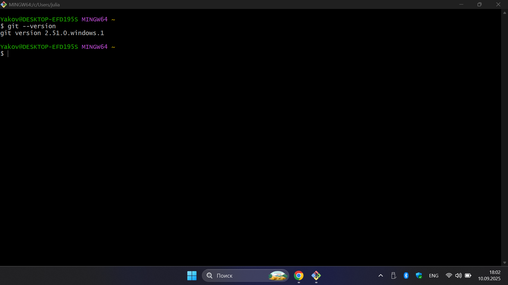

**Комментарий:** Установлен Git версии 2.51.0 для Windows. Проверка версии прошла успешно.

## 2.2. Настройка

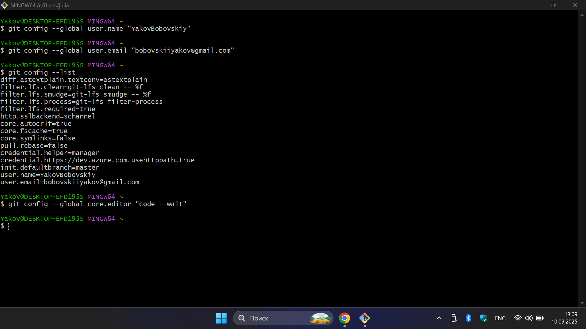

**Комментарий:** Настроил основные параметры Git - указал своё имя, почту и редактор кода.

## 2.3. Создание нового репозитория

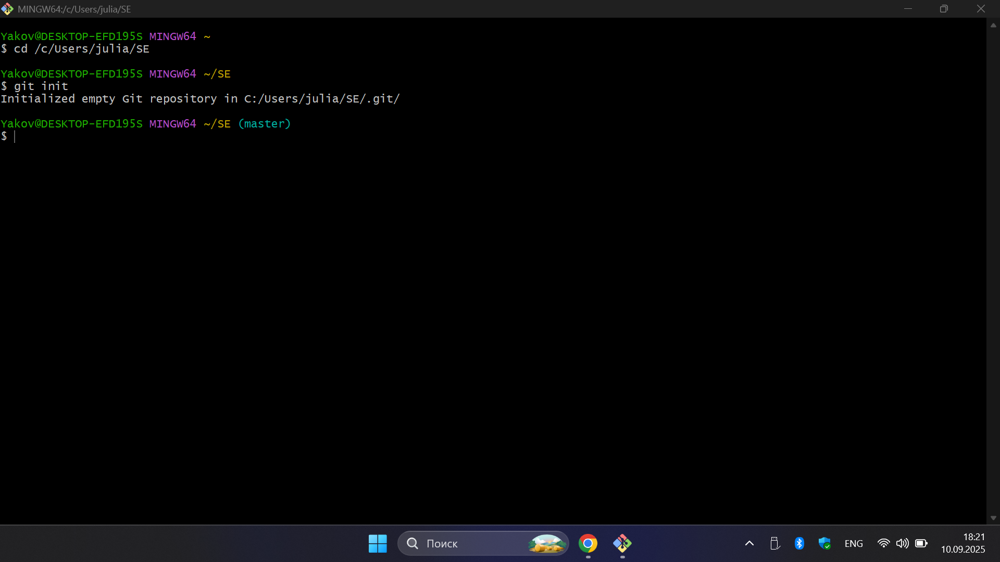

**Комментарий:** Инициализировал новый Git-репозиторий в указанной директории.

## 2.4. Подготовка файлов

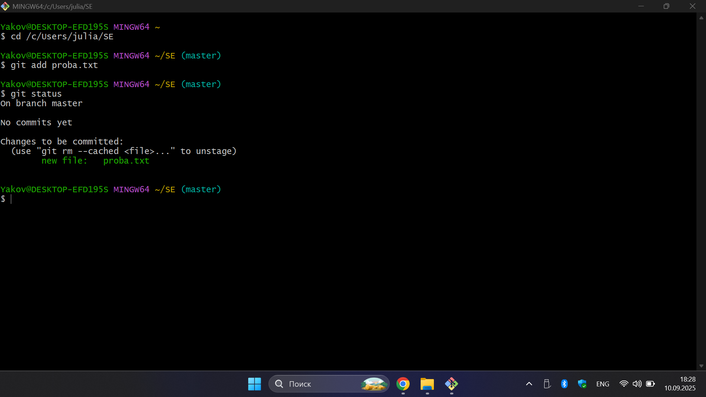

**Комментарий:** Добавил файл proba.txt в отслеживаемые. Файл готов к коммиту.

## 2.5. Фиксация изменений

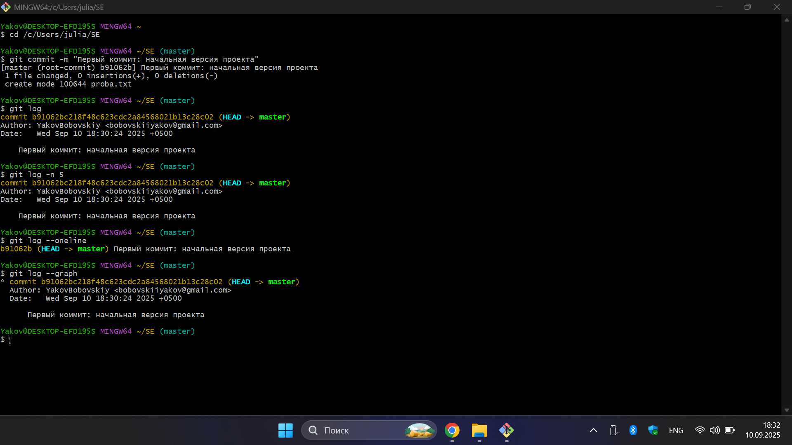

**Комментарий:** Сделал первый коммит с файлом proba.txt. Проверил историю коммитов.

## 2.6. Подключение к удаленному репозиторию

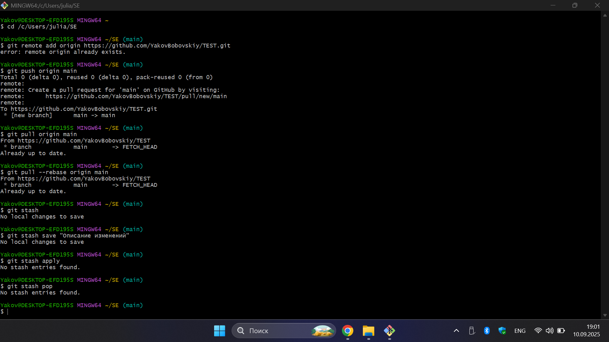

**Комментарий:** Подключил локальный репозиторий к GitHub и отправил все коммиты.

## 2.7. Ветвление

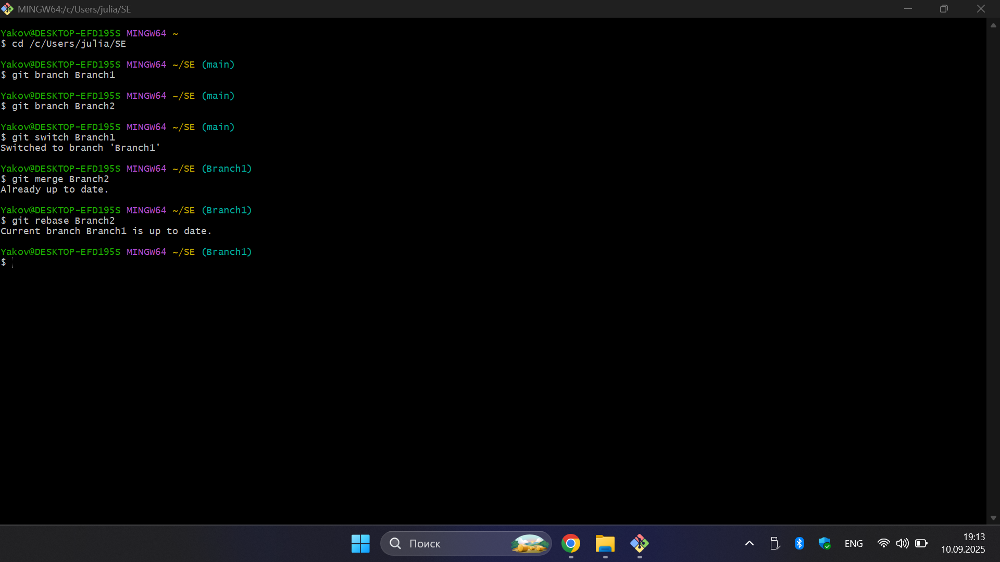

**Комментарий:** Создал и переключился между ветками. Ветки уже содержат идентичные коммиты.

## 2.8. Особенности применения «Фетч»

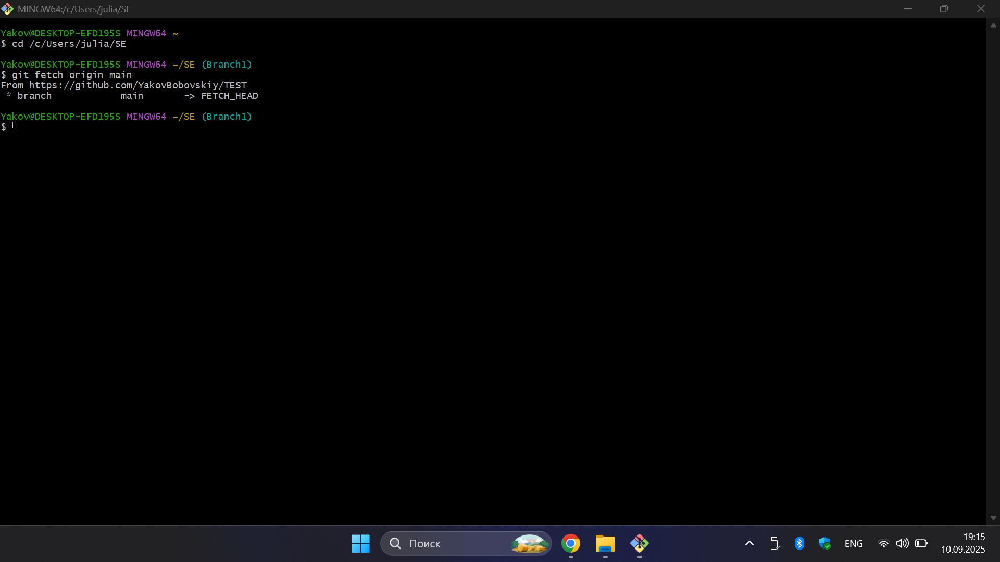

**Комментарий:** Получил обновления из основной ветки на GitHub.

## 2.9. Удаление файлов, веток, локальных и удалённых репозиториев

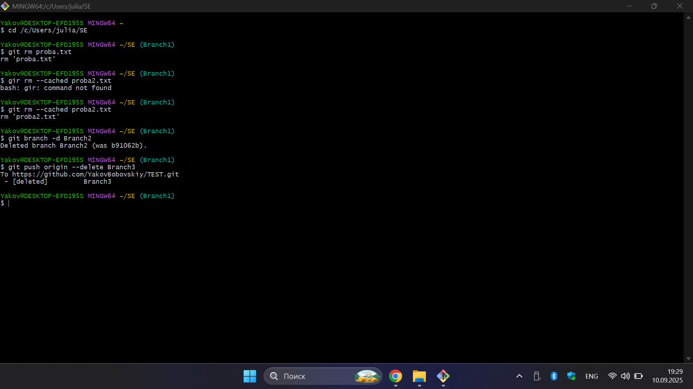

**Комментарий:** Удалил файл proba.txt из отслеживания и удалил ненужные ветки.

## 2.10. Отслеживание изменений в коммитах

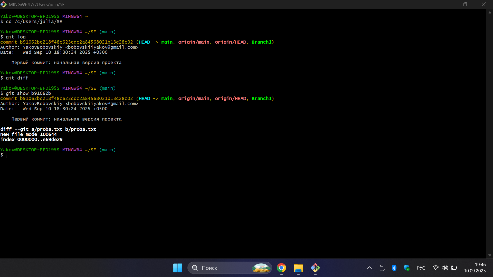

**Комментарий:** Проверил историю коммитов и изменения. Первый коммит содержит создание пустого файла.

## 2.11. Возвращение файла к предыдущему (определенному) состоянию

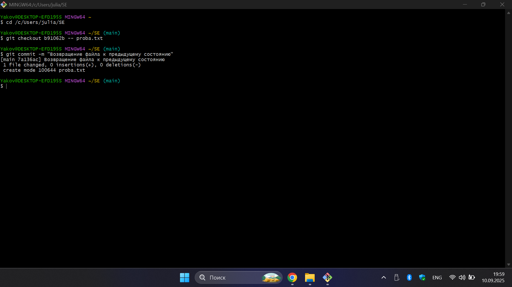

**Комментарий:** Вернул файл proba.txt к состоянию из предыдущего коммита.

## 2.12. Возвращение к предыдущему коммиту

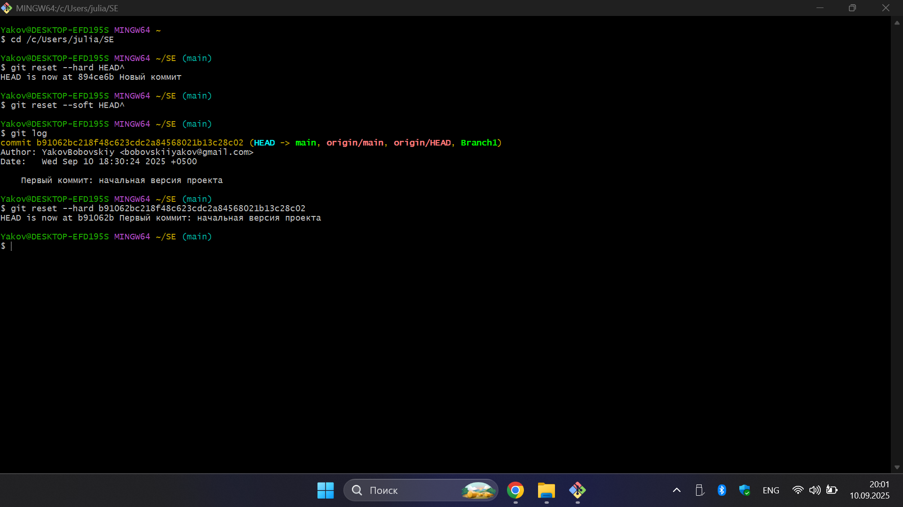

**Комментарий:** Сбросил состояние репозитория к первому коммиту.

## 2.13. Исправление коммита

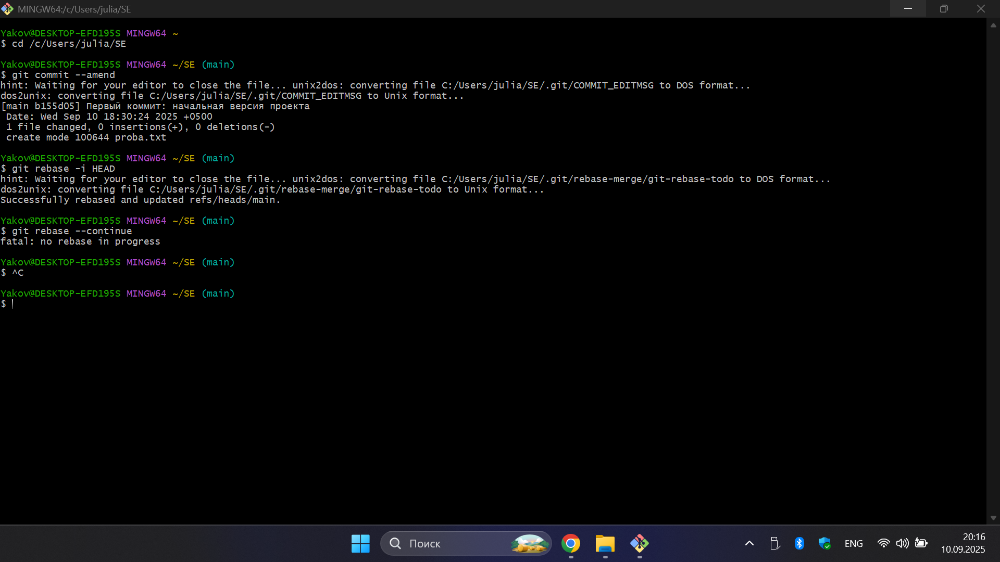

**Комментарий:** Изменил сообщение последнего коммита и выполнил перебазирование.

## 2.14. Разрешение конфликтов при слиянии

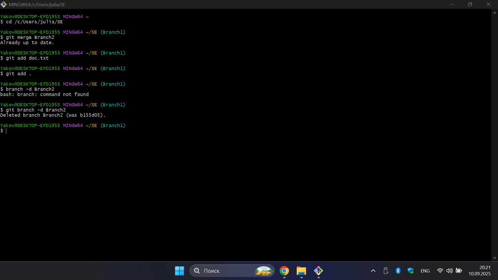

**Комментарий:** Объединил ветки Branch1 и Branch2, добавил новые файлы.

## 2.15. Настройка .gitignore

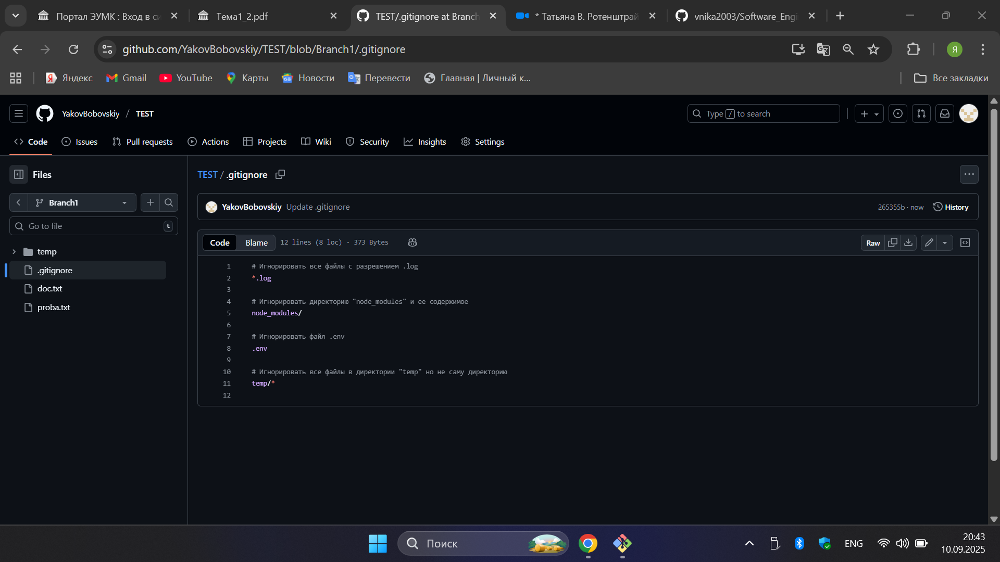

**Комментарий:** Создал файл .gitignore для исключения ненужных файлов.

## Вывод

В ходе лабораторной работы освоены базовые навыки работы с Git: установка и настройка, создание и ведение репозиториев, работа с ветками и коммитами, а также взаимодействие с GitHub. Полученные умения обеспечивают эффективный контроль версий и являются основой для дальнейшей разработки проектов.
